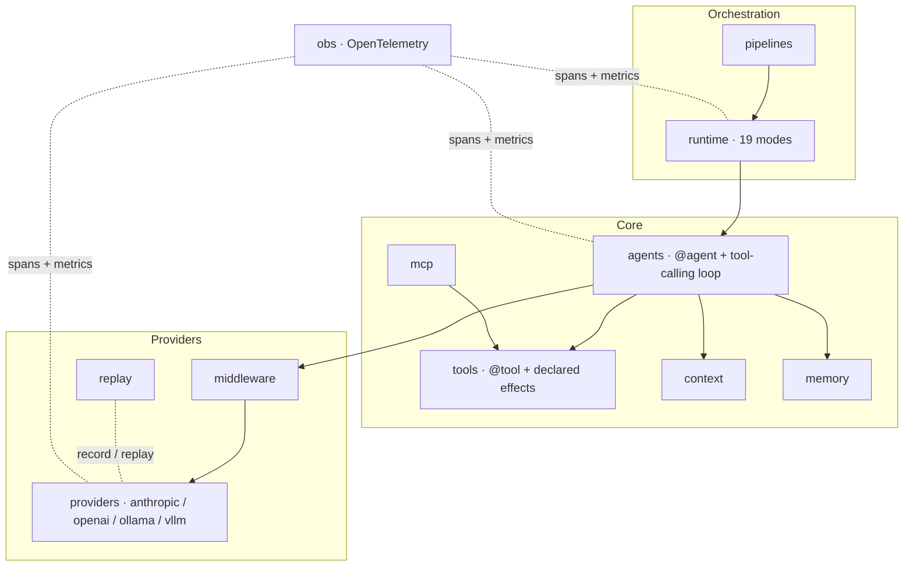

#

<div align="center">
  
</div>

<div align="center">

# Phronesis Framework

</div>

<div align="center">
  Practical wisdom for AI agent systems: typed, immutable specs, a closed catalog of execution patterns, and observability built in.
</div>

<div align="center">
  <a href="./docs/index.md">docs</a> ·
  <a href="./examples/README.md">examples</a> ·
  <a href="./src/phronesis/">source</a> ·
  <a href="./tests/">tests</a>
</div>

<div align="center">

[]()
[]()
[]()
[]()

</div>

---

<div align="center">

## 🎯 Purpose

</div>

*Phronesis* (φρόνησις): for Aristotle, **practical wisdom** — the capacity to
deliberate well and act with judgment in concrete situations. An LLM has *episteme*
(knowledge). An agent needs *phronesis*.

Most frameworks treat agents as enhanced chatbots glued to a tool-use loop. Phronesis
treats them as deliberating systems with explicit contracts:

- **Typed, immutable, JSON-serializable specs.** Agents, tools and pipelines are
  frozen data; execution state lives apart, observable and queryable.
- **A closed catalog of execution patterns.** Nineteen named modes (`Sequence`,
  `Debate`, `Reflexion`, …) you can reason about — not arbitrary control flow that
  nobody will be able to debug six months from now.
- **Observability from the first commit.** OpenTelemetry spans for every agent run,
  tool call, pipeline stage and MCP session, correlated by stable ids.
- **Reproducible determinism.** Record/replay of LLM responses in JSONL cassettes:
  examples and tests run without a network, byte for byte.

<div align="center">

## 📋 Examples

</div>

The smallest possible agent — a function as the spec, the body is ignored:

```python
from phronesis.agents import agent
from phronesis.providers import anthropic
from phronesis.tools import tool


@tool
def add(a: int, b: int) -> int:
    """Sum two integers and return the result."""
    return a + b


@agent(
    model=anthropic(model="claude-sonnet-4-6"),
    tools=(add,),
    system_prompt="You are a precise calculator. Always use your tools.",
)
def calculator() -> str:
    """Answer arithmetic questions by chaining the calculator tools."""


result = await calculator.run("How much is (17 + 25) * 2?")
print(result.output)
```

Agents compose into execution graphs through the runtime — here a parallel team whose
output is moderated by a debate:

```python
from phronesis.runtime import Debate, ExecutionContext, Parallel, Sequence, agent_node

pipeline = Sequence(
    nodes=(
        Parallel(nodes=(agent_node(fundamental), agent_node(sentiment))),
        Debate(
            participants=(agent_node(bull), agent_node(bear)),
            rounds=2,
            moderator=agent_node(manager),
        ),
    ),
)

outcome = await pipeline(ExecutionContext.new(), "AAPL @ 2024-01-15")
print(outcome.output)
```

The [examples catalog](./examples/README.md) covers all 19 modes with **22 runnable
examples** (each with a deterministic cassette) plus a complete mini-app:
[`trading_agents`](./examples/trading_agents/), a reproduction of the TradingAgents
paper organigram with 13 agents across 5 phases, [compared side by side](./examples/trading_agents/COMPARISON.md)
with the original implementation.

<div align="center">

## 🏗️ Architecture

</div>



A closed catalog of execution modes — expressive enough, finite enough to reason
about. Every mode satisfies the same `Executable` contract and modes nest freely:

| Category | Modes |
|---|---|
| Primitives | `Sequence` · `Parallel` · `Race` · `Fallback` · `Cascade` |
| Control flow | `Conditional` · `Router` · `Loop` · `Retry` |
| Multi-agent | `Consensus` · `HandoffChain` · `Supervisor` · `Debate` |
| Cognitive | `Reflexion` · `Validation` · `PlanAndExecute` · `TreeSearch` · `MapReduce` |
| Human-in-the-loop | `Approval` |

<div align="center">

## 📦 Module layout

</div>

| Area | What it provides | Docs |
|---|---|---|
| `agents` | `@agent`, sessions, streaming, tool-calling loop | [agents/](./docs/agents/index.md) |
| `tools` | `@tool`, declared effects, registry, canonical schemas | [tools/](./docs/tools/index.md) |
| `runtime` | 19 orchestration modes over the `Executable` contract | [runtime/](./docs/runtime/index.md) |
| `pipelines` | declarative composition with identity and dedicated spans | [pipelines/](./docs/pipelines/index.md) |
| `providers` | LLM adapters: Anthropic, OpenAI, Ollama, vLLM, OpenWebUI | [providers/](./docs/providers/index.md) |
| `memory` | working / kv / vector / episodic stores + checkpoints | [memory/](./docs/memory/index.md) |
| `context` | `ContextBuilder` (default, compacting) + `Context` for tools | [context/](./docs/context/index.md) |
| `mcp` | Model Context Protocol client and server | [mcp/](./docs/mcp/index.md) |
| `middleware` | onion chain over `LLMProvider.complete` | [middleware/](./docs/middleware/index.md) |
| `replay` | JSONL record/replay cassettes | [replay/](./docs/replay/index.md) |
| `obs` | spans, metrics and log correlation (optional OTel) | [obs/](./docs/obs/index.md) |
| `core` | domain types (`Message`, `ContentBlock`) | [core/](./docs/core/index.md) |
| `communication` | session identity (`SessionId`) | [communication/](./docs/communication/index.md) |
| `_internal` | http, ids, logging, retry, typing, concurrency | [internal/](./docs/internal/index.md) |

<div align="center">

## 🛠️ Install

</div>

Python 3.11+ and [uv](https://docs.astral.sh/uv/):

```bash
git clone https://github.com/phronesis-framework/phronesis-framework
cd phronesis-framework
uv sync --extra dev
```

Optional extras: `obs` (OpenTelemetry SDK + OTLP) and `trading` (yfinance, for the
examples mini-app).

The examples run deterministically against their cassette, with no network and no
API keys:

```bash
CASSETTE_PATH=examples/ex01_hello_agent/cassette.jsonl \
  uv run python -m examples.ex01_hello_agent.main
```

<div align="center">

## 🧪 Testing

</div>

Over **1,650 tests** with branch coverage gated at **90%** — the build fails below
the floor. The `tests/` tree mirrors `src/`. LLM responses are recorded once
(`RecordingProvider`) and replayed forever (`ReplayProvider`), so agent behavior is
reproducible in CI without touching the network.

<div align="center">

## 🚦 Quality gates

</div>

Every change passes, in this order and in green:

```bash
uv run ruff format <paths>
uv run ruff check <paths>
uv run mypy <paths>
uv run pytest -q
```

<div align="center">

## 🔮 Status

</div>

Phronesis is in **early alpha (v0.1.x)**: the API may change. What is already here —
typed, immutable specs; nineteen named modes; deterministic record/replay; OTel from
the first commit; and a 90% coverage floor — is built to last. No production claims,
no fabricated case studies: just the code, and an honest commitment to its design.
