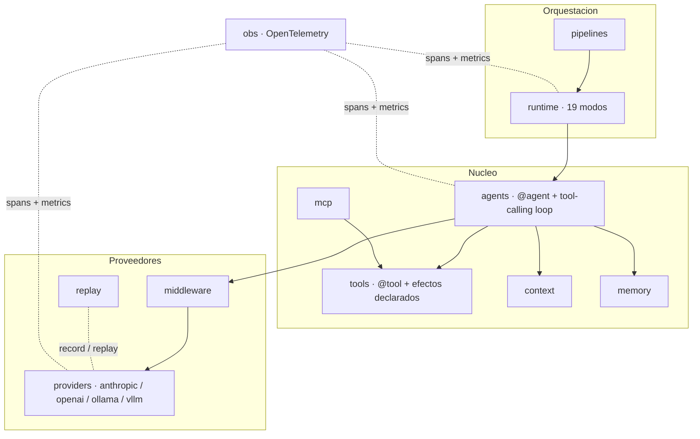

#

<div align="center">
  
</div>

<div align="center">

# Phronesis Framework

</div>

<div align="center">
  Sabiduría práctica para sistemas de agentes de IA: specs tipadas e inmutables, un catálogo cerrado de patrones de ejecución y observabilidad de serie.
</div>

<div align="center">
  <a href="./docs/index.md">docs</a> ·
  <a href="./examples/README.md">examples</a> ·
  <a href="./src/phronesis/">source</a> ·
  <a href="./tests/">tests</a>
</div>

<div align="center">

[]()
[]()
[]()
[]()
[]()

</div>

---

<div align="center">

## 🎯 Purpose

</div>

*Phronesis* (φρόνησις): para Aristóteles, la **sabiduría práctica** — la capacidad de
deliberar bien y actuar con juicio en situaciones concretas. Un LLM tiene *episteme*
(conocimiento). Un agente necesita *phronesis*.

La mayoría de los frameworks tratan a los agentes como chatbots mejorados pegados a un
bucle de tool-use. Phronesis los trata como sistemas deliberativos con contratos
explícitos:

- **Specs tipadas, inmutables y serializables a JSON.** Agentes, tools y pipelines son
  datos congelados; el estado de ejecución vive aparte, observable y consultable.
- **Catálogo cerrado de patrones de ejecución.** Diecinueve modos con nombre
  (`Sequence`, `Debate`, `Reflexion`, …) sobre los que se puede razonar — no flujo de
  control arbitrario que nadie podrá depurar seis meses después.
- **Observabilidad desde el primer commit.** Spans de OpenTelemetry para cada
  ejecución de agente, llamada a tool, etapa de pipeline y sesión MCP, correlacionados
  por ids estables.
- **Determinismo reproducible.** Record/replay de respuestas LLM en cassettes JSONL:
  los ejemplos y los tests corren sin red, byte a byte.

<div align="center">

## 📋 Examples

</div>

El agente más pequeño posible — una función como spec, el cuerpo se ignora:

```python
from phronesis.agents import agent
from phronesis.providers import anthropic
from phronesis.tools import tool


@tool
def add(a: int, b: int) -> int:
    """Sum two integers and return the result."""
    return a + b


@agent(
    model=anthropic(model="claude-sonnet-4-6"),
    tools=(add,),
    system_prompt="You are a precise calculator. Always use your tools.",
)
def calculator() -> str:
    """Answer arithmetic questions by chaining the calculator tools."""


result = await calculator.run("How much is (17 + 25) * 2?")
print(result.output)
```

Los agentes componen en grafos de ejecución mediante el runtime — aquí un equipo
paralelo cuyo resultado modera un debate:

```python
from phronesis.runtime import Debate, ExecutionContext, Parallel, Sequence, agent_node

pipeline = Sequence(
    nodes=(
        Parallel(nodes=(agent_node(fundamental), agent_node(sentiment))),
        Debate(
            participants=(agent_node(bull), agent_node(bear)),
            rounds=2,
            moderator=agent_node(manager),
        ),
    ),
)

outcome = await pipeline(ExecutionContext.new(), "AAPL @ 2024-01-15")
print(outcome.output)
```

El [catálogo de ejemplos](./examples/README.md) cubre los 19 modos con **22 ejemplos
ejecutables** (cada uno con cassette determinista) y una mini-app completa:
[`trading_agents`](./examples/trading_agents/), una reproducción del organigrama del
paper TradingAgents con 13 agentes en 5 fases, [comparada lado a lado](./examples/trading_agents/COMPARISON.md)
con la implementación original.

<div align="center">

## 🏗️ Architecture

</div>



| Área | Qué aporta | Docs |
|---|---|---|
| `agents` | `@agent`, sessions, streaming, tool-calling loop | [agents/](./docs/agents/index.md) |
| `tools` | `@tool`, efectos declarados, registro, schemas canónicos | [tools/](./docs/tools/index.md) |
| `runtime` | 19 modos de orquestación sobre el contrato `Executable` | [runtime/](./docs/runtime/index.md) |
| `pipelines` | composición declarativa con identidad y spans propios | [pipelines/](./docs/pipelines/index.md) |
| `providers` | adaptadores LLM: Anthropic, OpenAI, Ollama, vLLM, OpenWebUI | [providers/](./docs/providers/index.md) |
| `memory` | stores working / kv / vector / episodic + checkpoints | [memory/](./docs/memory/index.md) |
| `context` | `ContextBuilder` (default, compacting) + `Context` para tools | [context/](./docs/context/index.md) |
| `mcp` | cliente y servidor Model Context Protocol | [mcp/](./docs/mcp/index.md) |
| `middleware` | cadena onion sobre `LLMProvider.complete` | [middleware/](./docs/middleware/index.md) |
| `replay` | cassettes JSONL de record/replay | [replay/](./docs/replay/index.md) |
| `obs` | spans, métricas y correlación de logs (OTel opcional) | [obs/](./docs/obs/index.md) |
| `core` | tipos de dominio (`Message`, `ContentBlock`) | [core/](./docs/core/index.md) |
| `communication` | identidad de sesión (`SessionId`) | [communication/](./docs/communication/index.md) |
| `_internal` | http, ids, logging, retry, typing, concurrency | [internal/](./docs/internal/index.md) |

<div align="center">

## 📦 Execution modes

</div>

Un catálogo cerrado — suficientemente expresivo, suficientemente finito para razonar
sobre él. Todos los modos satisfacen el mismo contrato `Executable` y anidan entre sí.

| Categoría | Modos |
|---|---|
| Primitivas | `Sequence` · `Parallel` · `Race` · `Fallback` · `Cascade` |
| Control de flujo | `Conditional` · `Router` · `Loop` · `Retry` |
| Multiagente | `Consensus` · `HandoffChain` · `Supervisor` · `Debate` |
| Cognitivos | `Reflexion` · `Validation` · `PlanAndExecute` · `TreeSearch` · `MapReduce` |
| Human-in-the-loop | `Approval` |

<div align="center">

## 🛠️ Install

</div>

Python 3.11+ y [uv](https://docs.astral.sh/uv/):

```bash
git clone https://github.com/phronesis-framework/phronesis-framework
cd phronesis-framework
uv sync --extra dev
```

Extras opcionales: `obs` (OpenTelemetry SDK + OTLP) y `trading` (yfinance, para la
mini-app de ejemplos).

Los ejemplos corren deterministas contra su cassette, sin red ni API keys:

```bash
CASSETTE_PATH=examples/ex01_hello_agent/cassette.jsonl \
  uv run python -m examples.ex01_hello_agent.main
```

<div align="center">

## 🧪 Testing

</div>

Más de **1.650 tests** con cobertura de ramas bajo un umbral del **90%** que hace
fallar el build. La estructura de `tests/` refleja la de `src/`. Las respuestas LLM se
graban una vez (`RecordingProvider`) y se reproducen siempre (`ReplayProvider`), de
modo que el comportamiento de los agentes es reproducible en CI sin tocar la red.

<div align="center">

## 🚦 Quality gates

</div>

Todo cambio pasa, en este orden y en verde:

```bash
uv run ruff format <paths>
uv run ruff check <paths>
uv run mypy <paths>
uv run pytest -q
```

<div align="center">

## 🔮 Status

</div>

Phronesis está en **alfa temprana (v0.1.0)**: la API puede cambiar. Lo que ya está aquí
— specs tipadas e inmutables, 19 modos con nombre, record/replay determinista, OTel
desde el primer commit y un suelo de cobertura del 90% — está construido para durar.
Sin afirmaciones de producción ni casos de estudio inventados: solo el código y un
compromiso honesto con su diseño.
