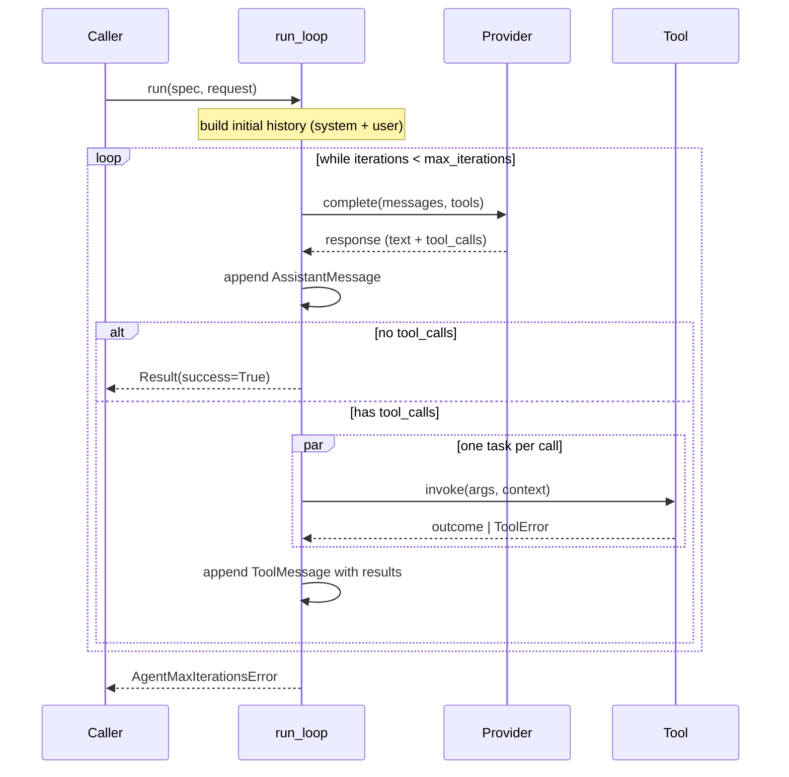
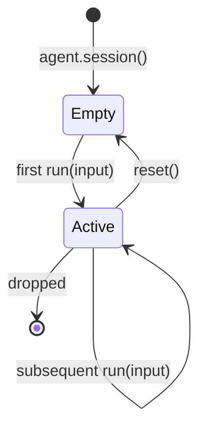
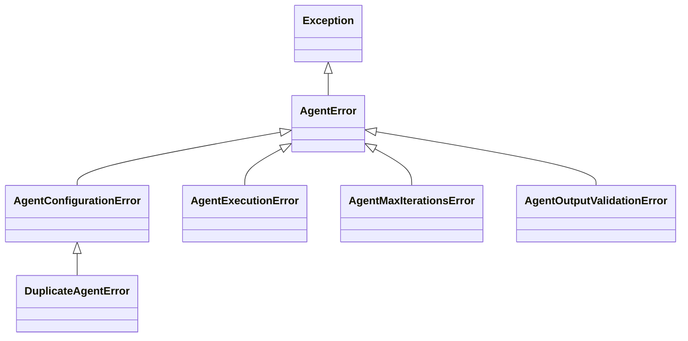

#

<div align="center">
  
</div>

<div align="center">

# Phronesis Framework - `agents`

</div>

<div align="center">
  Declarative <code>@agent</code> decorator and stateless <code>Agent</code> runtime that drive a typed, observable tool-calling loop on top of any LLM provider, with first-class multi-turn sessions and a tight error taxonomy.
</div>

<div align="center">
  <a href="../index.md">docs</a> ·
  <a href="../../src/phronesis/agents/">source</a> ·
  <a href="../../tests/agents/">tests</a>
</div>

<div align="center">

[]()
[]()
[]()
[]()

</div>

---

<div align="center">

## 🎯 Purpose

</div>

An `@agent`-decorated function (or a hand-built `AgentSpec`) becomes a **runnable unit** that:

1. **Holds configuration** (model, prompt, tools, output type, max iterations).
2. **Validates** itself at decoration time so misconfigurations surface eagerly.
3. **Runs** a tool-calling loop against an LLM provider with parallel tool execution.
4. **Tracks** token usage, emits OpenTelemetry spans/metrics, and surfaces a typed `Result`.
5. **Continues** across turns through `Session`, keeping the history outside the spec.

What the user writes:

```python
from phronesis import agent
from phronesis.providers import AnthropicProvider

@agent(model=AnthropicProvider(...), tools=(search, fetch))
def researcher() -> None:
    """Find sources and summarize them."""
```

What the framework derives for free:

- A stable **id** (`phronesis.agents.researcher`) and an LLM-facing **name** (`researcher`).
- A validated `AgentSpec` registered into the active registry.
- An `async run()` entry point that drives the tool-calling loop.
- A `session()` factory for multi-turn conversations.
- Spans (`phronesis.agents.run`, `step`, `tool_call`) and metrics (`agent_runs`, `agent_run_duration`, `agent_tool_calls_per_run`).

Non-goals (deliberately):

- Streaming token deltas - reserved for a later phase; the event types exist but the loop does not emit them yet.
- Structured output validation - the `output_type` field is honored in metadata only; runtime coercion is deferred.
- Multi-agent orchestration (handoffs, routing) - lives in a future `pipelines/` module.

<div align="center">

## 🏗️ Architecture

</div>

The module is split into a **pure-data side** (frozen specs, ids, results, events, errors) and an **executable side** (the loop, the agent wrapper, the session). The decorator stitches them together; the registry keeps them addressable.

```
                            +------------------+
                            |   decorator.py   |  @agent / @agent(...)
                            +------------------+
                                     |
              +----------------------+----------------------+
              |                      |                      |
              v                      v                      v
      +---------------+      +---------------+      +---------------+
      |   spec.py     |      |   agent.py    |      |  registry.py  |
      |   AgentSpec   |      |    Agent      |      |  agent_scope  |
      +---------------+      +---------------+      +---------------+
              ^                      |                      ^
              |                      |                      |
              |      +---------------+---------------+      |
              |      |               |               |      |
              |      v               v               v      |
              | +-----------+ +-----------+ +-----------+   |
              | |validation | |  loop.py  | | session.py|   |
              | |   .py     | | run_loop  | |  Session  |   |
              | +-----------+ +-----------+ +-----------+   |
              |       ^             |              |        |
              |       |             v              |        |
              |       |       +-----------+        |        |
              |       |       | events.py |        |        |
              |       |       +-----------+        |        |
              |       |                            |        |
      +---------------+   +---------------+   +-----------+ |
      |   errors      |   |   run.py      |   |   id.py   | |
      |     .py       |   | Result, etc.  |   | AgentId   | |
      +---------------+   +---------------+   +-----------+ |
                                                            |
                                +---------+-----------------+
                                | __init__|
                                |  .py    |
                                +---------+
```

**Pure-data side** (frozen, JSON-friendly):

- `id.py` - `AgentId`, `agent_id_generator`.
- `spec.py` - `AgentSpec` frozen dataclass.
- `run.py` - `RunRequest`, `RunId`, `TokenUsage`, `Result`.
- `events.py` - `RunStarted`, `TextDelta`, `ToolCallStarted`, `ToolCallCompleted`, `RunCompleted`, `RunFailed`.
- `errors.py` - `AgentError` hierarchy.

**Executable side**:

- `agent.py` - `Agent` wrapper with `run()` and `session()`.
- `loop.py` - `run_loop()` tool-calling engine.
- `session.py` - `Session` stateful conversation holder.
- `decorator.py` - `@agent` entry point.
- `registry.py` - process-wide registry + async-safe `agent_scope()`.
- `validation.py` - eager `validate_spec` plus warnings (`EmptySystemPromptWarning`).

<div align="center">

## 📦 Module layout

</div>

| File | Responsibility | Public symbols |
|---|---|---|
| `decorator.py` | `@agent` / `@agent(...)` decorator; assembles `AgentSpec`; validates and registers. | `agent` |
| `agent.py` | `Agent` callable: holds the spec, drives `run_loop`, hands out `Session` instances. | `Agent` |
| `spec.py` | Frozen description of an agent. No callable behavior. | `AgentSpec` |
| `loop.py` | Core tool-calling loop with parallel tool execution, error mapping, span/metric emission. | `run_loop` |
| `session.py` | Multi-turn history holder; reuses `run_loop` with `initial_history`. | `Session` |
| `events.py` | Streaming event vocabulary (reserved for the streaming phase). | `AgentEvent`, `RunStarted`, `TextDelta`, `ToolCallStarted`, `ToolCallCompleted`, `RunCompleted`, `RunFailed` |
| `id.py` | Internal identifier type for agents. | `AgentId`, `agent_id_generator` |
| `run.py` | Inputs and outputs of a single run. | `RunRequest`, `RunId`, `TokenUsage`, `Result` |
| `errors.py` | Agent-facing error hierarchy. | `AgentError`, `AgentConfigurationError`, `AgentExecutionError`, `AgentMaxIterationsError`, `AgentOutputValidationError`, `DuplicateAgentError` |
| `registry.py` | Thread-safe registry, async-safe `agent_scope()` via `ContextVar`. | `agent_scope`, `current_registry`, `AgentNotFoundError` |
| `validation.py` | Eager `AgentSpec` validation + `EmptySystemPromptWarning`. | `EmptySystemPromptWarning` |
| `__init__.py` | Public re-exports. | (see Public API) |

<div align="center">

## 🔌 Public API

</div>

### Imports

```python
from phronesis.agents import (
    # decorator and callable wrapper
    agent, Agent,
    # data
    AgentSpec, AgentId, Result, RunRequest, RunId, TokenUsage,
    # multi-turn
    Session,
    # registry
    agent_scope, current_registry,
    # events (streaming, reserved)
    AgentEvent, RunStarted, TextDelta,
    ToolCallStarted, ToolCallCompleted,
    RunCompleted, RunFailed,
    # errors and warnings
    AgentError, AgentConfigurationError, AgentExecutionError,
    AgentMaxIterationsError, AgentOutputValidationError,
    DuplicateAgentError, AgentNotFoundError,
    EmptySystemPromptWarning,
)
```

### `@agent`

```python
def agent(
    *,
    model: LLMProvider,
    name: str | None = None,
    id: str | None = None,
    description: str | None = None,
    system_prompt: str | None = None,
    tools: Iterable[Tool] | None = None,
    output_type: type | None = None,
    max_iterations: int | None = None,
    version: str | None = None,
) -> Callable[[Callable[..., Any]], Agent]: ...
```

| Argument | Inferred from | Override effect |
|---|---|---|
| `model` | required | The `LLMProvider` driving completions. |
| `name` | `fn.__name__` | LLM-facing handle. |
| `id` | `canonical_from_function(fn)` | Stable internal identifier. Collisions raise `DuplicateAgentError`. |
| `description` | `inspect.getdoc(fn)` first line | Free-form metadata. |
| `system_prompt` | `inspect.getdoc(fn)` | Seeds the initial `SystemMessage`. Empty prompt triggers `EmptySystemPromptWarning`. |
| `tools` | `()` | Tools bound to the agent. |
| `output_type` | `get_type_hints(fn).get("return")` | Reserved for structured output (metadata only today). |
| `max_iterations` | `8` | Safety cap on the tool-calling loop. |
| `version` | `"0.1.0"` | Semver-style string; informational. |

The function body is ignored (Model A): the decorator harvests metadata and returns an `Agent`. Eager validation runs `validate_spec`; failures raise `AgentConfigurationError` at import time.

### `Agent`

```python
class Agent:
    spec: AgentSpec

    async def run(self, input_or_request: str | RunRequest) -> Result: ...
    def session(self, session_id: SessionId | None = None) -> Session: ...
```

| Method | Purpose |
|---|---|
| `run(input)` | Single-shot run. Strings are wrapped into a `RunRequest`. |
| `session(id=None)` | Returns a `Session` that retains history across calls. |

### `Session`

```python
class Session:
    id: SessionId
    messages: tuple[Message, ...]

    async def run(self, input_or_request: str | RunRequest) -> Result: ...
    def reset(self) -> None: ...
```

Each `run` appends the user input to the existing history, executes `run_loop` with `initial_history=self.messages`, and absorbs the resulting tail. `reset()` clears history but preserves the `SessionId`. The session forces its own id on incoming `RunRequest`s.

### `RunRequest` and `Result`

```python
@dataclass(frozen=True, slots=True)
class RunRequest:
    input: str
    session_id: SessionId | None = None
    max_iterations: int | None = None
    metadata: Mapping[str, Any] = MappingProxyType({})

@dataclass(frozen=True, slots=True)
class Result:
    run_id: RunId
    output: str
    tokens: TokenUsage
    iterations: int
    tool_calls: tuple[ToolUseBlock, ...]
    messages: tuple[Message, ...]
```

`TokenUsage` aggregates `input_tokens`, `output_tokens`, `cache_read_tokens`, `cache_creation_tokens` across all provider calls of a run; missing fields stay `None`.

### `agent_scope` / `current_registry`

```python
@contextmanager
def agent_scope() -> Iterator[_AgentRegistry]: ...

def current_registry() -> _AgentRegistry: ...
```

Same `ContextVar`-based pattern as `tool_scope`: the scoped registry is visible only within the async block, and the previous one is restored on exit.

<div align="center">

## 📐 Design decisions

</div>

Full rationale is in [`../AGENTS-DECISIONS.md`](../AGENTS-DECISIONS.md). Headline-only enumeration:

| ID | Decision |
|---|---|
| D-01 | `@agent` and hand-built `AgentSpec` are both supported; the decorator is sugar. Function body is ignored (Model A). |
| D-02 | An agent is configured by: `model`, `system_prompt`, `tools`, `output_type`, `max_iterations`, `version`, `description`. |
| D-03 | `AgentSpec` (data, frozen, JSON-friendly) is split from `Agent` (callable runtime). |
| D-04 | `AgentId` is derived via `canonical_from_function` by default; explicit `id=` overrides. Collisions raise `DuplicateAgentError`. |
| D-05 | Public surface: `agent.run(...)` for single-shot; `agent.session().run(...)` for multi-turn; `stream` reserved for a later phase. |
| D-06 | `RunRequest` and `Result` are frozen dataclasses; `Result.messages` is the full transcript snapshot. |
| D-07 | The tool-calling loop is single-pass per turn: complete -> execute tool calls in parallel -> append results -> loop. |
| D-08 | `Message` (in `core.messages`) is the domain type; provider translation happens at the edge of the loop. |
| D-09 | `Session` is stateful, `Agent` is stateless. Session reuses `run_loop` with `initial_history`. |
| D-10 | Streaming events (`RunStarted`, `TextDelta`, `ToolCallStarted/Completed`, `RunCompleted`, `RunFailed`) are defined but not emitted yet. |
| D-11 | `AgentError` hierarchy: `AgentConfigurationError` (decoration time), `AgentExecutionError` (runtime), `AgentMaxIterationsError` (loop cap), `AgentOutputValidationError` (reserved). |
| D-12 | `validate_spec` runs eagerly at decoration; empty `system_prompt` warns rather than errors (`EmptySystemPromptWarning`). |

<div align="center">

## 📊 Diagrams

</div>

### Tool-calling loop



### Session lifecycle



### Error taxonomy



`ToolError` raised inside a tool is **not** an `AgentError`; the loop serializes it back to the model as a `ToolResultBlock` with `is_error=True`. Any other exception from a tool is wrapped into `AgentExecutionError`.

<div align="center">

## 📋 Examples

</div>

### Minimal agent

```python
from phronesis import agent
from phronesis.providers import AnthropicProvider

@agent(model=AnthropicProvider(model="claude-3-5-sonnet"))
def assistant() -> None:
    """You are a helpful assistant."""

result = await assistant.run("Hello!")
print(result.output)
print(result.tokens.input_tokens, result.tokens.output_tokens)
```

### Agent with tools

```python
from phronesis import agent, tool

@tool
def add(a: int, b: int) -> int:
    """Sum two integers."""
    return a + b

@agent(model=provider, tools=(add,))
def calculator() -> None:
    """Solve arithmetic by calling `add`."""

result = await calculator.run("What is 17 + 25?")
```

Tool calls are executed in parallel per turn via `asyncio.gather`. `ToolError` instances are serialized back to the model so it can self-correct; everything else aborts the run with `AgentExecutionError`.

### Multi-turn session

```python
sess = assistant.session()

await sess.run("My name is Alice.")
result = await sess.run("What is my name?")

assert "Alice" in result.output

sess.reset()             # history cleared, SessionId preserved
```

### Explicit `RunRequest`

```python
from phronesis.agents import RunRequest

req = RunRequest(
    input="Summarize the doc.",
    max_iterations=4,
    metadata={"trace_hint": "ingest"},
)

result = await assistant.run(req)
```

`metadata` flows through to tools via the injected `Context`.

### Context inside a tool

```python
from phronesis import tool, Context

@tool
def remember(payload: str, ctx: Context) -> dict[str, str]:
    """Tag with the current run id."""
    return {"run": ctx.run_id.canonical, "payload": payload}
```

The loop builds the `Context` (`run_id`, `agent_id`, `session_id`, `metadata`) and injects it into any tool parameter typed as `Context`.

### Scoped registry

```python
from phronesis.agents import agent_scope, current_registry

with agent_scope() as scope:
    @agent(model=provider)
    def scoped() -> None:
        """Visible only inside the scope."""

    assert scope.lookup(scoped.spec.id) is scoped
```

<div align="center">

## 🔗 Dependencies

</div>

### Hard dependencies

- **`phronesis.providers`** - the `LLMProvider` protocol and request/response types.
- **`phronesis.tools`** - `Tool` and `ToolError` (loop serializes the latter).
- **`phronesis.core.messages`** - domain `Message` hierarchy.
- **`phronesis.context.context`** - `Context` built per run and injected into tools.
- **`phronesis.communication.session_id`** - `SessionId` used by `Session`.
- **`phronesis._internal.ids.derivation`** - `canonical_from_function` for default ids.

### Soft dependencies

- **`phronesis.obs`** - spans and metrics. When the `obs` extra is absent everything degrades to no-op instruments.

### Who depends on `phronesis.agents`

Top-level convenience re-exports `agent`, `Agent`, `Session`. The future `pipelines/` module will be the first orchestrating consumer.

<div align="center">

## ⚠️ Pitfalls

</div>

- **Function body is ignored.** `@agent` is metadata-only (Model A). Writing logic in the decorated function is a no-op.
- **`<locals>` in qualified names break id derivation.** Define agents at module level; nesting under a class or function yields canonical ids that fail `AgentId` validation.
- **Sessions force their own id on `RunRequest`.** Passing a different `session_id` inside the request is silently overridden by `Session.id`.
- **`AgentMaxIterationsError` is raised, not returned.** A misbehaving model that keeps calling tools will trip the cap; callers must catch it.
- **`ToolError` does not abort the run.** It is serialized back to the model as a tool result with `is_error=True` so the model can self-correct.
- **`output_type` is metadata today.** Structured output validation is reserved; the loop returns the raw text in `Result.output`.
- **`Session` is not thread-safe.** Coordinate concurrent calls in user code if needed.
- **Empty `system_prompt` warns.** `EmptySystemPromptWarning` fires at decoration; promote to error in your test suite if you want it strict.

<div align="center">

## 🧪 Testing

</div>

Tests mirror the source layout under `tests/agents/`:

| Test file | What it covers |
|---|---|
| `test_id.py` | `AgentId` validation and generator. |
| `test_run.py` | `RunRequest`, `RunId`, `TokenUsage`, `Result` invariants. |
| `test_spec.py` | `AgentSpec` construction, equality, frozen behavior. |
| `test_validation.py` | `validate_spec` rules and `EmptySystemPromptWarning`. |
| `test_events.py` | Event types and the `AgentEvent` union. |
| `test_errors.py` | `AgentError` hierarchy, codes, details. |
| `test_registry.py` | Global registry, `agent_scope`, isolation, duplicate detection. |
| `test_agent.py` | `Agent` wrapper, `run` shortcut, `session` factory. |
| `test_loop.py` | Loop primitives: simple completion, parallel tools, error serialization, provider failure, max-iterations, usage aggregation, history translation. |
| `test_loop_context.py` | `Context` injection (agent_id, run_id, session_id, metadata). |
| `test_loop_obs.py` | Spans (`run`, `step`, `tool_call`) and metrics (`agent_runs`, `agent_run_duration`, `agent_tool_calls_per_run`). |
| `test_session.py` | Construction, single-turn, multi-turn continuation, request coercion, reset, repr. |
| `test_decorator.py` | `@agent` / `@agent(...)` forms, inference, overrides, registration. |
| `test_public_api.py` | `__all__` invariants and key re-export identities. |

Counts:

- `tests/agents/` - **171 tests**.

Common patterns used:

- `_ScriptedProvider` fixture: queues `LLMResponse` objects to drive the loop deterministically.
- Module-level `@tool` definitions to avoid `<locals>` in `__qualname__`.
- `monkeypatch.setattr(loop_module, "start_span_async", ...)` and fake metric instruments to assert obs emission without bringing up the OpenTelemetry SDK.
- `pytest.mark.asyncio` (auto mode) to drive coroutines.

<div align="center">

## 🚦 Quality gates

</div>

```
uv run ruff format src/phronesis/agents tests/agents
uv run ruff check src/phronesis/agents tests/agents
uv run mypy src/phronesis/agents
uv run pytest tests/agents -q
```

All four must be green before commit. `mypy` is configured in strict mode.

<div align="center">

## 🛠️ Tech stack

</div>

| Library | Version | Used for |
|---|---|---|
| Python | `>= 3.11` | `Annotated`, `Self`, dataclass `slots=True`, `StrEnum`. |
| stdlib | - | `asyncio`, `inspect`, `contextvars`, `types.MappingProxyType`, `typing.get_type_hints`. |
| OpenTelemetry | optional (`obs` extra) | spans (`phronesis.agents.run`, `step`, `tool_call`) and metric instruments. |

<div align="center">

## 🔮 Future work

</div>

- **Streaming (`stream`)** - emit `TextDelta`, `ToolCallStarted`, `ToolCallCompleted` from the loop; the event types already exist.
- **Structured output coercion** - validate `Result.output` against `output_type` (likely Pydantic-backed); raise `AgentOutputValidationError` on mismatch.
- **Pipelines / handoffs** - multi-agent orchestration lives in a future `pipelines/` module; `agents/` only describes a single runnable unit.
- **Budgeting** - hook `Context.budget` into the loop to short-circuit on token/cost limits.
- **Retries inside the loop** - currently provider exceptions abort the run; a configurable retry policy will plug into `phronesis._internal.retry`.
- **Tool effect policies** - integration with the future `policy/` module to gate effectful tools (`REQUIRES_CONFIRMATION`, `EXPENSIVE`) before invocation.
