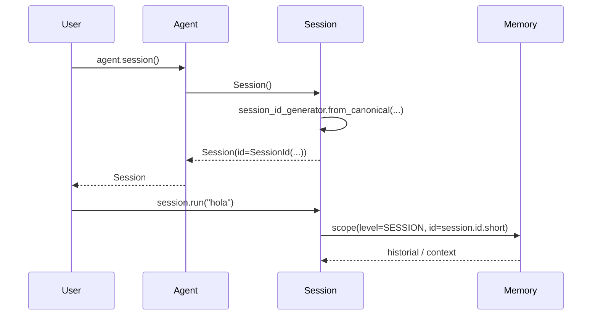

#

<div align="center">
  
</div>

<div align="center">

# Phronesis Framework - Communication

</div>

<div align="center">
  Identidad estable para sesiones de conversación: <code>SessionId</code>. Una pieza diminuta que hila agents, runs, contexto y memoria.
</div>

<div align="center">
  <a href="../index.md">docs</a> ·
  <a href="../../src/phronesis/communication/">source</a> ·
  <a href="../../tests/communication/">tests</a>
</div>

<div align="center">

[]()
[]()
[]()

</div>

---

<div align="center">

## 🎯 Purpose

</div>

Toda conversación multi-turno necesita un identificador estable: para mantener historial, para namespace de memoria, para correlación en logs y spans, para reanudar una sesión interrumpida. `phronesis.communication` provee exactamente eso, y nada más:

- Un tipo `SessionId` (subclase de `Id`, prefijo `SID`).
- Un generador singleton `session_id_generator`.

El módulo es deliberadamente pequeño. Cualquier metadata adicional de la sesión (creado_en, agent_id, propietario, etc.) vive en `phronesis.agents.Session`, no aquí. Esto preserva cohesión: identidad y datos viven separados.

<div align="center">

## 🏗️ Architecture

</div>

`SessionId` extiende `phronesis._internal.ids.Id` con el prefijo `"SID"`. La clase base aporta:

- Forma canónica con namespace (ej. `phronesis.sessions.abc123`).
- Forma corta para logs (ej. `SID-abc12345`).
- Validación estricta del canonical en el constructor.

```
session_id_generator.from_canonical("phronesis.sessions.demo")
   ──► SessionId.canonical = "phronesis.sessions.demo"
   ──► SessionId.short     = "SID-<hash>"
```

Tres puntos de consumo en el framework:

1. **`agents/session.py`** - cada `Session()` nueva genera un `SessionId` y lo guarda en `self.id`.
2. **`agents/run.py`** - `RunRequest.session_id: SessionId | None` permite atar un run a una sesión existente.
3. **`memory/scope.py`** - `MemoryLevel.SESSION` usa el `short` del `SessionId` para namespace de las stores de memoria.

<div align="center">

## 📦 Module layout

</div>

| Fichero | Responsabilidad |
|---|---|
| `__init__.py` | Docstring del paquete (sin re-exports; el módulo es lo bastante pequeño para importar desde `session_id` directamente). |
| `session_id.py` | `SessionId(Id)` con `prefix = "SID"` y `session_id_generator: IdGenerator[SessionId]`. |

<div align="center">

## 🔌 Public API

</div>

```python
from phronesis.communication.session_id import SessionId, session_id_generator
```

Shapes:

```python
class SessionId(Id):
    """Identificador estable para una sesión multi-turno."""
    prefix = "SID"

session_id_generator: IdGenerator[SessionId]
```

API heredada de `Id`:

```python
sid = session_id_generator.from_canonical("phronesis.sessions.demo")

sid.canonical    # "phronesis.sessions.demo"
sid.short        # "SID-<hash>"
str(sid)         # "phronesis.sessions.demo"
SessionId("phronesis.sessions.demo") == sid
```

<div align="center">

## 📐 Design decisions

</div>

- **D-01 Una sola responsabilidad.** El módulo expone identidad y nada más. Metadata, lifecycle hooks y persistencia viven en `Session`, no aquí.
- **D-02 Subclase de `Id` (no string).** Aprovecha la validación canonical / short del módulo `_internal.ids`, evita typos y permite type-checking estricto (`def foo(sid: SessionId)` distinto de `def foo(sid: str)`).
- **D-03 Prefijo corto y explícito.** `SID` aparece en logs cuando se usa la forma `short`. Tres letras bastan, son inequívocas y casan con la convención del resto de IDs (`TID`, `AID`, `MID`, `MSID`, ...).
- **D-04 Generador singleton.** `session_id_generator` se importa, no se construye. Reduce ruido en agents/runtime y centraliza el punto de creación.
- **D-05 Sin `__all__` explícito en `__init__.py`.** El paquete es tan pequeño que la convención es importar directamente desde `session_id`. Mantiene el `__init__.py` minimal a propósito.

<div align="center">

## 📊 Diagrams

</div>

Ciclo de vida típico de un `SessionId`:



<div align="center">

## 🔗 Dependencies

</div>

- `phronesis._internal.ids.id.Id` - clase base.
- `phronesis._internal.ids.generator.IdGenerator` - factory genérica.

Quien depende:

- `phronesis.agents.agent` - type-hint y creación de `Session`.
- `phronesis.agents.session` - generación y almacenamiento del id.
- `phronesis.agents.run` - campo opcional en `RunRequest`.
- `phronesis.context.context` - type-hint en `Context` (import lazy).
- `phronesis.memory.scope` - referencia documental en `MemoryLevel.SESSION`.

<div align="center">

## 🧪 Testing

</div>

Tests en `tests/communication/test_session_id.py`:

- `SessionId.prefix == "SID"`.
- `SessionId` es subclase de `Id`.
- Validación de canonical (formato correcto / incorrecto).
- Forma corta sigue el patrón `SID-<hash>`.
- `session_id_generator.from_canonical` construye instancias válidas.
- Errores apropiados ante canonical inválido.

Cobertura: 100%.

<div align="center">

## 📋 Examples

</div>

Crear un id explícito:

```python
from phronesis.communication.session_id import session_id_generator

sid = session_id_generator.from_canonical("phronesis.sessions.demo")
print(sid.canonical)  # "phronesis.sessions.demo"
print(sid.short)      # "SID-<hash>"
```

Usar el id como namespace de memoria:

```python
from phronesis.memory.scope import MemoryLevel, MemoryScope

scope = MemoryScope(level=MemoryLevel.SESSION, id=sid.short)
# las stores de memoria namespacean por scope, aislando datos por sesión
```

Reanudar una sesión pasada a un run:

```python
from phronesis.agents.run import RunRequest

req = RunRequest(input="continúa donde lo dejamos", session_id=sid)
```

<div align="center">

## ⚠️ Pitfalls

</div>

- **No mezclar `SessionId` con `str`** en firmas. `def run(sid: SessionId)` es estricto y captura bugs en mypy; `def run(sid: str)` los esconde.
- **`SessionId(...)` valida el canonical**. Pasar un string que no respete el formato `phronesis.<namespace>.<segment>` lanza un error en construcción.
- **`session_id_generator` es singleton**. No construyas `IdGenerator(SessionId)` a mano salvo en tests muy específicos; reutiliza el existente.
- **`Id` está en `_internal`**. No importes `Id` directamente para chequeos de tipo desde código de usuario; usa siempre `SessionId`.
- **El módulo no persiste nada**. Si necesitas que un `SessionId` sobreviva entre procesos, guárdate `sid.canonical` y reconstruye con `session_id_generator.from_canonical(...)`.

<div align="center">

## 🚦 Quality gates

</div>

```
uv run ruff format src/phronesis/communication tests/communication
uv run ruff check src/phronesis/communication tests/communication
uv run mypy src/phronesis/communication
uv run pytest tests/communication -q
uv run pytest -q
```

<div align="center">

## 🛠️ Tech stack

</div>

- Python 3.11+.
- Sólo `phronesis._internal.ids` y stdlib.

<div align="center">

## 🔮 Future work

</div>

- **Subtipos** - `ConversationId`, `WorkflowId` si surgen casos donde una "sesión" no captura bien la unidad.
- **Adapters** - helpers para mapear `SessionId` desde IDs externos (Slack thread, ticket id, ...) preservando estabilidad.
- **Más routing** - el package incluye "message routing" en su docstring pero sólo aloja identidad; si en el futuro el framework necesita dispatch multi-canal, este es el sitio natural.
