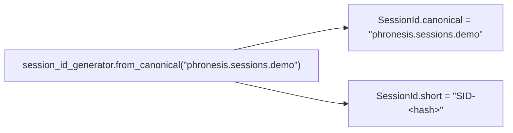
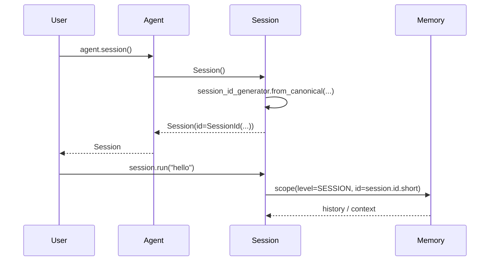

#

<div align="center">
  
</div>

<div align="center">

# Phronesis Framework - Communication

</div>

<div align="center">
  Stable identity for conversation sessions: <code>SessionId</code>. A tiny piece that ties together agents, runs, context and memory.
</div>

<div align="center">

[]()
[]()
[]()

</div>

---

<div align="center">

## 🎯 Purpose

</div>

Every multi-turn conversation needs a stable identifier: to keep history, to namespace memory, for correlation in logs and spans, to resume an interrupted session. `phronesis.communication` provides exactly that, and nothing more:

- A `SessionId` type (subclass of `Id`, prefix `SID`).
- A singleton generator `session_id_generator`.

The module is deliberately small. Any additional session metadata (created_at, agent_id, owner, etc.) lives in `phronesis.agents.Session`, not here. This preserves cohesion: identity and data live apart.

<div align="center">

## 🏗️ Architecture

</div>

`SessionId` extends `phronesis._internal.ids.Id` with the prefix `"SID"`. The base class provides:

- Namespaced canonical form (e.g. `phronesis.sessions.abc123`).
- Short form for logs (e.g. `SID-abc12345`).
- Strict validation of the canonical form in the constructor.


```mermaid
flowchart LR
    G["session_id_generator.from_canonical(#quot;phronesis.sessions.demo#quot;)"] --> C["SessionId.canonical = #quot;phronesis.sessions.demo#quot;"]
    G --> S["SessionId.short = #quot;SID-#lt;hash#gt;#quot;"]
```

Three consumption points in the framework:

1. **`agents/session.py`** - every new `Session()` generates a `SessionId` and stores it in `self.id`.
2. **`agents/run.py`** - `RunRequest.session_id: SessionId | None` lets you bind a run to an existing session.
3. **`memory/scope.py`** - `MemoryLevel.SESSION` uses the `short` form of the `SessionId` to namespace the memory stores.

<div align="center">

## 📦 Module layout

</div>

| File | Responsibility |
|---|---|
| `__init__.py` | Package docstring (no re-exports; the module is small enough to import from `session_id` directly). |
| `session_id.py` | `SessionId(Id)` with `prefix = "SID"` and `session_id_generator: IdGenerator[SessionId]`. |

<div align="center">

## 🔌 Public API

</div>

```python
from phronesis.communication.session_id import SessionId, session_id_generator
```

Shapes:

```python
class SessionId(Id):
    """Stable identifier for a multi-turn session."""
    prefix = "SID"

session_id_generator: IdGenerator[SessionId]
```

API inherited from `Id`:

```python
sid = session_id_generator.from_canonical("phronesis.sessions.demo")

sid.canonical    # "phronesis.sessions.demo"
sid.short        # "SID-<hash>"
str(sid)         # "phronesis.sessions.demo"
SessionId("phronesis.sessions.demo") == sid
```

<div align="center">

## 📐 Design decisions

</div>

- **D-01 Single responsibility.** The module exposes identity and nothing else. Metadata, lifecycle hooks and persistence live in `Session`, not here.
- **D-02 Subclass of `Id` (not a string).** Leverages the canonical / short validation of the `_internal.ids` module, avoids typos and enables strict type-checking (`def foo(sid: SessionId)` is distinct from `def foo(sid: str)`).
- **D-03 Short, explicit prefix.** `SID` appears in logs when the `short` form is used. Three letters are enough, unambiguous and consistent with the convention of the other IDs (`TID`, `AID`, `MID`, `MSID`, ...).
- **D-04 Singleton generator.** `session_id_generator` is imported, not constructed. Reduces noise in agents/runtime and centralizes the creation point.
- **D-05 No explicit `__all__` in `__init__.py`.** The package is so small that the convention is to import directly from `session_id`. Keeps `__init__.py` minimal on purpose.

<div align="center">

## 📊 Diagrams

</div>

Typical lifecycle of a `SessionId`:


```mermaid
sequenceDiagram
    participant User
    participant Agent
    participant Session
    participant Memory

    User->>Agent: agent.session()
    Agent->>Session: Session()
    Session->>Session: session_id_generator.from_canonical(...)
    Session-->>Agent: Session(id=SessionId(...))
    Agent-->>User: Session
    User->>Session: session.run("hello")
    Session->>Memory: scope(level=SESSION, id=session.id.short)
    Memory-->>Session: history / context
```

<div align="center">

## 🔗 Dependencies

</div>

- `phronesis._internal.ids.id.Id` - base class.
- `phronesis._internal.ids.generator.IdGenerator` - generic factory.

Dependents:

- `phronesis.agents.agent` - type hint and creation of `Session`.
- `phronesis.agents.session` - id generation and storage.
- `phronesis.agents.run` - optional field in `RunRequest`.
- `phronesis.context.context` - type hint in `Context` (lazy import).
- `phronesis.memory.scope` - documentation reference in `MemoryLevel.SESSION`.

<div align="center">

## 🧪 Testing

</div>

Tests in `tests/communication/test_session_id.py`:

- `SessionId.prefix == "SID"`.
- `SessionId` is a subclass of `Id`.
- Canonical validation (valid / invalid format).
- Short form follows the `SID-<hash>` pattern.
- `session_id_generator.from_canonical` builds valid instances.
- Appropriate errors on invalid canonical input.

Coverage: 100%.

<div align="center">

## 📋 Examples

</div>

Create an explicit id:

```python
from phronesis.communication.session_id import session_id_generator

sid = session_id_generator.from_canonical("phronesis.sessions.demo")
print(sid.canonical)  # "phronesis.sessions.demo"
print(sid.short)      # "SID-<hash>"
```

Use the id as a memory namespace:

```python
from phronesis.memory.scope import MemoryLevel, MemoryScope

scope = MemoryScope(level=MemoryLevel.SESSION, id=sid.short)
# memory stores namespace by scope, isolating data per session
```

Resume a past session in a run:

```python
from phronesis.agents.run import RunRequest

req = RunRequest(input="continue where we left off", session_id=sid)
```

<div align="center">

## ⚠️ Pitfalls

</div>

- **Do not mix `SessionId` with `str`** in signatures. `def run(sid: SessionId)` is strict and catches bugs in mypy; `def run(sid: str)` hides them.
- **`SessionId(...)` validates the canonical form**. Passing a string that does not follow the `phronesis.<namespace>.<segment>` format raises an error at construction.
- **`session_id_generator` is a singleton**. Do not build `IdGenerator(SessionId)` by hand except in very specific tests; reuse the existing one.
- **`Id` lives in `_internal`**. Do not import `Id` directly for type checks from user code; always use `SessionId`.
- **The module persists nothing**. If you need a `SessionId` to survive across processes, keep `sid.canonical` and rebuild it with `session_id_generator.from_canonical(...)`.

<div align="center">

## 🚦 Quality gates

</div>

```
uv run ruff format src/phronesis/communication tests/communication
uv run ruff check src/phronesis/communication tests/communication
uv run mypy src/phronesis/communication
uv run pytest tests/communication -q
uv run pytest -q
```

<div align="center">

## 🛠️ Tech stack

</div>

- Python 3.11+.
- Only `phronesis._internal.ids` and stdlib.

<div align="center">

## 🔮 Future work

</div>

- **Subtypes** - `ConversationId`, `WorkflowId` if cases arise where a "session" does not capture the unit well.
- **Adapters** - helpers to map `SessionId` from external IDs (Slack thread, ticket id, ...) while preserving stability.
- **More routing** - the package mentions "message routing" in its docstring but only hosts identity; if the framework ever needs multi-channel dispatch, this is the natural place.
