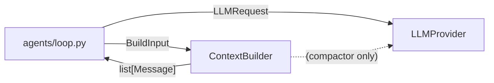
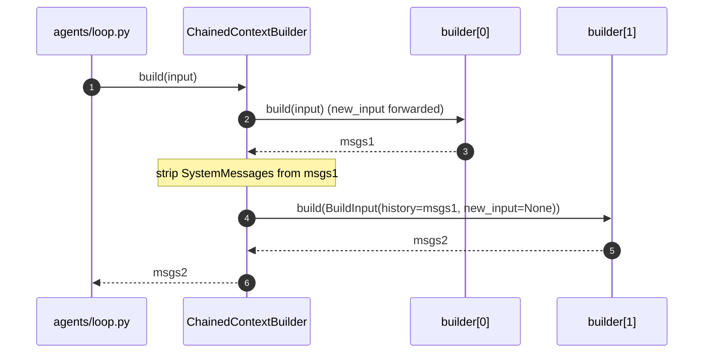
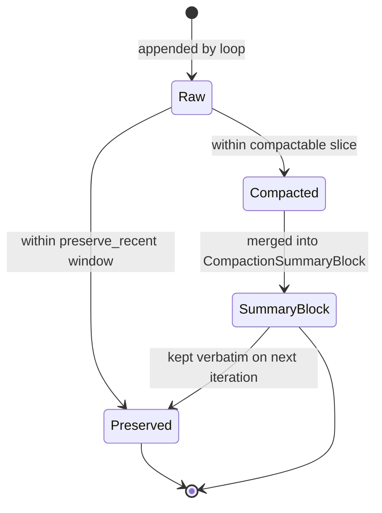

#

<div align="center">
  
</div>

<div align="center">

# Phronesis Framework - `context`

</div>

<div align="center">
  Pluggable <code>ContextBuilder</code> abstraction that turns accumulated run state into the message list sent to the LLM provider, with reference implementations for pass-through and LLM-driven compaction.
</div>

<div align="center">
  <a href="../index.md">docs</a> ·
  <a href="../../src/phronesis/context/">source</a> ·
  <a href="../../tests/context/">tests</a>
</div>

<div align="center">

[]()
[]()
[]()
[]()

</div>

---

<div align="center">

## 🎯 Purpose

</div>

The `context/` package gives agent runs an explicit, swappable seam between **what the framework knows** (system prompt, accumulated history, optional new input, the active provider) and **what gets sent to the LLM on every iteration**. That seam is the `ContextBuilder` protocol.

Two reference implementations ship with the framework:

- **`DefaultContextBuilder`** - trivial pass-through. Returns `[SystemMessage, *history, new_input?]` without any token estimation. The agent loop installs it by default.
- **`CompactingContextBuilder`** - estimates token usage via `LLMProvider.count_tokens` and, when the history exceeds a configurable fraction of `LLMProvider.context_window_size()`, replaces the older portion with an LLM-generated summary stored as a `CompactionSummaryBlock`.

The package is **opt-in for advanced behaviour**: every agent gets `DefaultContextBuilder` unless the user opts into compaction (or a custom builder) through the `context_builder` argument of `@agent`.

Non-goals (deliberately deferred):

- Truncating / summarising / RAG builders.
- `MemoryStore` / `Policy` slots inside `BuildInput`.
- Exact tokenization (tiktoken, Anthropic counting endpoint) - the providers ship a 4-chars/token heuristic for the MVP.
- Streaming compaction (incremental summarisation).

<div align="center">

## 🏗️ Architecture

</div>

The module separates the **contract** (`protocol.py`, `input.py`, `errors.py`) from the **implementations** (`default.py`, `compacting.py`). The loop never imports a concrete builder; it only calls `spec.context_builder.build(input)` and forwards the result to the provider.



`CompactingContextBuilder` may issue a **secondary** call to either the run's provider or an overridden `compactor_provider` to generate the summary text. Failures are surfaced as `CompactionError` - the builder never silently falls back.

<div align="center">

## 📦 Module layout

</div>

```
src/phronesis/context/
├── __init__.py          re-exports the public surface
├── protocol.py          ContextBuilder (runtime_checkable Protocol)
├── input.py             BuildInput (frozen dataclass)
├── default.py           DefaultContextBuilder
├── compacting.py        CompactingContextBuilder + helpers
├── chain.py             ChainedContextBuilder + chain() factory
├── dry_run.py           dry_run() helper + DryRunReport
├── errors.py            ContextError -> ContextBuilderError -> CompactionError
├── budget.py            Budget (tool-side, predates this module)
└── context.py           Context (tool-side, predates this module)
```

The two pre-existing files (`budget.py`, `context.py`) belong to a separate concern (the `Context` object injected into tool callables). They share a package because both are "execution context" abstractions and live close to the loop.

<div align="center">

## 🔌 Public API

</div>

```python
from phronesis.context import (
    BuildInput,
    ChainedContextBuilder,
    CompactingContextBuilder,
    CompactionError,
    ContextBuilder,
    ContextBuilderError,
    ContextError,
    DefaultContextBuilder,
    DryRunReport,
    chain,
    dry_run,
)
```

Key shapes:

```python
@runtime_checkable
class ContextBuilder(Protocol):
    async def build(self, input: BuildInput) -> list[Message]: ...

@dataclass(frozen=True, slots=True)
class BuildInput:
    system_prompt: str
    history: tuple[Message, ...]
    new_input: Message | None
    provider: LLMProvider
```

`CompactingContextBuilder` constructor:

| Parameter            | Default | Meaning                                                                 |
|----------------------|---------|-------------------------------------------------------------------------|
| `threshold_ratio`    | `0.8`   | Fraction of `provider.context_window_size()` above which compaction triggers. |
| `preserve_recent`    | `6`     | Trailing messages always kept verbatim.                                  |
| `compactor_provider` | `None`  | Optional override; defaults to the run's provider.                       |
| `compaction_prompt`  | `None`  | Override for the internal summarisation system prompt.                  |

Composition helper:

```python
class ChainedContextBuilder:
    builders: tuple[ContextBuilder, ...]

    def __init__(self, builders: Sequence[ContextBuilder]) -> None: ...
    async def build(self, input: BuildInput) -> list[Message]: ...

def chain(*builders: ContextBuilder) -> ChainedContextBuilder: ...
```

`ChainedContextBuilder` runs each child in order. Only the **first** builder sees `input.new_input`; the rest receive `new_input=None` because the input has already been folded into the running history. Any `SystemMessage` produced by an intermediate builder is stripped before the next child runs - only the last builder in the chain can contribute system messages to the final output. `input.provider` is forwarded verbatim. An empty `builders` raises `ValueError`.

Inspect-only helper:

```python
@dataclass(frozen=True, slots=True)
class DryRunReport:
    messages: tuple[Message, ...]
    message_count: int
    token_estimate: int
    window_size: int
    within_window: bool

async def dry_run(
    builder: ContextBuilder,
    *,
    provider: LLMProvider,
    system_prompt: str = "",
    history: Sequence[Message] = (),
    new_input: Message | None = None,
) -> DryRunReport: ...
```

`dry_run` invokes `builder.build(...)` with a synthetic `BuildInput`, then computes `provider.count_tokens(messages)` and `provider.context_window_size()`. It has no other side effects: no completions are issued, no run state is mutated. Use it to snapshot what a builder would emit at a given history depth.

<div align="center">

## 📐 Design decisions

</div>

Summarised here; the full rationale lives in `docs/CONTEXT-DECISIONS.md`.

- **Protocol over base class** - lets users plug RAG, memory or custom compaction without inheriting from framework types.
- **Stateless builders** - the state lives in the history. Two concurrent runs may share a builder instance.
- **History carries the summary** - `CompactionSummaryBlock` is a regular `ContentBlock` inside an `AssistantMessage`, so a re-entrant loop detects already-compacted prefixes and skips re-compaction.
- **Compaction failures propagate** - no silent fallback. The agent loop surfaces them as `AgentExecutionError`.
- **Tool-pair safety** - the split point is walked left until it never lands between a `ToolUseBlock` and its matching `ToolResultBlock`.

<div align="center">

## 📊 Diagrams

</div>

Sequence of a compacting iteration:

```mermaid
sequenceDiagram
    autonumber
    participant Loop as agents/loop.py
    participant Builder as CompactingContextBuilder
    participant Provider as LLMProvider
    participant Compactor as Compactor LLM

    Loop->>Builder: build(BuildInput)
    Builder->>Provider: count_tokens(history)
    Provider-->>Builder: used
    Builder->>Provider: context_window_size()
    Provider-->>Builder: limit

    alt used / limit < threshold
        Builder-->>Loop: [system, *history, new_input?]
    else above threshold
        Builder->>Compactor: complete(summarisation request)
        Compactor-->>Builder: summary text
        Builder-->>Loop: [system, *prior_summaries, new_summary, *preserved, new_input?]
    end
```

Composition through `ChainedContextBuilder`:



State of a message inside the history across iterations:



<div align="center">

## 🔗 Dependencies

</div>

- `phronesis.core.messages` - `Message`, `ContentBlock`, `CompactionSummaryBlock`.
- `phronesis.providers.protocol` - `LLMProvider`, `context_window_size()`, `count_tokens()`.
- `phronesis.providers.types` - `LLMRequest`, `Message as ProviderMessage`, `Role`.
- `phronesis.errors` - `PhronesisError` (base for the error hierarchy).
- `phronesis.obs.attributes` - `context.builder`, `context.history_size`, `context.compacted` constants.

Downstream consumers:

- `phronesis.agents.spec` - holds the `context_builder` field.
- `phronesis.agents.decorator` - injects `DefaultContextBuilder` when the user omits the override.
- `phronesis.agents.loop` - wraps `build(...)` in the `phronesis.context.build` span.

<div align="center">

## 🧪 Testing

</div>

The package is exercised by:

- `tests/context/test_protocol.py` - runtime `isinstance` checks against the `Protocol`.
- `tests/context/test_input.py` - frozen, slotted dataclass invariants.
- `tests/context/test_errors.py` - exception hierarchy.
- `tests/context/test_default.py` - empty / non-empty histories, system prompt placement, `new_input` appending, statelessness.
- `tests/context/test_compacting.py` - threshold gating, compaction output shape, tool-pair preservation, prior summary preservation, leading system message preservation, compactor failures, override provider, concurrent runs.
- `tests/agents/test_loop_context_builder.py` - integration: `@agent` with a custom builder, the loop invokes `build()` once per iteration, custom output reaches the provider.

<div align="center">

## 📋 Examples

</div>

Opting into compaction:

```python
from phronesis import agent
from phronesis.context import CompactingContextBuilder
from phronesis.providers.anthropic import AnthropicProvider

provider = AnthropicProvider(model="claude-3-5-sonnet-20241022", api_key=...)

@agent(
    model=provider,
    context_builder=CompactingContextBuilder(
        threshold_ratio=0.7,
        preserve_recent=4,
    ),
)
def long_running_assistant() -> None:
    """Stay productive across thousands of turns."""
```

Using a different provider for the compaction step:

```python
cheap = OpenAIProvider(model="gpt-4o-mini", api_key=...)
strong = AnthropicProvider(model="claude-opus-4", api_key=...)

builder = CompactingContextBuilder(compactor_provider=cheap)

@agent(model=strong, context_builder=builder)
def researcher() -> None:
    """Cheap compaction; powerful main model."""
```

Custom builder:

```python
class PrependFactsBuilder:
    def __init__(self, facts: tuple[str, ...]) -> None:
        self._facts = facts

    async def build(self, input):
        from phronesis.core.messages import SystemMessage, TextBlock

        intro = SystemMessage(content=tuple(TextBlock(text=f) for f in self._facts))
        return [intro, *input.history] + ([input.new_input] if input.new_input else [])
```

Composing builders with `chain`:

```python
from phronesis import agent
from phronesis.context import CompactingContextBuilder, chain

facts_builder = PrependFactsBuilder(facts=("user_tier=enterprise", "tz=UTC"))
compactor = CompactingContextBuilder(threshold_ratio=0.7, preserve_recent=4)

@agent(model=provider, context_builder=chain(facts_builder, compactor))
def composed_assistant() -> None:
    """Inject orienting facts, then compact when the window fills."""
```

Debugging with `dry_run`:

```python
import asyncio

from phronesis.context import CompactingContextBuilder, dry_run
from phronesis.core.messages import UserMessage, TextBlock

builder = CompactingContextBuilder(threshold_ratio=0.5)
pending = UserMessage(content=(TextBlock(text="What did we agree on?"),))

report = asyncio.run(
    dry_run(
        builder,
        provider=provider,
        system_prompt="You are a helpful assistant.",
        history=long_history,
        new_input=pending,
    )
)

assert report.within_window
print(report.message_count, report.token_estimate, report.window_size)
```

<div align="center">

## ⚠️ Pitfalls

</div>

- **Token estimation is a heuristic.** The default provider implementations use `len(text) // 4`. Do not rely on it for billing or hard limits.
- **`CompactionError` is fatal.** It propagates from the builder to the loop and surfaces as `AgentExecutionError`. No retries inside the builder.
- **The summary is plain text on the wire.** Providers translate `CompactionSummaryBlock` as a regular text block. Tool-call structure inside the compacted slice is flattened.
- **Custom builders must remain stateless.** Mutable state on the instance breaks concurrent runs.
- **Leading `SystemMessage` in history wins.** The loop seeds the system prompt into `BuildInput.history`; builders that re-emit it must detect the duplicate.
- **`ChainedContextBuilder` only feeds `new_input` to the first child.** Subsequent builders see `new_input=None`; design downstream builders to operate on `history` alone.
- **`ChainedContextBuilder` discards intermediate `SystemMessage`s.** Only the last builder in the chain can contribute system messages to the final output.
- **`dry_run` still hits the provider.** It calls `provider.count_tokens` and `provider.context_window_size`. With paid providers these may count against rate limits even though no completion is issued.

<div align="center">

## 🚦 Quality gates

</div>

```
uv run ruff format src/phronesis/context tests/context
uv run ruff check src/phronesis/context tests/context
uv run mypy src/phronesis/context
uv run pytest tests/context -q
```

<div align="center">

## 🛠️ Tech stack

</div>

| Library | Version | Used for |
|---|---|---|
| Python | `>= 3.11` | `Protocol`, frozen dataclasses con `slots=True`, `MappingProxyType`. |
| stdlib | - | `asyncio`, `dataclasses`, `types.MappingProxyType`. |
| OpenTelemetry | optional (`obs` extra) | Spans `phronesis.context.build` emitidos por el loop de agents (no por este modulo). |

<div align="center">

## 🔮 Future work

</div>

- Built-in RAG / truncation builders (today composable through `chain()`; a first-party implementation is deferred).
- `MemoryStore` and `Policy` slots in `BuildInput`.
- Warnings in `DefaultContextBuilder` when approaching the context window.
- Exact tokenization through provider-native endpoints.
