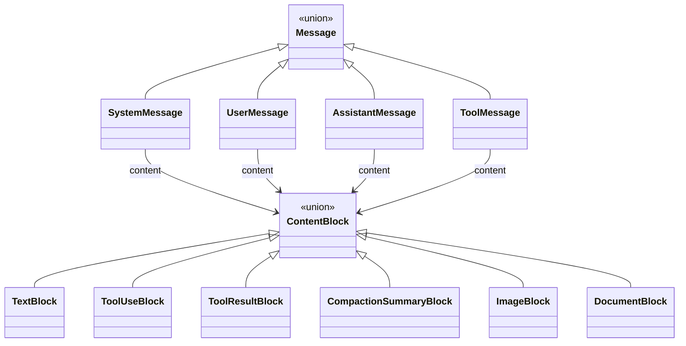

#

<div align="center">
  
</div>

<div align="center">

# Phronesis Framework - Core

</div>

<div align="center">
  Tipos de dominio compartidos por agents, runtime y providers: <code>Message</code>, <code>ContentBlock</code> y sus variantes. La lingua franca de la conversación dentro de phronesis.
</div>

<div align="center">
  <a href="../index.md">docs</a> ·
  <a href="../../src/phronesis/core/">source</a> ·
  <a href="../../tests/core/">tests</a>
</div>

<div align="center">

[]()
[]()
[]()

</div>

---

<div align="center">

## 🎯 Purpose

</div>

`phronesis.core` aloja los tipos de mensaje y contenido que viajan por todo el framework. Cumple tres roles:

- **Universal**: agents, context builders, providers, memory, replay y middleware operan todos sobre el mismo `Message`. No hay dialectos.
- **Inmutable**: cada mensaje y cada bloque es un `frozen dataclass` con `slots=True`. Sin mutación accidental, sin sorpresas en concurrencia.
- **Provider-agnóstico**: las shapes específicas de Anthropic, OpenAI o quien sea viven en `phronesis.providers.types`. `core` no sabe de ellas.

Es deliberadamente pequeño: un módulo de tipos sin lógica.

<div align="center">

## 🏗️ Architecture

</div>

Dos jerarquías paralelas: cuatro roles de mensaje y seis tipos de bloque de contenido.

```
Message (union)
├── SystemMessage       prompts del sistema
├── UserMessage         input del humano
├── AssistantMessage    output del LLM
└── ToolMessage         resultados de tool calls

ContentBlock (union)
├── TextBlock                  texto plano (+ flag cache para prompt caching)
├── ToolUseBlock               el LLM pide ejecutar una tool
├── ToolResultBlock            resultado de esa tool
├── CompactionSummaryBlock     resumen tras compactar histórico
├── ImageBlock                 entrada multimodal de imagen
└── DocumentBlock              entrada multimodal de documento
```

Cada `Message` lleva una tupla inmutable `content: tuple[ContentBlock, ...]`, un `id: MessageId` autogenerado y un `created_at` en UTC.

Flujo típico (asimétrico, sin ciclos):

```
agents/context  ──crea──►  phronesis.core.Message
                                    │
                                    ▼ providers.translation.translate_history
                            phronesis.providers.types.Message
                                    │
                                    ▼ adapter del provider
                            wire format (Anthropic, OpenAI, ...)
```

`providers` depende de `core`; `core` no depende de `providers`.

<div align="center">

## 📦 Module layout

</div>

| Fichero | Responsabilidad |
|---|---|
| `__init__.py` | Re-exports de la API pública (`__all__`) con los 12 nombres. |
| `messages.py` | `MessageId`, `message_id_generator`, los 6 `ContentBlock`s, los 4 mensajes y las uniones `ContentBlock` / `Message`. |

<div align="center">

## 🔌 Public API

</div>

```python
from phronesis.core import (
    # mensajes
    Message,
    SystemMessage,
    UserMessage,
    AssistantMessage,
    ToolMessage,
    # bloques
    ContentBlock,
    TextBlock,
    ToolUseBlock,
    ToolResultBlock,
    CompactionSummaryBlock,
    ImageBlock,
    DocumentBlock,
)
```

Shapes esenciales:

```python
@dataclass(frozen=True, slots=True)
class TextBlock:
    text: str
    cache: bool = False

@dataclass(frozen=True, slots=True)
class ToolUseBlock:
    tool_call_id: str
    tool_name: str
    args: Mapping[str, Any]

@dataclass(frozen=True, slots=True)
class ToolResultBlock:
    tool_call_id: str
    output: Any
    is_error: bool = False

@dataclass(frozen=True, slots=True)
class UserMessage:
    content: tuple[ContentBlock, ...]
    id: MessageId            # autogenerado
    created_at: datetime     # UTC, autogenerado
```

Los otros mensajes (`SystemMessage`, `AssistantMessage`, `ToolMessage`) y los bloques multimodales (`ImageBlock`, `DocumentBlock`) siguen la misma forma.

<div align="center">

## 📐 Design decisions

</div>

- **D-01 Frozen + slots.** Todos los mensajes y bloques son `@dataclass(frozen=True, slots=True)`. Inmutables y compactos en memoria.
- **D-02 Argumentos de tool inmutables.** `ToolUseBlock.args` se almacena como `MappingProxyType` aunque te pasen un `dict`. Garantiza que un mensaje grabado en memoria/replay no se mute por accidente desde fuera.
- **D-03 `id` y `created_at` autogenerados y excluidos de equality/repr.** Dos mensajes con el mismo contenido son iguales aunque tengan IDs distintos. Hace los tests estables y los `==` semánticamente útiles.
- **D-04 Tupla de bloques, no lista.** `content` es `tuple[ContentBlock, ...]` para reforzar la inmutabilidad a nivel de tipo.
- **D-05 `CompactionSummaryBlock` lleva `original_message_count`.** Cuando `CompactingContextBuilder` colapsa un trozo del histórico, queda registro del tamaño original para tracing/debug.
- **D-06 Cache hint en `TextBlock`.** El flag `cache: bool` permite señalar al provider que ese bloque puede beneficiarse de prompt caching (Anthropic, Bedrock). Es un hint, no un compromiso: el provider decide.
- **D-07 Multimodal homogéneo.** `ImageBlock` y `DocumentBlock` comparten campos (`data`, `media_type`, `source_type: Literal["url", "base64"]`) para que los adaptadores de provider los traten uniformemente.
- **D-08 Sin lógica de serialización.** `core` no sabe convertir a JSON ni a wire-format. Eso es trabajo de `providers.translation`.

<div align="center">

## 📊 Diagrams

</div>

Jerarquía de tipos:



<div align="center">

## 🔗 Dependencies

</div>

- `phronesis._internal.ids` - `Id`, `IdGenerator` para `MessageId` (prefijo `MID`).
- Stdlib: `dataclasses`, `datetime`, `types.MappingProxyType`.

Quien depende (23 ficheros del framework):

- `phronesis.agents` (`agent.py`, `loop.py`, `session.py`, `run.py`, `hooks.py`).
- `phronesis.context` (`chain.py`, `compacting.py`, `default.py`, `dry_run.py`, `input.py`, `protocol.py`).
- `phronesis.providers` (`translation.py`, `anthropic/provider.py`, `openai/provider.py`, `fallback.py`, `protocol.py`).
- `phronesis.memory.context_builder`.
- `phronesis.replay` (`recording.py`, `replay.py`).
- `phronesis.middleware.chain` (lazy import).
- `phronesis.testing.providers`.

<div align="center">

## 🧪 Testing

</div>

Tests en `tests/core/`:

- `test_messages.py` - inmutabilidad, equality, autogeneración de id/timestamp, los cuatro roles, los cuatro bloques principales.
- `test_messages_multimodal.py` - `ImageBlock` y `DocumentBlock` con `url` y `base64`.

Cobertura: 100%.

<div align="center">

## 📋 Examples

</div>

Construir un mensaje de usuario con texto y una imagen:

```python
from phronesis.core import UserMessage, TextBlock, ImageBlock

msg = UserMessage(
    content=(
        TextBlock(text="¿qué hay en esta imagen?"),
        ImageBlock(
            data="https://example.com/cat.jpg",
            media_type="image/jpeg",
            source_type="url",
        ),
    ),
)
```

Mensaje del asistente pidiendo una tool call:

```python
from phronesis.core import AssistantMessage, TextBlock, ToolUseBlock

msg = AssistantMessage(
    content=(
        TextBlock(text="déjame consultar el clima"),
        ToolUseBlock(
            tool_call_id="call_001",
            tool_name="get_weather",
            args={"city": "Madrid"},
        ),
    ),
)
```

Devolver el resultado de la tool:

```python
from phronesis.core import ToolMessage, ToolResultBlock

msg = ToolMessage(
    content=(
        ToolResultBlock(
            tool_call_id="call_001",
            output={"temp_c": 22, "condition": "sunny"},
        ),
    ),
)
```

Cache hint para prompt caching:

```python
from phronesis.core import SystemMessage, TextBlock

system = SystemMessage(
    content=(
        TextBlock(text=open("long_system_prompt.txt").read(), cache=True),
    ),
)
```

<div align="center">

## ⚠️ Pitfalls

</div>

- **No confundir con `phronesis.providers.types.Message`**. Son tipos distintos. `core.Message` es el dominio; `providers.types.Message` es el wire-format que los adaptadores envían al SDK del proveedor. La traducción la hace `providers.translation`.
- **`args` siempre es un mapping inmutable**. Mutar `msg.content[0].args["k"] = ...` lanza `TypeError`. Si necesitas variar, construye un `ToolUseBlock` nuevo.
- **`id` y `created_at` se autogeneran**. No los pases en construcción salvo en tests muy específicos. Y no se incluyen en `==` / `repr`, así que los tests son estables.
- **`content` es una tupla**. `messages[0].content.append(...)` no existe. Construye una tupla nueva.
- **`cache=True` es un hint**. El provider puede ignorarlo si no soporta prompt caching. No asumas que se aplica.
- **`MessageId` no se exporta en `__all__`**. Es uso interno; si lo necesitas, importa explícitamente desde `phronesis.core.messages`.

<div align="center">

## 🚦 Quality gates

</div>

```
uv run ruff format src/phronesis/core tests/core
uv run ruff check src/phronesis/core tests/core
uv run mypy src/phronesis/core
uv run pytest tests/core -q
uv run pytest -q
```

<div align="center">

## 🛠️ Tech stack

</div>

- Python 3.11+.
- Sólo stdlib (`dataclasses`, `datetime`, `types`).

<div align="center">

## 🔮 Future work

</div>

- **`AudioBlock`** - cuando se onboarde algún LLM de voz.
- **`VideoBlock`** - para inputs de vídeo si surge el caso real.
- **`JSONBlock`** - bloque dedicado a salidas estructuradas si la convención `args` se queda corta.
- **Roundtrip tests** automáticos `core.Message <-> providers.wire` cuando los adaptadores maduren.
