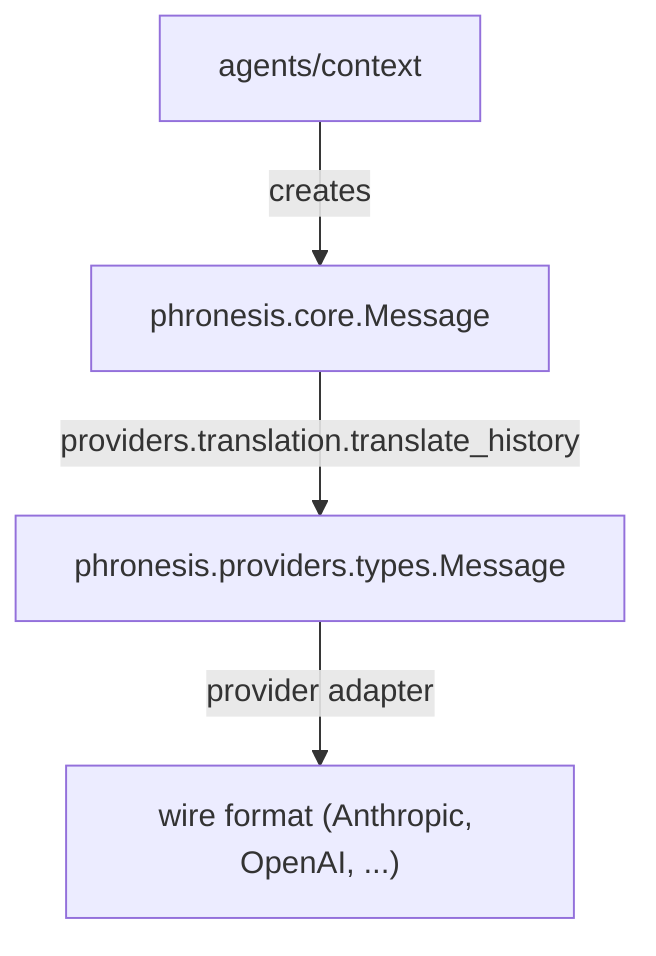
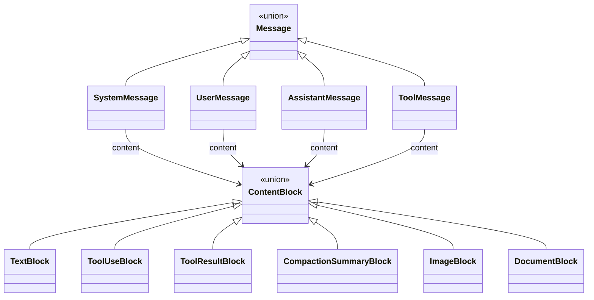

#

<div align="center">
  
</div>

<div align="center">

# Phronesis Framework - Core

</div>

<div align="center">
  Domain types shared by agents, runtime and providers: <code>Message</code>, <code>ContentBlock</code> and their variants. The lingua franca of conversation inside phronesis.
</div>

<div align="center">

[]()
[]()
[]()

</div>

---

<div align="center">

## 🎯 Purpose

</div>

`phronesis.core` hosts the message and content types that travel across the whole framework. It fulfils three roles:

- **Universal**: agents, context builders, providers, memory, replay and middleware all operate on the same `Message`. There are no dialects.
- **Immutable**: every message and every block is a `frozen dataclass` with `slots=True`. No accidental mutation, no concurrency surprises.
- **Provider-agnostic**: the shapes specific to Anthropic, OpenAI or anyone else live in `phronesis.providers.types`. `core` knows nothing about them.

It is deliberately small: a module of types with no logic.

<div align="center">

## 🏗️ Architecture

</div>

Two parallel hierarchies: four message roles and six content block types.


```mermaid
classDiagram
    class Message {
        <<union>>
    }
    Message <|-- SystemMessage
    Message <|-- UserMessage
    Message <|-- AssistantMessage
    Message <|-- ToolMessage
    note for SystemMessage "system prompts"
    note for UserMessage "human input"
    note for AssistantMessage "LLM output"
    note for ToolMessage "tool call results"

    class ContentBlock {
        <<union>>
    }
    ContentBlock <|-- TextBlock
    ContentBlock <|-- ToolUseBlock
    ContentBlock <|-- ToolResultBlock
    ContentBlock <|-- CompactionSummaryBlock
    ContentBlock <|-- ImageBlock
    ContentBlock <|-- DocumentBlock
    note for TextBlock "plain text (+ cache flag for prompt caching)"
    note for ToolUseBlock "the LLM asks to run a tool"
    note for ToolResultBlock "result of that tool"
    note for CompactionSummaryBlock "summary after compacting history"
    note for ImageBlock "multimodal image input"
    note for DocumentBlock "multimodal document input"
```

Each `Message` carries an immutable tuple `content: tuple[ContentBlock, ...]`, an autogenerated `id: MessageId` and a `created_at` in UTC.

Typical flow (asymmetric, no cycles):


```mermaid
flowchart TD
    A["agents/context"] -->|creates| B["phronesis.core.Message"]
    B -->|"providers.translation.translate_history"| C["phronesis.providers.types.Message"]
    C -->|provider adapter| D["wire format (Anthropic, OpenAI, ...)"]
```

`providers` depends on `core`; `core` does not depend on `providers`.

<div align="center">

## 📦 Module layout

</div>

| File | Responsibility |
|---|---|
| `__init__.py` | Re-exports of the public API (`__all__`) with the 12 names. |
| `messages.py` | `MessageId`, `message_id_generator`, the 6 `ContentBlock`s, the 4 messages and the `ContentBlock` / `Message` unions. |

<div align="center">

## 🔌 Public API

</div>

```python
from phronesis.core import (
    # messages
    Message,
    SystemMessage,
    UserMessage,
    AssistantMessage,
    ToolMessage,
    # blocks
    ContentBlock,
    TextBlock,
    ToolUseBlock,
    ToolResultBlock,
    CompactionSummaryBlock,
    ImageBlock,
    DocumentBlock,
)
```

Essential shapes:

```python
@dataclass(frozen=True, slots=True)
class TextBlock:
    text: str
    cache: bool = False

@dataclass(frozen=True, slots=True)
class ToolUseBlock:
    tool_call_id: str
    tool_name: str
    args: Mapping[str, Any]

@dataclass(frozen=True, slots=True)
class ToolResultBlock:
    tool_call_id: str
    output: Any
    is_error: bool = False

@dataclass(frozen=True, slots=True)
class UserMessage:
    content: tuple[ContentBlock, ...]
    id: MessageId            # autogenerated
    created_at: datetime     # UTC, autogenerated
```

The other messages (`SystemMessage`, `AssistantMessage`, `ToolMessage`) and the multimodal blocks (`ImageBlock`, `DocumentBlock`) follow the same shape.

<div align="center">

## 📐 Design decisions

</div>

- **D-01 Frozen + slots.** All messages and blocks are `@dataclass(frozen=True, slots=True)`. Immutable and compact in memory.
- **D-02 Immutable tool arguments.** `ToolUseBlock.args` is stored as a `MappingProxyType` even if you pass a `dict`. Guarantees that a message recorded in memory/replay is not accidentally mutated from outside.
- **D-03 `id` and `created_at` autogenerated and excluded from equality/repr.** Two messages with the same content are equal even if they have different IDs. Makes tests stable and `==` semantically useful.
- **D-04 Tuple of blocks, not a list.** `content` is `tuple[ContentBlock, ...]` to reinforce immutability at the type level.
- **D-05 `CompactionSummaryBlock` carries `original_message_count`.** When `CompactingContextBuilder` collapses a chunk of history, the original size is recorded for tracing/debugging.
- **D-06 Cache hint on `TextBlock`.** The `cache: bool` flag lets you signal to the provider that the block can benefit from prompt caching (Anthropic, Bedrock). It is a hint, not a commitment: the provider decides.
- **D-07 Homogeneous multimodal.** `ImageBlock` and `DocumentBlock` share fields (`data`, `media_type`, `source_type: Literal["url", "base64"]`) so provider adapters treat them uniformly.
- **D-08 No serialization logic.** `core` does not know how to convert to JSON or wire format. That is the job of `providers.translation`.

<div align="center">

## 📊 Diagrams

</div>

Type hierarchy:


```mermaid
classDiagram
    class Message {
        <<union>>
    }
    class SystemMessage
    class UserMessage
    class AssistantMessage
    class ToolMessage
    Message <|-- SystemMessage
    Message <|-- UserMessage
    Message <|-- AssistantMessage
    Message <|-- ToolMessage

    class ContentBlock {
        <<union>>
    }
    class TextBlock
    class ToolUseBlock
    class ToolResultBlock
    class CompactionSummaryBlock
    class ImageBlock
    class DocumentBlock
    ContentBlock <|-- TextBlock
    ContentBlock <|-- ToolUseBlock
    ContentBlock <|-- ToolResultBlock
    ContentBlock <|-- CompactionSummaryBlock
    ContentBlock <|-- ImageBlock
    ContentBlock <|-- DocumentBlock

    SystemMessage --> ContentBlock : content
    UserMessage --> ContentBlock : content
    AssistantMessage --> ContentBlock : content
    ToolMessage --> ContentBlock : content
```

<div align="center">

## 🔗 Dependencies

</div>

- `phronesis._internal.ids` - `Id`, `IdGenerator` for `MessageId` (prefix `MID`).
- Stdlib: `dataclasses`, `datetime`, `types.MappingProxyType`.

Dependents (23 framework files):

- `phronesis.agents` (`agent.py`, `loop.py`, `session.py`, `run.py`, `hooks.py`).
- `phronesis.context` (`chain.py`, `compacting.py`, `default.py`, `dry_run.py`, `input.py`, `protocol.py`).
- `phronesis.providers` (`translation.py`, `anthropic/provider.py`, `openai/provider.py`, `fallback.py`, `protocol.py`).
- `phronesis.memory.context_builder`.
- `phronesis.replay` (`recording.py`, `replay.py`).
- `phronesis.middleware.chain` (lazy import).
- `phronesis.testing.providers`.

<div align="center">

## 🧪 Testing

</div>

Tests in `tests/core/`:

- `test_messages.py` - immutability, equality, id/timestamp autogeneration, the four roles, the four main blocks.
- `test_messages_multimodal.py` - `ImageBlock` and `DocumentBlock` with `url` and `base64`.

Coverage: 100%.

<div align="center">

## 📋 Examples

</div>

Build a user message with text and an image:

```python
from phronesis.core import UserMessage, TextBlock, ImageBlock

msg = UserMessage(
    content=(
        TextBlock(text="what is in this image?"),
        ImageBlock(
            data="https://example.com/cat.jpg",
            media_type="image/jpeg",
            source_type="url",
        ),
    ),
)
```

Assistant message requesting a tool call:

```python
from phronesis.core import AssistantMessage, TextBlock, ToolUseBlock

msg = AssistantMessage(
    content=(
        TextBlock(text="let me check the weather"),
        ToolUseBlock(
            tool_call_id="call_001",
            tool_name="get_weather",
            args={"city": "Madrid"},
        ),
    ),
)
```

Return the tool result:

```python
from phronesis.core import ToolMessage, ToolResultBlock

msg = ToolMessage(
    content=(
        ToolResultBlock(
            tool_call_id="call_001",
            output={"temp_c": 22, "condition": "sunny"},
        ),
    ),
)
```

Cache hint for prompt caching:

```python
from phronesis.core import SystemMessage, TextBlock

system = SystemMessage(
    content=(
        TextBlock(text=open("long_system_prompt.txt").read(), cache=True),
    ),
)
```

<div align="center">

## ⚠️ Pitfalls

</div>

- **Do not confuse with `phronesis.providers.types.Message`**. They are different types. `core.Message` is the domain; `providers.types.Message` is the wire format that adapters send to the provider SDK. The translation is done by `providers.translation`.
- **`args` is always an immutable mapping**. Mutating `msg.content[0].args["k"] = ...` raises `TypeError`. If you need a variation, build a new `ToolUseBlock`.
- **`id` and `created_at` are autogenerated**. Do not pass them at construction except in very specific tests. They are not included in `==` / `repr`, so tests are stable.
- **`content` is a tuple**. `messages[0].content.append(...)` does not exist. Build a new tuple.
- **`cache=True` is a hint**. The provider may ignore it if it does not support prompt caching. Do not assume it is applied.
- **`MessageId` is not exported in `__all__`**. It is for internal use; if you need it, import it explicitly from `phronesis.core.messages`.

<div align="center">

## 🚦 Quality gates

</div>

```
uv run ruff format src/phronesis/core tests/core
uv run ruff check src/phronesis/core tests/core
uv run mypy src/phronesis/core
uv run pytest tests/core -q
uv run pytest -q
```

<div align="center">

## 🛠️ Tech stack

</div>

- Python 3.11+.
- Stdlib only (`dataclasses`, `datetime`, `types`).

<div align="center">

## 🔮 Future work

</div>

- **`AudioBlock`** - when a voice LLM is onboarded.
- **`VideoBlock`** - for video inputs if a real use case arises.
- **`JSONBlock`** - dedicated block for structured outputs if the `args` convention falls short.
- Automatic **roundtrip tests** `core.Message <-> providers.wire` once the adapters mature.
