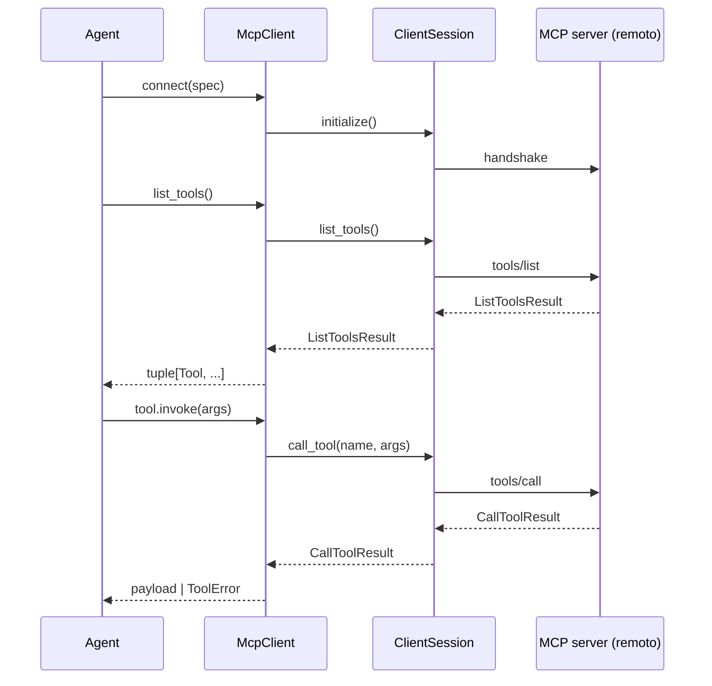
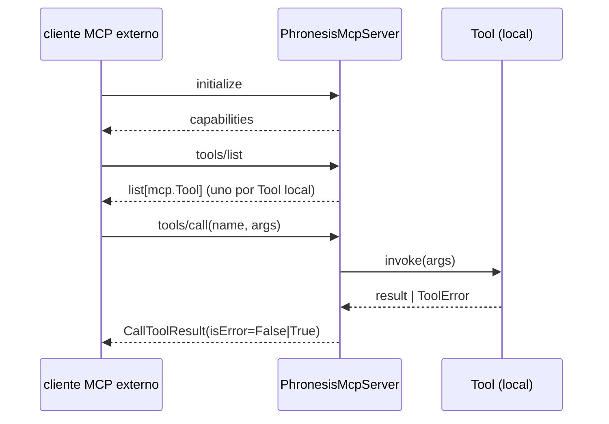

#

<div align="center">
  
</div>

<div align="center">

# Phronesis Framework - MCP

</div>

<div align="center">
  Integración bidireccional con el Model Context Protocol: consume servidores MCP externos como tools y publica tools phronesis como servidor MCP.
</div>

<div align="center">
  <a href="../index.md">docs</a> ·
  <a href="../../src/phronesis/mcp/">source</a> ·
  <a href="../../tests/mcp/">tests</a>
</div>

<div align="center">

[]()
[]()
[]()

</div>

---

<div align="center">

## 🎯 Purpose

</div>

El Model Context Protocol (MCP) es el estándar abierto para conectar agentes a servidores de tools. Este módulo lo integra en phronesis en las dos direcciones:

- **Cliente** - abre una sesión contra un servidor MCP externo (filesystem, búsqueda, IDE, lo que sea) y adapta cada tool remota en un `Tool` de phronesis listo para inyectarse en un `Agent`.
- **Servidor** - publica un conjunto de `Tool` declarados con `@tool` como servidor MCP, consumible desde Claude Desktop, otros agentes phronesis, o cualquier cliente MCP.

En v1 solo se cubren **Tools**, que es donde está el grueso del valor con el menor coste de integración. Resources, prompts y sampling quedan para v2.

<div align="center">

## 🏗️ Architecture

</div>

Dos sub-superficies que comparten el mismo SDK por debajo:

```
phronesis.Agent --with_added_tools--> Tool (adaptado) --invoke--> McpClient.session --call_tool--> servidor MCP externo

cliente MCP externo --tools/call--> PhronesisMcpServer --invoke--> Tool (local) --resultado--> CallToolResult
```

Ambas caras se apoyan en el SDK oficial `mcp` para JSON-RPC, framing y handshake. Phronesis solo adapta los tipos en los bordes.

<div align="center">

## 📦 Module layout

</div>

| Fichero | Responsabilidad |
|---|---|
| `__init__.py` | Re-exports de la API pública (`__all__`). |
| `errors.py` | Jerarquía `McpError` -> `McpConnectionError`, `McpProtocolError`, `McpTimeoutError`, `McpToolNotFoundError`. |
| `ids.py` | `McpServerId` (prefijo `MSID`), `McpClientId` (prefijo `MCID`) + generators singleton. |
| `obs.py` | `mcp_span(operation, extra=...)` async ctx manager con prefijo `phronesis.mcp.<op>`. |
| `transport.py` | `StdioTransport`, `HttpTransport`, alias `Transport`. |
| `server_spec.py` | `McpServerSpec` (frozen): describe cómo conectar a un servidor remoto. |
| `client.py` | `McpClient` async context manager con `list_tools()` adaptado. |
| `server.py` | `PhronesisMcpServer` + factory `mcp_server(...)` con `run_stdio()` / `run_http()`. |
| `_adapt.py` | Adaptadores `MCP tool <-> phronesis Tool` en ambas direcciones. |

<div align="center">

## 🔌 Public API

</div>

```python
from phronesis.mcp import (
    McpClient,
    McpServerSpec,
    StdioTransport,
    HttpTransport,
    Transport,
    PhronesisMcpServer,
    mcp_server,
    McpServerId,
    McpClientId,
    McpError,
    McpConnectionError,
    McpProtocolError,
    McpTimeoutError,
    McpToolNotFoundError,
    mcp_span,
    mcp_server_id_generator,
    mcp_client_id_generator,
)
```

Signaturas clave:

```python
class McpClient:
    @classmethod
    @asynccontextmanager
    async def connect(cls, spec: McpServerSpec) -> AsyncIterator[McpClient]: ...
    async def list_tools(self) -> tuple[Tool, ...]: ...

def mcp_server(
    *,
    name: str,
    tools: Iterable[Tool],
    server_id: McpServerId | None = None,
) -> PhronesisMcpServer: ...

class PhronesisMcpServer:
    async def run_stdio(self) -> None: ...
    async def run_http(self, *, host: str = "127.0.0.1", port: int = 8000) -> None: ...
```

<div align="center">

## 📐 Design decisions

</div>

- **D-01 SDK oficial como dependencia.** Se añade `mcp>=1.27` a `pyproject.toml`. No reimplementamos JSON-RPC ni framing: dejamos que el SDK haga lo que mejor sabe hacer y phronesis solo adapta tipos en los bordes.
- **D-02 Solo Tools en v1.** Resources, prompts y sampling tienen ratio valor/esfuerzo menor para los casos de uso reales; se difieren a v2 explícitamente.
- **D-03 stdio + Streamable HTTP.** Son los dos transports que el spec actual considera estables. SSE legacy queda descartado.
- **D-04 Cliente: bypass del decorador `@tool`.** No hay función Python tipada detrás de una tool MCP remota. El adapter construye un `Tool` directo con un stub `async def _remote_call(**kwargs)`, sobrescribe el `schema` con el `inputSchema` remoto y el `_validator` con un passthrough (el servidor valida).
- **D-05 Cliente = un servidor por sesión.** Componer varios servidores se hace fuera: `agent.with_added_tools(*tools_a, *tools_b)`. Mantiene la clase mínima.
- **D-06 Errores MCP -> ToolError.** Una tool MCP que falla no debe abortar el run del agente: el adapter mapea timeouts a `ToolTimeoutError`, `tool not found` a `ToolNotFoundError` y el resto a `ToolError` genérico.

<div align="center">

## 📊 Diagrams

</div>

Cliente phronesis consumiendo un servidor MCP externo:



Servidor phronesis publicando tools locales:



<div align="center">

## 🔗 Dependencies

</div>

- `mcp>=1.27` (nueva dependencia).
- `phronesis.tools` - `Tool`, `ToolSpec`, `ToolError`, ids.
- `phronesis._internal.ids` - `Id`, `IdGenerator`.
- `phronesis.errors.PhronesisError` - jerarquía raíz.
- `phronesis.obs.spans.start_span_async` - tracing wrapper.
- `phronesis.obs.attributes` - constantes `MCP_*`.

Quien depende: `phronesis.agents` puede inyectar las tools obtenidas vía `Agent.with_added_tools(*tools)`. No hay acoplamiento inverso.

<div align="center">

## 🧪 Testing

</div>

Tests en `tests/mcp/`. Estrategia:

- **Unitarios** con mocks (`unittest.mock.AsyncMock`) sobre `ClientSession.call_tool` para cubrir adaptación y mapeo de errores sin abrir transports.
- **Loopback in-memory** usando `mcp.shared.memory.create_connected_server_and_client_session` para tests de integración cliente <-> servidor sin red ni procesos.
- Cobertura objetivo: 100% sobre el código nuevo.

<div align="center">

## 📋 Examples

</div>

Conectar a un servidor MCP externo e inyectar sus tools en un agente:

```python
import asyncio
from phronesis.mcp import McpClient, McpServerSpec, StdioTransport

async def main():
    spec = McpServerSpec(
        name="filesystem",
        transport=StdioTransport(
            command="npx",
            args=("-y", "@modelcontextprotocol/server-filesystem", "/tmp"),
        ),
    )

    async with McpClient.connect(spec) as client:
        remote_tools = await client.list_tools()

        # agent = my_agent.with_added_tools(*remote_tools)
        # await agent.run("lista los ficheros de /tmp")

asyncio.run(main())
```

Servir tools phronesis como servidor MCP:

```python
import asyncio
from phronesis.mcp import mcp_server
from phronesis.tools import tool

@tool
def add(a: int, b: int) -> int:
    """Sum two integers."""
    return a + b

async def main():
    server = mcp_server(name="math", tools=(add,))
    await server.run_stdio()

asyncio.run(main())
```

<div align="center">

## ⚠️ Pitfalls

</div>

- **El validador local no se aplica a tools remotas.** Las tools adaptadas reciben los args tal cual; la validación es responsabilidad del servidor remoto contra su `inputSchema`. Esto es deliberado (D-04).
- **Cerrar siempre la sesión.** `McpClient` solo se construye vía `McpClient.connect(spec)` como `async with`. Construirlo "a mano" sin el context manager deja procesos/streams sin cerrar.
- **`list_tools()` no es perezoso.** Cada llamada va al servidor; cachealo en cliente si lo necesitas más de una vez.
- **Esquemas remotos pueden ser parciales.** Si un servidor MCP devuelve un `inputSchema` sin `type`, el adapter lo pasa tal cual al `ToolSpec.input_schema`; el LLM cliente decide qué hacer con él.
- **Tools que cuelgan cuelgan al agente.** En v1 confiamos en la cancelación cooperativa de `ExecutionContext`. Wrap con `RetryPolicy` cuando exista soporte cliente.

<div align="center">

## 🚦 Quality gates

</div>

```
uv run ruff format src/phronesis/mcp tests/mcp
uv run ruff check src/phronesis/mcp tests/mcp
uv run mypy src/phronesis/mcp
uv run pytest tests/mcp -q
uv run pytest -q
```

<div align="center">

## 🛠️ Tech stack

</div>

- Python 3.11+.
- `mcp` SDK oficial (Anthropic) - JSON-RPC, framing, handshake, stdio + Streamable HTTP transports.
- `anyio` (vía `mcp`) para el modelo async.

<div align="center">

## 🔮 Future work

</div>

- **Resources** (`resources/list`, `resources/read`).
- **Prompts** (`prompts/list`, `prompts/get`).
- **Sampling** - el servidor pide al cliente que invoque su LLM.
- **OAuth / autenticación** sobre Streamable HTTP.
- **Exponer un `Agent` entero como una tool MCP** (delegación de tool-calling).
- **`McpRegistry`** - agregador multi-servidor con discovery.
- **Reconexión automática** + back-pressure.
- **SSE legacy** queda fuera (deprecated).
