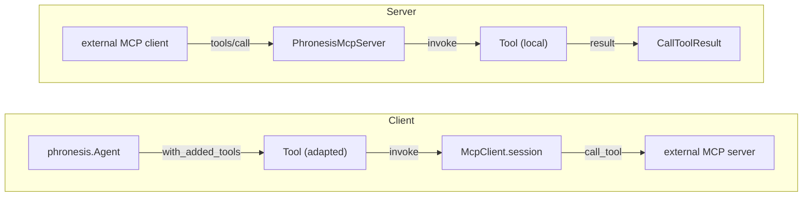
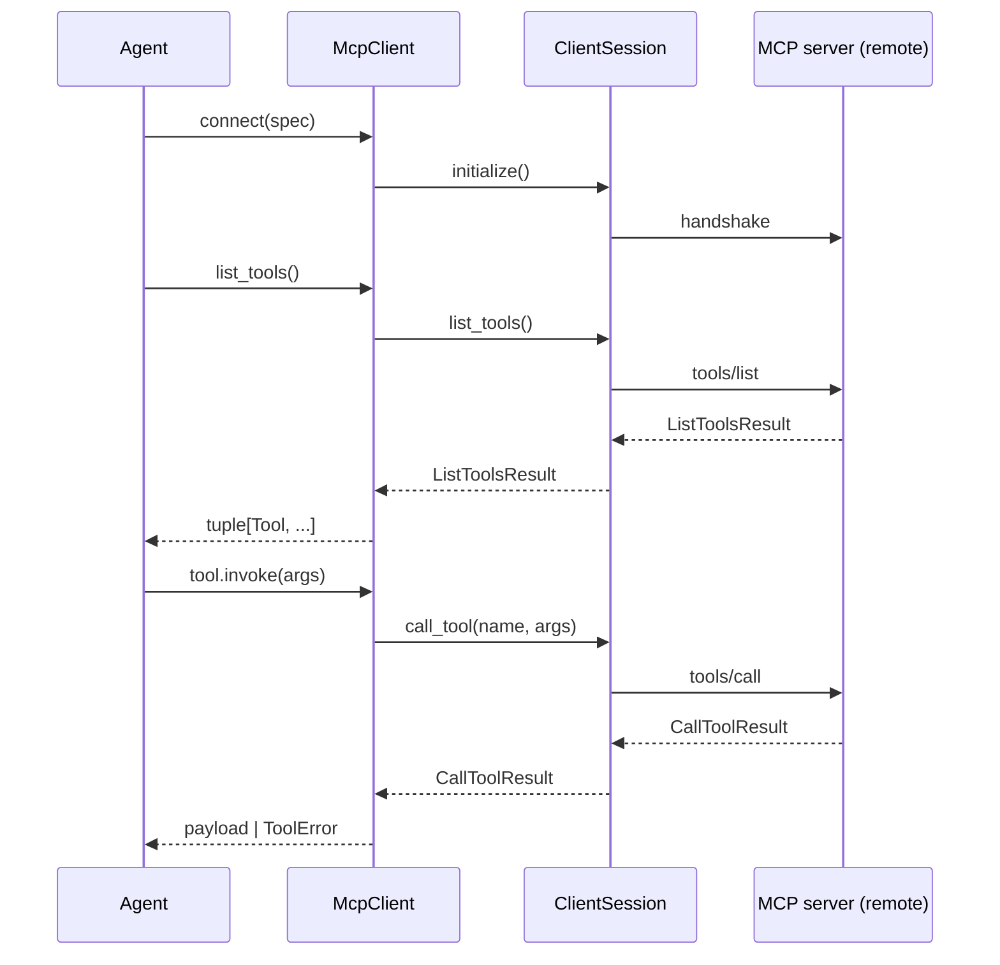
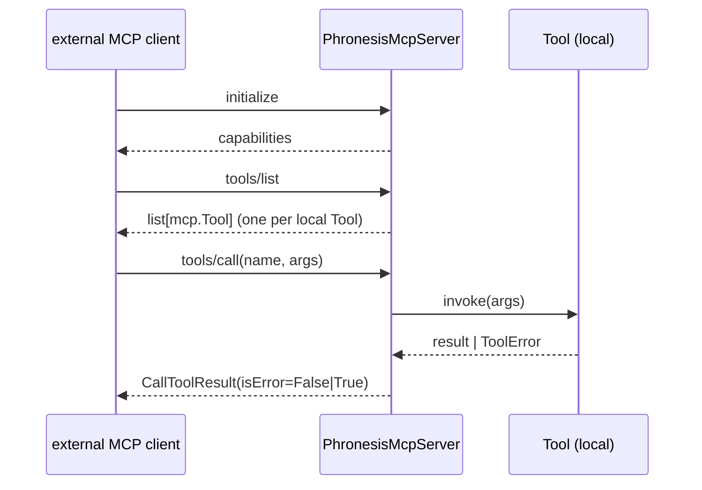

#

<div align="center">
  
</div>

<div align="center">

# Phronesis Framework - MCP

</div>

<div align="center">
  Bidirectional integration with the Model Context Protocol: consumes external MCP servers as tools and publishes phronesis tools as an MCP server.
</div>

<div align="center">

[]()
[]()
[]()

</div>

---

<div align="center">

## 🎯 Purpose

</div>

The Model Context Protocol (MCP) is the open standard for connecting agents to tool servers. This module integrates it into phronesis in both directions:

- **Client** - opens a session against an external MCP server (filesystem, search, IDE, whatever) and adapts each remote tool into a phronesis `Tool` ready to be injected into an `Agent`.
- **Server** - publishes a set of `Tool`s declared with `@tool` as an MCP server, consumable from Claude Desktop, other phronesis agents, or any MCP client.

v1 only covers **Tools**, which is where most of the value lies at the lowest integration cost. Resources, prompts and sampling are left for v2.

<div align="center">

## 🏗️ Architecture

</div>

Two sub-surfaces sharing the same SDK underneath:


```mermaid
flowchart LR
    subgraph client_side["Client"]
        direction LR
        Agent["phronesis.Agent"] -->|with_added_tools| AdaptedTool["Tool (adapted)"]
        AdaptedTool -->|invoke| Session["McpClient.session"]
        Session -->|call_tool| Remote["external MCP server"]
    end

    subgraph server_side["Server"]
        direction LR
        ExtClient["external MCP client"] -->|"tools/call"| PServer["PhronesisMcpServer"]
        PServer -->|invoke| LocalTool["Tool (local)"]
        LocalTool -->|result| Result["CallToolResult"]
    end
```

Both sides rely on the official `mcp` SDK for JSON-RPC, framing and handshake. Phronesis only adapts the types at the edges.

<div align="center">

## 📦 Module layout

</div>

| File | Responsibility |
|---|---|
| `__init__.py` | Re-exports of the public API (`__all__`). |
| `errors.py` | Hierarchy `McpError` -> `McpConnectionError`, `McpProtocolError`, `McpTimeoutError`, `McpToolNotFoundError`. |
| `ids.py` | `McpServerId` (prefix `MSID`), `McpClientId` (prefix `MCID`) + singleton generators. |
| `obs.py` | `mcp_span(operation, extra=...)` async ctx manager with prefix `phronesis.mcp.<op>`. |
| `transport.py` | `StdioTransport`, `HttpTransport`, `Transport` alias. |
| `server_spec.py` | `McpServerSpec` (frozen): describes how to connect to a remote server. |
| `client.py` | `McpClient` async context manager with adapted `list_tools()`. |
| `server.py` | `PhronesisMcpServer` + factory `mcp_server(...)` with `run_stdio()` / `run_http()`. |
| `_adapt.py` | `MCP tool <-> phronesis Tool` adapters in both directions. |

<div align="center">

## 🔌 Public API

</div>

```python
from phronesis.mcp import (
    McpClient,
    McpServerSpec,
    StdioTransport,
    HttpTransport,
    Transport,
    PhronesisMcpServer,
    mcp_server,
    McpServerId,
    McpClientId,
    McpError,
    McpConnectionError,
    McpProtocolError,
    McpTimeoutError,
    McpToolNotFoundError,
    mcp_span,
    mcp_server_id_generator,
    mcp_client_id_generator,
)
```

Key signatures:

```python
class McpClient:
    @classmethod
    @asynccontextmanager
    async def connect(cls, spec: McpServerSpec) -> AsyncIterator[McpClient]: ...
    async def list_tools(self) -> tuple[Tool, ...]: ...

def mcp_server(
    *,
    name: str,
    tools: Iterable[Tool],
    server_id: McpServerId | None = None,
) -> PhronesisMcpServer: ...

class PhronesisMcpServer:
    async def run_stdio(self) -> None: ...
    async def run_http(self, *, host: str = "127.0.0.1", port: int = 8000) -> None: ...
```

<div align="center">

## 📐 Design decisions

</div>

- **D-01 Official SDK as a dependency.** `mcp>=1.27` is added to `pyproject.toml`. We do not reimplement JSON-RPC or framing: we let the SDK do what it does best and phronesis only adapts types at the edges.
- **D-02 Tools only in v1.** Resources, prompts and sampling have a lower value/effort ratio for real use cases; they are explicitly deferred to v2.
- **D-03 stdio + Streamable HTTP.** These are the two transports the current spec considers stable. Legacy SSE is discarded.
- **D-04 Client: bypass of the `@tool` decorator.** There is no typed Python function behind a remote MCP tool. The adapter builds a `Tool` directly with an `async def _remote_call(**kwargs)` stub, overrides the `schema` with the remote `inputSchema` and the `_validator` with a passthrough (the server validates).
- **D-05 Client = one server per session.** Composing several servers is done outside: `agent.with_added_tools(*tools_a, *tools_b)`. Keeps the class minimal.
- **D-06 MCP errors -> ToolError.** A failing MCP tool must not abort the agent run: the adapter maps timeouts to `ToolTimeoutError`, `tool not found` to `ToolNotFoundError` and everything else to a generic `ToolError`.

<div align="center">

## 📊 Diagrams

</div>

Phronesis client consuming an external MCP server:


```mermaid
sequenceDiagram
    participant Agent
    participant McpClient
    participant ClientSession
    participant Server as MCP server (remote)

    Agent->>McpClient: connect(spec)
    McpClient->>ClientSession: initialize()
    ClientSession->>Server: handshake
    Agent->>McpClient: list_tools()
    McpClient->>ClientSession: list_tools()
    ClientSession->>Server: tools/list
    Server-->>ClientSession: ListToolsResult
    ClientSession-->>McpClient: ListToolsResult
    McpClient-->>Agent: tuple[Tool, ...]

    Agent->>McpClient: tool.invoke(args)
    McpClient->>ClientSession: call_tool(name, args)
    ClientSession->>Server: tools/call
    Server-->>ClientSession: CallToolResult
    ClientSession-->>McpClient: CallToolResult
    McpClient-->>Agent: payload | ToolError
```

Phronesis server publishing local tools:


```mermaid
sequenceDiagram
    participant Client as external MCP client
    participant Server as PhronesisMcpServer
    participant Tool as Tool (local)

    Client->>Server: initialize
    Server-->>Client: capabilities

    Client->>Server: tools/list
    Server-->>Client: list[mcp.Tool] (one per local Tool)

    Client->>Server: tools/call(name, args)
    Server->>Tool: invoke(args)
    Tool-->>Server: result | ToolError
    Server-->>Client: CallToolResult(isError=False|True)
```

<div align="center">

## 🔗 Dependencies

</div>

- `mcp>=1.27` (new dependency).
- `phronesis.tools` - `Tool`, `ToolSpec`, `ToolError`, ids.
- `phronesis._internal.ids` - `Id`, `IdGenerator`.
- `phronesis.errors.PhronesisError` - root hierarchy.
- `phronesis.obs.spans.start_span_async` - tracing wrapper.
- `phronesis.obs.attributes` - `MCP_*` constants.

Dependents: `phronesis.agents` can inject the obtained tools via `Agent.with_added_tools(*tools)`. There is no reverse coupling.

<div align="center">

## 🧪 Testing

</div>

Tests in `tests/mcp/`. Strategy:

- **Unit tests** with mocks (`unittest.mock.AsyncMock`) on `ClientSession.call_tool` to cover adaptation and error mapping without opening transports.
- **In-memory loopback** using `mcp.shared.memory.create_connected_server_and_client_session` for client <-> server integration tests without network or processes.
- Target coverage: 100% on the new code.

<div align="center">

## 📋 Examples

</div>

Connect to an external MCP server and inject its tools into an agent:

```python
import asyncio
from phronesis.mcp import McpClient, McpServerSpec, StdioTransport

async def main():
    spec = McpServerSpec(
        name="filesystem",
        transport=StdioTransport(
            command="npx",
            args=("-y", "@modelcontextprotocol/server-filesystem", "/tmp"),
        ),
    )

    async with McpClient.connect(spec) as client:
        remote_tools = await client.list_tools()

        # agent = my_agent.with_added_tools(*remote_tools)
        # await agent.run("list the files in /tmp")

asyncio.run(main())
```

Serve phronesis tools as an MCP server:

```python
import asyncio
from phronesis.mcp import mcp_server
from phronesis.tools import tool

@tool
def add(a: int, b: int) -> int:
    """Sum two integers."""
    return a + b

async def main():
    server = mcp_server(name="math", tools=(add,))
    await server.run_stdio()

asyncio.run(main())
```

<div align="center">

## ⚠️ Pitfalls

</div>

- **The local validator is not applied to remote tools.** Adapted tools receive the args as-is; validation is the responsibility of the remote server against its `inputSchema`. This is deliberate (D-04).
- **Always close the session.** `McpClient` is only built via `McpClient.connect(spec)` as `async with`. Building it "by hand" without the context manager leaves processes/streams open.
- **`list_tools()` is not lazy.** Every call goes to the server; cache it on the client side if you need it more than once.
- **Remote schemas may be partial.** If an MCP server returns an `inputSchema` without `type`, the adapter passes it as-is to `ToolSpec.input_schema`; the client LLM decides what to do with it.
- **Hanging tools hang the agent.** In v1 we rely on the cooperative cancellation of `ExecutionContext`. Wrap with `RetryPolicy` once client support exists.

<div align="center">

## 🚦 Quality gates

</div>

```
uv run ruff format src/phronesis/mcp tests/mcp
uv run ruff check src/phronesis/mcp tests/mcp
uv run mypy src/phronesis/mcp
uv run pytest tests/mcp -q
uv run pytest -q
```

<div align="center">

## 🛠️ Tech stack

</div>

- Python 3.11+.
- Official `mcp` SDK (Anthropic) - JSON-RPC, framing, handshake, stdio + Streamable HTTP transports.
- `anyio` (via `mcp`) for the async model.

<div align="center">

## 🔮 Future work

</div>

- **Resources** (`resources/list`, `resources/read`).
- **Prompts** (`prompts/list`, `prompts/get`).
- **Sampling** - the server asks the client to invoke its LLM.
- **OAuth / authentication** over Streamable HTTP.
- **Expose a whole `Agent` as an MCP tool** (tool-calling delegation).
- **`McpRegistry`** - multi-server aggregator with discovery.
- **Automatic reconnection** + back-pressure.
- **Legacy SSE** stays out (deprecated).
