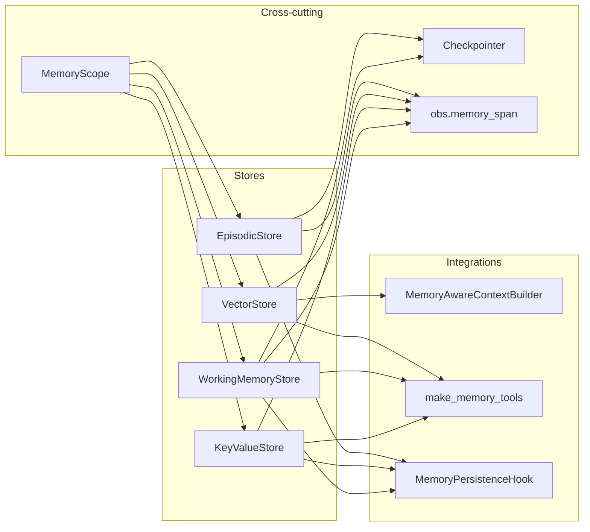
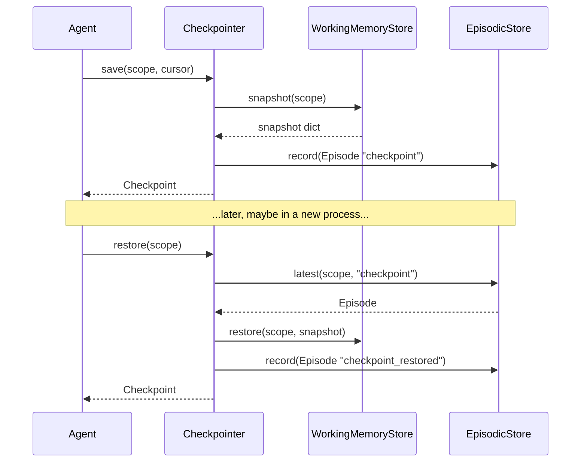

#

<div align="center">
  
</div>

<div align="center">

# Phronesis Framework - `memory`

</div>

<div align="center">
  Four memory variants (working, key-value, vector, episodic) with pluggable backends, scope-based isolation, atomic ops, and checkpointing for the agent runtime.
</div>

<div align="center">
  <a href="../index.md">docs</a> ·
  <a href="../../src/phronesis/memory/">source</a> ·
  <a href="../../tests/memory/">tests</a>
</div>

<div align="center">

[]()
[]()
[]()

</div>

---

<div align="center">

## 🎯 Purpose

</div>

Agents, pipelines, and RAG flows need to remember things. The `memory` module supplies the four primitives that cover every memory use case in the framework:

- **Working memory** - ephemeral scratchpad for the current run.
- **Key-value memory** - durable structured state with atomic ops (CAS, append, increment) for blackboard patterns and shared counters.
- **Vector memory** - semantic search over embedded items for RAG.
- **Episodic memory** - append-only event log for audit, replay, and checkpoints.

Every store is a `Protocol` with two backends out of the box: in-memory (process-local) and filesystem-JSON (persistent, single-process). The same Protocol is the integration seam for production backends (Redis, Chroma, Qdrant) that live outside this module.

<div align="center">

## 🏗️ Architecture

</div>



- Every operation is scoped through `MemoryScope` (level + id).
- `Checkpointer` composes `WorkingMemoryStore` and `EpisodicStore` to give pause/resume semantics.
- `obs.memory_span` emits OpenTelemetry-style spans on every op.
- The three integration points plug memory into the agent runtime without touching its internals.

<div align="center">

## 📦 Module layout

</div>

| Path | Responsibility |
|---|---|
| `scope.py` | `MemoryLevel`, `MemoryScope` (frozen, slotted, validated). |
| `errors.py` | `MemoryError` hierarchy with stable `code` attributes. |
| `working.py` | `WorkingMemoryStore` Protocol + `InMemoryWorkingStore`. |
| `kv/` | `KeyValueStore` Protocol + `InMemoryKeyValueStore` + `FilesystemJSONKeyValueStore`. |
| `vector/` | `VectorStore` and `EmbeddingProvider` Protocols + in-memory and filesystem backends + `DeterministicEmbeddingProvider`. |
| `episodic/` | `EpisodicStore` Protocol + `Episode` dataclass + in-memory and filesystem backends. |
| `checkpoint.py` | `Checkpoint` dataclass + `Checkpointer`. |
| `context_builder.py` | `MemoryAwareContextBuilder` (RAG integration). |
| `tools.py` | `make_memory_tools` factory (model-facing integration). |
| `hooks.py` | `MemoryPersistenceHook` (lifecycle integration). |
| `obs.py` | Span attribute constants + `memory_span` async context manager. |

<div align="center">

## 🔌 Public API

</div>

### Scope

| Symbol | Signature | Notes |
|---|---|---|
| `MemoryScope.global_()` | `() -> MemoryScope` | Singleton-like global scope. |
| `MemoryScope.agent(id)` | `(str) -> MemoryScope` | Agent-bound scope. |
| `MemoryScope.session(id)` | `(str) -> MemoryScope` | Session-bound scope. |
| `MemoryScope.run(id)` | `(str) -> MemoryScope` | Run-bound scope. |
| `MemoryScope.pipeline_run(id)` | `(str) -> MemoryScope` | Pipeline-run scope. |
| `scope.key` | `str` | Stable namespace key (`"session:SID_x"`). |

### Working memory

| Method | Signature |
|---|---|
| `set` | `(scope, key, value) -> None` |
| `get` | `(scope, key) -> Any \| None` |
| `append` | `(scope, key, value) -> None` |
| `list_keys` | `(scope) -> tuple[str, ...]` |
| `clear` | `(scope) -> None` |
| `snapshot` | `(scope) -> dict[str, Any]` |
| `restore` | `(scope, snapshot) -> None` |

### Key-value

| Method | Signature |
|---|---|
| `get` | `(scope, key) -> Any \| None` |
| `set` | `(scope, key, value, ttl_s=None) -> None` |
| `delete` | `(scope, key) -> bool` |
| `list_keys` | `(scope, prefix="") -> tuple[str, ...]` |
| `compare_and_swap` | `(scope, key, expected, new) -> bool` |
| `append` | `(scope, key, value) -> None` |
| `increment` | `(scope, key, delta=1) -> int` |

### Vector

| Method | Signature |
|---|---|
| `upsert` | `(scope, items) -> None` |
| `search` | `(scope, query, k=5, min_score=0.0) -> tuple[(VectorItem, float), ...]` |
| `delete` | `(scope, ids) -> int` |
| `count` | `(scope) -> int` |

`EmbeddingProvider` exposes `embed(texts)` and a `dimensions` property.

### Episodic

| Method | Signature |
|---|---|
| `record` | `(episode) -> None` |
| `query` | `(scope, types=(), since=None, limit=100) -> tuple[Episode, ...]` |
| `latest` | `(scope, type) -> Episode \| None` |
| `delete` | `(scope) -> int` |

### Checkpoint

| Method | Signature |
|---|---|
| `save` | `(scope, cursor=None) -> Checkpoint` |
| `load` | `(scope, checkpoint_id=None) -> Checkpoint \| None` |
| `restore` | `(scope, checkpoint_id=None) -> Checkpoint \| None` |

<div align="center">

## 📐 Design decisions

</div>

- **Stateless Protocols + concrete backends.** Every store is a `runtime_checkable` Protocol. State lives in the backend instance, not in the agent. This matches the pattern used in `phronesis.context`.
- **Scopes are mandatory.** Every operation takes a `MemoryScope`. There is no implicit "current scope" - it makes RAG, blackboard, and multi-agent isolation explicit.
- **Atomicity at the KV layer.** `compare_and_swap`, `append`, `increment` are first-class so blackboard patterns (Supervisor, Debate, MapReduce) can be built without ad-hoc locks.
- **Checkpoints are snapshots, not event sourcing.** `restore` overwrites the current working memory. Reconstructing delta-by-delta would tie checkpoints to a specific runtime; snapshots stay portable.
- **Filesystem persistence is atomic per file.** `tempfile.mkstemp + os.replace` gives an atomic rename. Single-process only - inter-process locking is out of scope.
- **TTL is lazy.** The in-memory KV expires entries on read. There is no background sweeper; long-lived scopes that never read keys keep that memory alive. Documented as a known trade-off.
- **No global registry pollution.** `make_memory_tools` returns `Tool` instances; the caller registers them inside an explicit `tool_scope()`.
- **High-cardinality span attributes.** `memory.scope.id` is allowed as a **span attribute** but **never** as a metric label - the obs module documents this explicitly.
- **`DeterministicEmbeddingProvider` is not semantic.** It is a hash-based stub for tests; the framework refuses to ship a real embedder because production callers should pick one.

<div align="center">

## 🔗 Dependencies

</div>

- `phronesis.errors` - `PhronesisError` base class.
- `phronesis.context.input` - `BuildInput` for the context builder.
- `phronesis.core.messages` - `Message`, `SystemMessage`, `TextBlock` types.
- `phronesis.tools.{spec,tool,tool_id}` - tool wiring.
- `phronesis.agents.run.Result` - hook input.
- `phronesis.obs.spans` - `start_span_async` for tracing.

No third-party dependencies. Pure standard library: `asyncio`, `json`, `tempfile`, `os`, `hashlib`, `struct`, `pathlib`.

<div align="center">

## 📊 Diagrams

</div>

**Checkpoint save / restore**



**MemoryAwareContextBuilder injection**

```mermaid
sequenceDiagram
  participant Loop
  participant Builder as MemoryAwareContextBuilder
  participant Emb as EmbeddingProvider
  participant Vec as VectorStore

  Loop->>Builder: build(input)
  Builder->>Emb: embed([query])
  Emb-->>Builder: [vector]
  Builder->>Vec: search(scope, vector, k, min_score)
  Vec-->>Builder: [(item, score), ...]
  Builder-->>Loop: [system?, retrieved*, *history, new_input?]
```

<div align="center">

## 🧪 Testing

</div>

Tests live under `tests/memory/` and mirror the source tree:

```
tests/memory/
├── conftest.py                  # shared fixtures (scopes, fake provider/embedder)
├── test_scope.py
├── test_errors.py
├── test_checkpoint.py
├── test_context_builder.py
├── test_tools.py
├── test_hooks.py
├── test_obs.py
├── working/test_in_memory.py
├── kv/test_in_memory.py
├── kv/test_filesystem_json.py
├── vector/test_in_memory.py
├── vector/test_filesystem_json.py
├── vector/test_deterministic_embedding.py
├── episodic/test_in_memory.py
└── episodic/test_filesystem_json.py
```

Patterns:

- Arrange / act / assert with blank lines between phases.
- One `class TestX` per behavioural cluster.
- Filesystem backends use `tmp_path` and verify both functional behaviour and on-disk artefacts (atomic write, dedicated global file, corruption surfaces as `MemoryBackendError`).

<div align="center">

## 📋 Examples

</div>

**RAG with the context builder**

```python
from phronesis.memory import (
    MemoryScope, InMemoryVectorStore,
    DeterministicEmbeddingProvider, MemoryAwareContextBuilder,
)

vector = InMemoryVectorStore()
embed = DeterministicEmbeddingProvider(dimensions=16)
builder = MemoryAwareContextBuilder(
    vector_store=vector,
    embedding_provider=embed,
    scope=MemoryScope.session("SID_demo"),
    top_k=5,
    min_score=0.5,
)
# Agent.run(..., context_builder=builder)
```

**Blackboard with KV**

```python
from phronesis.memory import InMemoryKeyValueStore, MemoryScope

kv = InMemoryKeyValueStore()
run = MemoryScope.pipeline_run("PRID_demo")

# Acquire a logical lock.
acquired = await kv.compare_and_swap(run, "lock", None, "agent_a")
if acquired:
    await kv.increment(run, "completed_steps")
    await kv.append(run, "log", "step 1 done")
```

**Pause/resume with checkpoints**

```python
from phronesis.memory import (
    Checkpointer, InMemoryEpisodicStore,
    InMemoryWorkingStore, MemoryScope,
)

working = InMemoryWorkingStore()
episodic = InMemoryEpisodicStore()
cp = Checkpointer(working, episodic)
scope = MemoryScope.run("RID_demo")

await working.set(scope, "plan", ["step1", "step2"])
await cp.save(scope, cursor={"i": 0})

# ...later: rewind to the last checkpoint.
restored = await cp.restore(scope)
```

<div align="center">

## ⚠️ Pitfalls

</div>

- **Scope cardinality in metrics.** `memory.scope.id` is high-cardinality. Put it on **spans**, not metric labels.
- **Filesystem backends are single-process.** Atomic rename is per-file; concurrent processes can clobber each other's writes.
- **Vector search is linear.** Both in-memory and filesystem backends do a full scan. Use a dedicated vector DB behind the same Protocol for large workloads.
- **TTL is lazy.** Scopes that accumulate write-only keys never reclaim memory until you explicitly `delete` or `clear`.
- **`DeterministicEmbeddingProvider` is not semantic.** Tests only; never ship as a product.
- **Memory tools do not auto-register.** Wrap them in an explicit `tool_scope()`; they will not appear in the global registry.
- **Checkpoint = full snapshot.** `restore` overwrites the current working memory of the scope. No delta replay.

<div align="center">

## 🛠️ Tech stack

</div>

- Python 3.11+ (`StrEnum`, `slots=True`, `MappingProxyType`).
- `asyncio` for per-scope locking.
- `tempfile` + `os.replace` for atomic filesystem writes.
- `hashlib` + `struct` for the deterministic embedder.
- OpenTelemetry-style attribute naming (dot-separated) via `phronesis.obs`.
