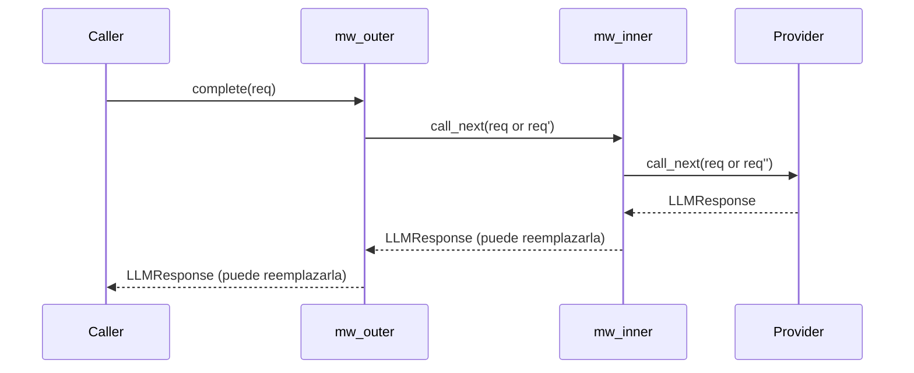
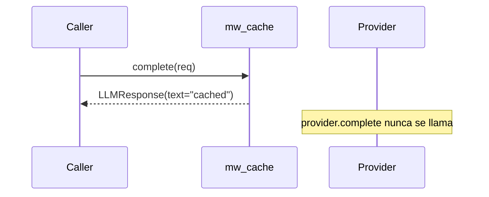

#

<div align="center">
  
</div>

<div align="center">

# Phronesis Framework - Middleware

</div>

<div align="center">
  Cadena de middlewares estilo "cebolla" sobre <code>LLMProvider.complete</code>: transforma requests, intercepta responses, corta el flujo, sin tocar el resto del protocolo.
</div>

<div align="center">
  <a href="../index.md">docs</a> ·
  <a href="../../src/phronesis/middleware/">source</a> ·
  <a href="../../tests/middleware/">tests</a>
</div>

<div align="center">

[]()
[]()
[]()

</div>

---

<div align="center">

## 🎯 Purpose

</div>

Los middlewares dan un punto de extensión limpio sobre la operación más cara y más útil de un proveedor LLM: `complete`. Cubren casos como:

- **Cache** - cortar la cadena devolviendo una respuesta sin invocar al LLM.
- **Re-escritura** - mutar el `LLMRequest` antes de mandarlo (cambiar modelo, normalizar mensajes, añadir cabeceras).
- **Auditoría / observabilidad** - inspeccionar request + response, emitir spans propios, persistir trazas.
- **Transformación de la salida** - post-procesar `LLMResponse.text` (sanitización, formato).

El módulo es deliberadamente minimal: un `Protocol` y una función `apply_middleware`. No hay registro global, no hay clases base obligatorias, no hay state.

<div align="center">

## 🏗️ Architecture

</div>

Modelo onion-layer: el primer middleware envuelve al segundo, que envuelve al tercero, ..., el último llama al provider real.

```
apply_middleware(provider, [mw_a, mw_b]).complete(req)
   ──► mw_a(req, call_next=λ r: mw_b(r, call_next=λ r2: provider.complete(r2)))
```

Solo `complete` se intercepta. `stream`, `supports`, `context_window_size`, `count_tokens`, `count_tokens_exact` se delegan tal cual al provider envuelto. Eso garantiza que las capacidades de cancelación, feature-detection y token-accounting siguen funcionando sin que la cadena tenga que enterarse.

<div align="center">

## 📦 Module layout

</div>

| Fichero | Responsabilidad |
|---|---|
| `__init__.py` | Re-exports de la API pública (`__all__`). |
| `protocol.py` | `Middleware` (`Protocol`, `runtime_checkable`) y alias `NextCall`. |
| `chain.py` | `apply_middleware(...)` + wrapper interno `_MiddlewareProvider`. |
| `errors.py` | `MiddlewareError(PhronesisError)`. |

<div align="center">

## 🔌 Public API

</div>

```python
from phronesis.middleware import (
    Middleware,
    NextCall,
    MiddlewareError,
    apply_middleware,
)
```

Signaturas clave:

```python
NextCall = Callable[[LLMRequest], Awaitable[LLMResponse]]

@runtime_checkable
class Middleware(Protocol):
    async def __call__(
        self,
        request: LLMRequest,
        call_next: NextCall,
    ) -> LLMResponse: ...

def apply_middleware(
    provider: LLMProvider,
    middlewares: Sequence[Middleware],
) -> LLMProvider: ...
```

<div align="center">

## 📐 Design decisions

</div>

- **D-01 `Protocol` runtime-checkable.** No hay clase base; cualquier callable con la firma `(request, call_next) -> LLMResponse` cumple. Sirve tanto una función async como un objeto con `__call__` async. `isinstance(obj, Middleware)` funciona.
- **D-02 Solo intercepta `complete`.** El streaming, las cuentas de tokens y las feature-flags pasan directas al provider envuelto. Razones: (a) la cadena onion no añade valor sobre streams chunk a chunk, (b) la cancelación cooperativa funciona sin contaminación, (c) los contadores deben reflejar lo que el provider real reporta.
- **D-03 Sin mutación.** `apply_middleware` no modifica el provider ni la lista de middlewares. Devuelve siempre un wrapper nuevo. Permite componer libremente sin temer aliasing.
- **D-04 Orden = "outer first".** El primer middleware de la lista es el más externo; el último, el más cercano al provider. El bucle invierte la lista internamente para construir las closures.
- **D-05 Sin observabilidad propia.** El módulo no emite spans. Cada middleware decide si traza. Mantiene la pieza minimal y compone con `phronesis.obs` cuando el usuario lo pide explícitamente.
- **D-06 Sin validación de request.** Un middleware puede devolver un `LLMRequest` con cualquier forma. La responsabilidad de mantener invariantes recae en el autor del middleware.

<div align="center">

## 📊 Diagrams

</div>

Cadena con dos middlewares: orden de ejecución.



Short-circuit: un middleware que no llama a `call_next`.



<div align="center">

## 🔗 Dependencies

</div>

- `phronesis.providers.protocol` - `LLMProvider`, `ProviderFeature`.
- `phronesis.providers.types` - `LLMRequest`, `LLMResponse`.
- `phronesis.providers.chunks` - `LLMChunk` (sólo para el passthrough de `stream`).
- `phronesis.core.messages` - `Message` (sólo para el passthrough de `count_tokens`).
- `phronesis.errors.PhronesisError` - jerarquía raíz.

Quien depende: cualquier composición de provider que quiera capas extra antes de inyectarlo a un agente. Patrón típico:

```python
provider = apply_middleware(base_provider, [cache, audit])
agent = my_agent.with_provider(provider)
```

<div align="center">

## 🧪 Testing

</div>

Tests en `tests/middleware/`. Estrategia:

- Provider stub minimal in-memory.
- Casos cubiertos: passthrough, transformación de response, mutación de request, short-circuit, orden de varios middlewares, passthrough de los métodos no interceptados (`stream`, `count_tokens`, ...).
- Cobertura objetivo: 100%.

<div align="center">

## 📋 Examples

</div>

Cache rudimentaria que corta la cadena si la última pregunta ya estaba vista:

```python
from phronesis.middleware import apply_middleware, Middleware, NextCall
from phronesis.providers.types import LLMRequest, LLMResponse

_cache: dict[str, LLMResponse] = {}

async def cache(request: LLMRequest, call_next: NextCall) -> LLMResponse:
    key = request.messages[-1].content if request.messages else ""

    if key in _cache:
        return _cache[key]

    response = await call_next(request)
    _cache[key] = response

    return response

cached_provider = apply_middleware(base_provider, [cache])
```

Auditoría que registra todas las llamadas:

```python
import logging

log = logging.getLogger("audit")

async def audit(request: LLMRequest, call_next: NextCall) -> LLMResponse:
    log.info("request", extra={"model": request.model, "n_messages": len(request.messages)})

    try:
        response = await call_next(request)
    except Exception:
        log.exception("provider failed")
        raise

    log.info("response", extra={"text_len": len(response.text), "finish": response.finish_reason})

    return response

audited_provider = apply_middleware(base_provider, [audit])
```

Composición de varios (el primero es el más externo):

```python
provider = apply_middleware(base_provider, [audit, cache])
# audit corre primero al entrar y último al salir; cache corre por dentro
```

<div align="center">

## ⚠️ Pitfalls

</div>

- **El orden importa**. El primer middleware envuelve al segundo. Una cache puesta fuera de un audit registrará todos los hits; puesta dentro, sólo los misses.
- **No olvidar `call_next`**. Un middleware que no llame a `call_next` y no devuelva un `LLMResponse` rompe el contrato. Si quieres cortar, devuelve una `LLMResponse` válida.
- **El middleware sólo ve `complete`**. Si esperas interceptar `stream`, este módulo no es el sitio: añade el wrapping a mano o construye un decorador de provider completo.
- **Sin re-entrancia segura por diseño**. Si tu middleware mantiene estado mutable (cache, contador), tú gestionas la concurrencia.
- **`apply_middleware` no copia el provider**. Devuelve un wrapper que delega; si mutas el provider original desde fuera, el wrapper lo verá.

<div align="center">

## 🚦 Quality gates

</div>

```
uv run ruff format src/phronesis/middleware tests/middleware
uv run ruff check src/phronesis/middleware tests/middleware
uv run mypy src/phronesis/middleware
uv run pytest tests/middleware -q
uv run pytest -q
```

<div align="center">

## 🛠️ Tech stack

</div>

- Python 3.11+.
- `typing.Protocol` + `runtime_checkable`.
- Sólo stdlib.

<div align="center">

## 🔮 Future work

</div>

- **Middlewares oficiales** - `cache`, `retry`, `audit`, `redact` como helpers listos para usar.
- **Hook sobre `stream`** - si surgen casos reales (contar chunks, fusionar streams), añadir un `apply_stream_middleware` análogo.
- **Telemetría opcional** - flag para envolver cada middleware en un span sin obligar al autor a llamar a `obs` manualmente.
- **Composición declarativa** - `MiddlewareStack(...)` reutilizable y reordenable en runtime.
