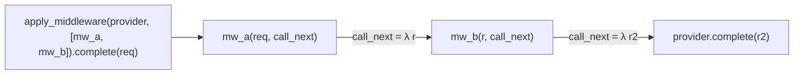
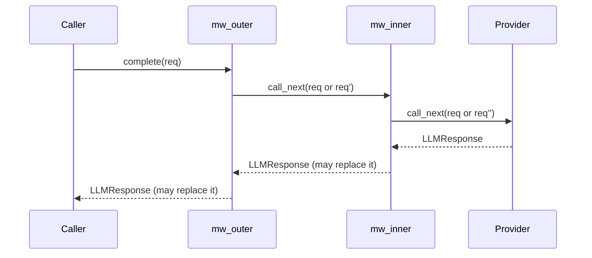
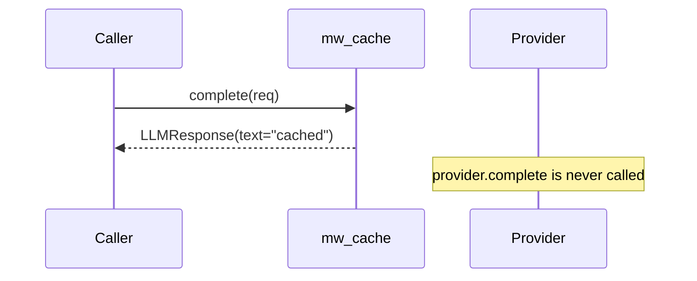

#

<div align="center">
  
</div>

<div align="center">

# Phronesis Framework - Middleware

</div>

<div align="center">
  "Onion"-style middleware chain over <code>LLMProvider.complete</code>: transforms requests, intercepts responses, short-circuits the flow, without touching the rest of the protocol.
</div>

<div align="center">
  <a href="../index.md">docs</a> ·
  <a href="../../src/phronesis/middleware/">source</a> ·
  <a href="../../tests/middleware/">tests</a>
</div>

<div align="center">

[]()
[]()
[]()

</div>

---

<div align="center">

## 🎯 Purpose

</div>

Middlewares provide a clean extension point over the most expensive and most useful operation of an LLM provider: `complete`. They cover cases such as:

- **Cache** - short-circuit the chain by returning a response without invoking the LLM.
- **Rewriting** - mutate the `LLMRequest` before sending it (change model, normalize messages, add headers).
- **Auditing / observability** - inspect request + response, emit custom spans, persist traces.
- **Output transformation** - post-process `LLMResponse.text` (sanitization, formatting).

The module is deliberately minimal: a `Protocol` and an `apply_middleware` function. No global registry, no mandatory base classes, no state.

<div align="center">

## 🏗️ Architecture

</div>

Onion-layer model: the first middleware wraps the second, which wraps the third, ..., and the last one calls the real provider.


```mermaid
flowchart LR
    Call["apply_middleware(provider, [mw_a, mw_b]).complete(req)"] --> A["mw_a(req, call_next)"]
    A -->|"call_next = λ r"| B["mw_b(r, call_next)"]
    B -->|"call_next = λ r2"| P["provider.complete(r2)"]
```

Only `complete` is intercepted. `stream`, `supports`, `context_window_size`, `count_tokens`, `count_tokens_exact` are delegated as-is to the wrapped provider. This guarantees that cancellation, feature detection and token accounting keep working without the chain having to know about them.

<div align="center">

## 📦 Module layout

</div>

| File | Responsibility |
|---|---|
| `__init__.py` | Re-exports of the public API (`__all__`). |
| `protocol.py` | `Middleware` (`Protocol`, `runtime_checkable`) and the `NextCall` alias. |
| `chain.py` | `apply_middleware(...)` + internal wrapper `_MiddlewareProvider`. |
| `errors.py` | `MiddlewareError(PhronesisError)`. |

<div align="center">

## 🔌 Public API

</div>

```python
from phronesis.middleware import (
    Middleware,
    NextCall,
    MiddlewareError,
    apply_middleware,
)
```

Key signatures:

```python
NextCall = Callable[[LLMRequest], Awaitable[LLMResponse]]

@runtime_checkable
class Middleware(Protocol):
    async def __call__(
        self,
        request: LLMRequest,
        call_next: NextCall,
    ) -> LLMResponse: ...

def apply_middleware(
    provider: LLMProvider,
    middlewares: Sequence[Middleware],
) -> LLMProvider: ...
```

<div align="center">

## 📐 Design decisions

</div>

- **D-01 Runtime-checkable `Protocol`.** There is no base class; any callable with the signature `(request, call_next) -> LLMResponse` qualifies. Both an async function and an object with an async `__call__` work. `isinstance(obj, Middleware)` works.
- **D-02 Only intercepts `complete`.** Streaming, token counts and feature flags go straight to the wrapped provider. Reasons: (a) the onion chain adds no value over chunk-by-chunk streams, (b) cooperative cancellation works without contamination, (c) counters must reflect what the real provider reports.
- **D-03 No mutation.** `apply_middleware` does not modify the provider or the middleware list. It always returns a new wrapper. Allows free composition without fear of aliasing.
- **D-04 Order = "outer first".** The first middleware in the list is the outermost; the last, the closest to the provider. The loop reverses the list internally to build the closures.
- **D-05 No built-in observability.** The module emits no spans. Each middleware decides whether to trace. Keeps the piece minimal and composes with `phronesis.obs` when the user explicitly asks for it.
- **D-06 No request validation.** A middleware can return an `LLMRequest` of any shape. Responsibility for maintaining invariants falls on the middleware author.

<div align="center">

## 📊 Diagrams

</div>

Chain with two middlewares: execution order.


```mermaid
sequenceDiagram
    participant Caller
    participant Outer as mw_outer
    participant Inner as mw_inner
    participant Provider

    Caller->>Outer: complete(req)
    Outer->>Inner: call_next(req or req')
    Inner->>Provider: call_next(req or req'')
    Provider-->>Inner: LLMResponse
    Inner-->>Outer: LLMResponse (may replace it)
    Outer-->>Caller: LLMResponse (may replace it)
```

Short-circuit: a middleware that does not call `call_next`.


```mermaid
sequenceDiagram
    participant Caller
    participant Cache as mw_cache
    participant Provider

    Caller->>Cache: complete(req)
    Cache-->>Caller: LLMResponse(text="cached")
    Note over Provider: provider.complete is never called
```

<div align="center">

## 🔗 Dependencies

</div>

- `phronesis.providers.protocol` - `LLMProvider`, `ProviderFeature`.
- `phronesis.providers.types` - `LLMRequest`, `LLMResponse`.
- `phronesis.providers.chunks` - `LLMChunk` (only for the `stream` passthrough).
- `phronesis.core.messages` - `Message` (only for the `count_tokens` passthrough).
- `phronesis.errors.PhronesisError` - root hierarchy.

Dependents: any provider composition that wants extra layers before injecting it into an agent. Typical pattern:

```python
provider = apply_middleware(base_provider, [cache, audit])
agent = my_agent.with_provider(provider)
```

<div align="center">

## 🧪 Testing

</div>

Tests in `tests/middleware/`. Strategy:

- Minimal in-memory provider stub.
- Covered cases: passthrough, response transformation, request mutation, short-circuit, ordering of multiple middlewares, passthrough of non-intercepted methods (`stream`, `count_tokens`, ...).
- Target coverage: 100%.

<div align="center">

## 📋 Examples

</div>

Rudimentary cache that short-circuits the chain if the last question was already seen:

```python
from phronesis.middleware import apply_middleware, Middleware, NextCall
from phronesis.providers.types import LLMRequest, LLMResponse

_cache: dict[str, LLMResponse] = {}

async def cache(request: LLMRequest, call_next: NextCall) -> LLMResponse:
    key = request.messages[-1].content if request.messages else ""

    if key in _cache:
        return _cache[key]

    response = await call_next(request)
    _cache[key] = response

    return response

cached_provider = apply_middleware(base_provider, [cache])
```

Auditing that logs every call:

```python
import logging

log = logging.getLogger("audit")

async def audit(request: LLMRequest, call_next: NextCall) -> LLMResponse:
    log.info("request", extra={"model": request.model, "n_messages": len(request.messages)})

    try:
        response = await call_next(request)
    except Exception:
        log.exception("provider failed")
        raise

    log.info("response", extra={"text_len": len(response.text), "finish": response.finish_reason})

    return response

audited_provider = apply_middleware(base_provider, [audit])
```

Composing several (the first is the outermost):

```python
provider = apply_middleware(base_provider, [audit, cache])
# audit runs first on the way in and last on the way out; cache runs inside
```

<div align="center">

## ⚠️ Pitfalls

</div>

- **Order matters**. The first middleware wraps the second. A cache placed outside an audit will log all hits; placed inside, only the misses.
- **Do not forget `call_next`**. A middleware that neither calls `call_next` nor returns an `LLMResponse` breaks the contract. If you want to short-circuit, return a valid `LLMResponse`.
- **The middleware only sees `complete`**. If you expect to intercept `stream`, this module is not the place: add the wrapping by hand or build a full provider decorator.
- **No safe re-entrancy by design**. If your middleware keeps mutable state (cache, counter), you manage concurrency.
- **`apply_middleware` does not copy the provider**. It returns a delegating wrapper; if you mutate the original provider from outside, the wrapper will see it.

<div align="center">

## 🚦 Quality gates

</div>

```
uv run ruff format src/phronesis/middleware tests/middleware
uv run ruff check src/phronesis/middleware tests/middleware
uv run mypy src/phronesis/middleware
uv run pytest tests/middleware -q
uv run pytest -q
```

<div align="center">

## 🛠️ Tech stack

</div>

- Python 3.11+.
- `typing.Protocol` + `runtime_checkable`.
- Stdlib only.

<div align="center">

## 🔮 Future work

</div>

- **Official middlewares** - `cache`, `retry`, `audit`, `redact` as ready-to-use helpers.
- **Hook on `stream`** - if real cases arise (counting chunks, merging streams), add an analogous `apply_stream_middleware`.
- **Optional telemetry** - flag to wrap each middleware in a span without forcing the author to call `obs` manually.
- **Declarative composition** - reusable `MiddlewareStack(...)` that can be reordered at runtime.
