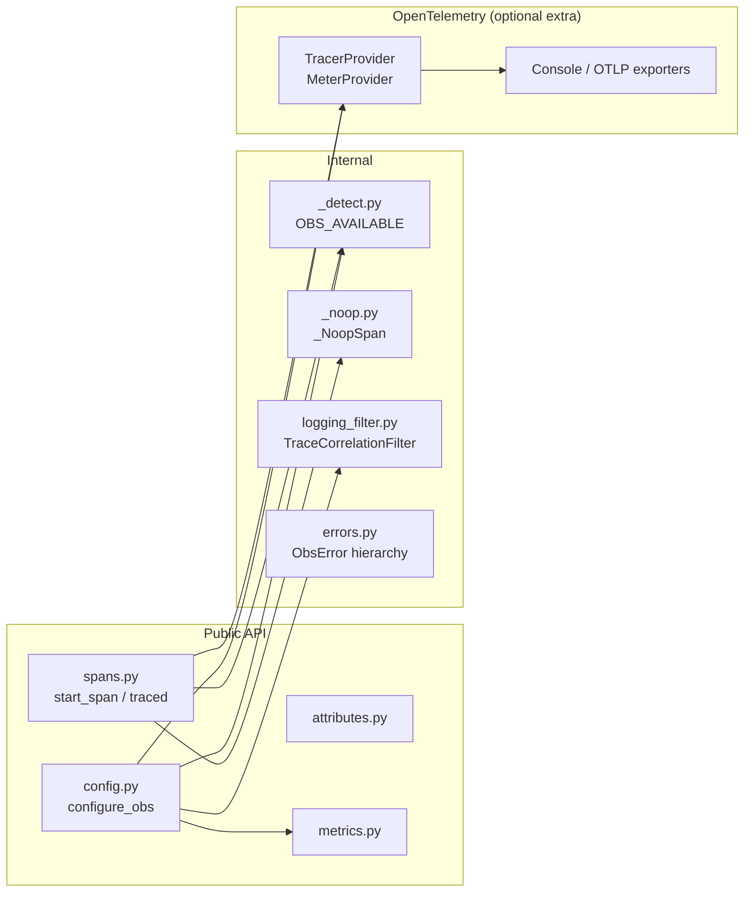
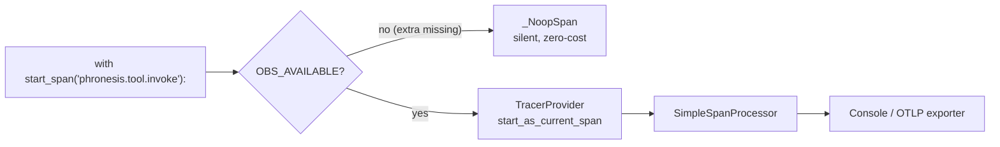
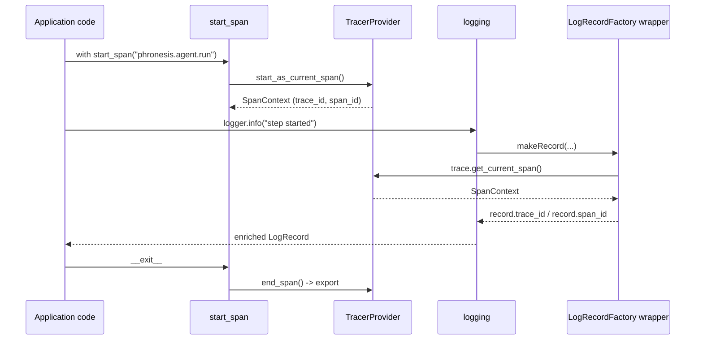

#

<div align="center">
  
</div>

<div align="center">

# Phronesis Framework - `obs`

</div>

<div align="center">
  Observability infrastructure built on OpenTelemetry: spans, metrics and log correlation, with a transparent no-op fallback when the <code>obs</code> extra is not installed.
</div>

<div align="center">
  <a href="../index.md">docs</a> ·
  <a href="../../src/phronesis/obs/">source</a> ·
  <a href="../../tests/obs/">tests</a>
</div>

<div align="center">

[]()
[]()
[]()
[]()

</div>

---

<div align="center">

## 🎯 Purpose

</div>

Phronesis components need to be observable end-to-end (tools, providers, agents, pipelines) without forcing every consumer of the framework to install or configure OpenTelemetry. This module provides the contract that makes that possible:

- A small, **stable public API** (`configure_obs`, `traced`, `start_span`, `start_span_async`, `current_trace_id`, plus `attributes` and `metrics` catalogs).
- A **no-op fallback** that activates automatically when the `obs` extra is missing, so call sites never have to branch on availability.
- A **closed catalog** of attribute names and metric instruments so dashboards and alerts stay consistent across the framework.
- **First-class OTLP support** for production deployments.
- **Automatic log correlation** - every log record produced while a span is active is enriched with `trace_id` and `span_id` in canonical hex form.

Non-goals:

- Wrapping every framework call site automatically. Instrumentation is opt-in via `@traced` and `start_span(_async)`.
- Replacing or shadowing OpenTelemetry. We expose OTel objects directly inside span context managers.
- Defining sampling, batching or exporter strategies beyond the two officially supported (`console`, `otlp`). Custom setups go through `exporter_instance` / `metric_reader_instance`.

<div align="center">

## 🏗️ Architecture

</div>

The module is split into a **detection / fallback layer** (`_detect`, `_noop`), a **public API layer** (`config`, `spans`), and two **closed catalogs** (`attributes`, `metrics`). Log correlation lives in its own module (`logging_filter`) and is wired in by `configure_obs`.



<div align="center">

## 📦 Module layout

</div>

| File | Responsibility |
|---|---|
| `_detect.py` | Runtime detection of OpenTelemetry. Exports `OBS_AVAILABLE: bool`. |
| `_noop.py` | `_NoopSpan` - silent stand-in that satisfies both sync and async context manager protocols. |
| `attributes.py` | Closed catalog of 24 attribute name constants (identifiers, provider, operation, tokens, streaming). |
| `metrics.py` | Closed catalog of 13 instrument names. Starts no-op, gets rebound to real OTel instruments by `_build_registry`. |
| `errors.py` | `ObsError`, `ObsNotAvailableError`, `ObsConfigError`. |
| `config.py` | `ObsConfig` (frozen snapshot) and `configure_obs(...)` entry point. |
| `spans.py` | `start_span`, `start_span_async`, `traced`, `current_trace_id`. |
| `logging_filter.py` | `TraceCorrelationFilter` and the global `install_trace_correlation_filter` / `uninstall_trace_correlation_filter` helpers. |

<div align="center">

## 🔌 Public API

</div>

Symbols re-exported from `phronesis.obs.__init__`:

| Symbol | Kind | Purpose |
|---|---|---|
| `configure_obs(...)` | function | Initialize tracer/meter providers and install the logging filter. Idempotent. |
| `ObsConfig` | dataclass | Immutable snapshot of an active configuration. |
| `ObsError` | exception | Base of the obs hierarchy. |
| `ObsNotAvailableError` | exception | Raised when an obs API is called and the `obs` extra is missing. |
| `ObsConfigError` | exception | Raised on invalid argument combinations (unknown exporter, OTLP without endpoint). |
| `start_span(name, *, attributes=None)` | context manager | Open a span as the current span. No-op when extra missing. |
| `start_span_async(name, *, attributes=None)` | async context manager | Async counterpart of `start_span`. |
| `traced(name, *, attributes_from=None)` | decorator | Wrap a sync or async function in a span. |
| `current_trace_id()` | function | Active trace id as a 32-char hex string, or `None`. |
| `attributes` | module | Closed catalog of attribute name constants. |
| `metrics` | module | Closed catalog of metric instruments. |

`configure_obs` signature:

```python
def configure_obs(
    *,
    exporter: str = "console",            # "console" | "otlp"
    endpoint: str | None = None,          # required when exporter="otlp"
    sampling: float = 1.0,                # 0.0 .. 1.0 (TraceIdRatioBased)
    service_name: str = "phronesis",
    exporter_instance: Any = None,        # bypass exporter/endpoint, inject your own
    metric_reader_instance: Any = None,   # bypass for metric reader
) -> ObsConfig: ...
```

<div align="center">

## 📐 Design decisions

</div>

| Decision | Why |
|---|---|
| `obs` is an **optional extra**, not a hard dep. | Library users that don't want OTel don't pay for it, neither in install size nor runtime cost. |
| **No-op fallback** in every entry point. | Call sites stay branch-free. `start_span("...")` is always valid. |
| **Closed catalog** for attributes and metrics. | Prevents cardinality drift and keeps dashboards stable across versions. |
| Span naming convention `phronesis.<component>.<operation>`. | Variability (tool id, provider name) goes into attributes, not into the span name. |
| `configure_obs` is **idempotent** and **fully replaces** prior providers. | Avoids stacking exporters in tests and notebooks. |
| Log correlation via `setLogRecordFactory`, not per-logger filter. | Covers every logger in the process, including third-party libraries, with one hook. |
| Two supported exporters (`console`, `otlp`) + escape hatch (`exporter_instance`). | Covers the 95% case while leaving the door open for custom setups. |
| `current_trace_id` returns canonical 32-hex format. | Matches the OTel spec and the format used by `TraceCorrelationFilter`, so logs and traces match 1:1. |

<div align="center">

## 📊 Diagrams

</div>

No-op vs active mode - same call site, different runtime behavior:



Trace propagation and log correlation inside a span:



<div align="center">

## 🧪 Testing

</div>

| Test file | Focus |
|---|---|
| `test_detect.py` | `OBS_AVAILABLE` truthfulness in both environments. |
| `test_noop.py` | `_NoopSpan` accepts every span method and both context manager protocols. |
| `test_attributes.py` | Catalog is closed, constants are strings, naming convention holds. |
| `test_errors.py` | Hierarchy: `ObsConfigError` and `ObsNotAvailableError` derive from `ObsError`. |
| `test_config.py` | `configure_obs` idempotency, exporter validation, logging filter wiring. |
| `test_spans.py` | `start_span(_async)`, `current_trace_id`, status/exception recording. |
| `test_traced.py` | Sync and async wrappers, `attributes_from`, no-op pass-through. |
| `test_metrics.py` | Instruments rebound to real OTel after `configure_obs`. |
| `test_logging_filter.py` | Records gain `trace_id`/`span_id` inside spans, are inert outside. |
| `test_public_api.py` | `__all__` matches the documented surface. |
| `test_package.py` | Importability of all submodules. |

Tests that require OpenTelemetry are gated with `@pytest.mark.skipif(not OBS_AVAILABLE, ...)`. The suite runs to completion in both environments: install with the `obs` extra to exercise the active mode, without it to exercise the no-op fallback.

<div align="center">

## 📋 Examples

</div>

Bootstrap with the default console exporter:

```python
from phronesis.obs import configure_obs

configure_obs()  # exporter="console", sampling=1.0, service_name="phronesis"
```

Bootstrap for production with OTLP/HTTP:

```python
configure_obs(
    exporter="otlp",
    endpoint="https://otel.example.com:4318/v1/traces",
    sampling=0.1,
    service_name="agent-runner",
)
```

Decorate any sync or async function:

```python
from phronesis.obs import traced

@traced("phronesis.tool.invoke", attributes_from=lambda *a, **k: {"tool.id": k["tool_id"]})
def invoke(tool_id: str, args: dict) -> dict:
    ...

@traced("phronesis.provider.complete")
async def complete(prompt: str) -> str:
    ...
```

Open a span inline:

```python
from phronesis.obs import start_span
from phronesis.obs import attributes as A

with start_span("phronesis.pipeline.run", attributes={A.PIPELINE_ID: pid}) as span:
    span.set_attribute(A.OPERATION_OUTCOME, "ok")
```

Record a metric:

```python
from phronesis.obs import metrics

metrics.tool_invocations.add(1, attributes={"tool.id": "phronesis.tools.add"})
metrics.provider_duration.record(0.42, attributes={"provider.name": "anthropic"})
```

Log correlation works automatically once `configure_obs` has been called:

```python
import logging
from phronesis.obs import start_span

logger = logging.getLogger(__name__)

with start_span("phronesis.agent.run"):
    logger.info("step started")
    # record gains record.trace_id (32 hex) and record.span_id (16 hex)
```

Pair with `current_trace_id` when you need the active id explicitly:

```python
from phronesis.obs import current_trace_id, start_span

with start_span("phronesis.runtime.invoke"):
    tid = current_trace_id()  # 32-hex string, matches the exported span's trace_id
```

<div align="center">

## 🔗 Dependencies

</div>

- **Hard:** none. The module imports nothing from OpenTelemetry at import time.
- **Optional (extra `obs`):** `opentelemetry-api>=1.27`, `opentelemetry-sdk>=1.27`, `opentelemetry-exporter-otlp>=1.27` (only loaded when the exporter is actually used).
- **Internal consumers:** `_internal.logging` (for trace-id-aware formatters), future `runtime/`, `providers/`, `tools/` instrumentation sites.

<div align="center">

## ⚠️ Pitfalls

</div>

- Calling any obs API without the `obs` extra and without checking first raises `ObsNotAvailableError` for `configure_obs`. The span context managers and `traced` do **not** raise - they fall back to no-op behavior. Reach for the extra only when you actually want exports.
- `configure_obs(exporter="otlp")` requires `endpoint`. Omitting it raises `ObsConfigError`. Unknown exporter names raise the same error.
- The logging filter wraps `logging.setLogRecordFactory` globally. If your app re-installs its own factory **after** `configure_obs`, you must call `install_trace_correlation_filter()` again to re-wire enrichment.
- Span names must follow `phronesis.<component>.<operation>`. Variability (which tool, which provider) belongs in attributes from the closed catalog, not in the name.
- `metrics.*` symbols are rebound at `configure_obs` time. If you stash a reference (`counter = metrics.tool_invocations`) before configuration, you will keep recording into the no-op. Always access through the module: `metrics.tool_invocations.add(...)`.

<div align="center">

## 🚦 Quality gates

</div>

```bash
uv run ruff format src/phronesis/obs tests/obs
uv run ruff check src/phronesis/obs tests/obs
uv run mypy src/phronesis/obs tests/obs
uv run pytest -q tests/obs
```

All four must pass in green before commit. The pytest run is environment-aware: with the `obs` extra installed the active-mode tests execute, without it they skip cleanly.

<div align="center">

## 🚀 Deployable stack

</div>

The `obs` module emits OTLP. To **consume** what it emits, the repo ships a self-contained Grafana stack under [`deploy/observability/`](../../deploy/observability/) in two profiles:

- **Dev**: `grafana/otel-lgtm` all-in-one (one container, no persistence). For local iteration.
- **Prod**: separated containers (OTel Collector, Tempo, Loki, Prometheus, Grafana) with persistent volumes, healthchecks and isolated networks.

Both profiles auto-provision seven pre-built dashboards (`overview`, `providers`, `tools`, `agents`, `pipelines`, `retries`, `traces-explorer`) wired against the closed catalogs from `metrics.py` and `attributes.py`.

- [`docs/obs/stack.md`](./stack.md) - stack architecture, versions, troubleshooting.
- [`docs/obs/dashboards.md`](./dashboards.md) - panel-by-panel catalog with queries.
