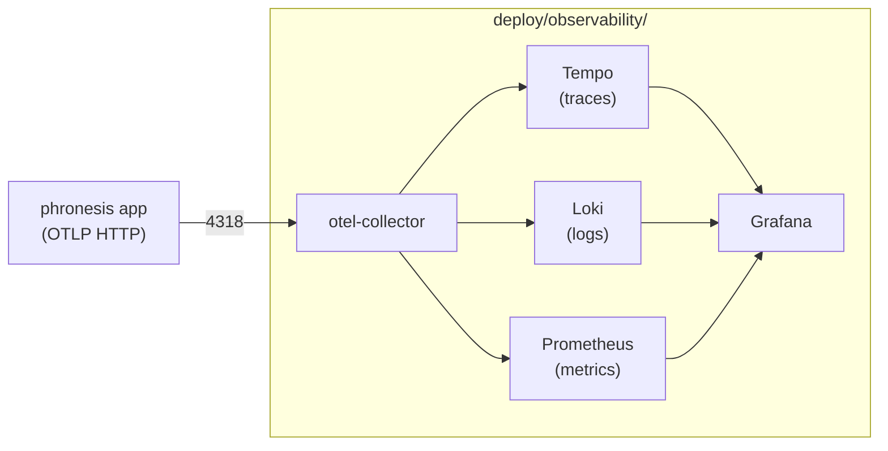

#

<div align="center">
  
</div>

<div align="center">

# Phronesis Framework - Observability stack

</div>

<div align="center">
  Stack OTLP estandar (Grafana + Tempo + Loki + Prometheus) que consume lo que <code>phronesis.obs</code> emite, en dos perfiles: dev all-in-one y produccion con servicios separados.
</div>

<div align="center">
  <a href="../index.md">docs</a> ·
  <a href="../../deploy/observability/">source</a> ·
  <a href="./dashboards.md">dashboards</a>
</div>

<div align="center">

[]()
[]()
[]()

</div>

---

<div align="center">

## 🎯 Purpose

</div>

Cualquier despliegue real de Phronesis necesita un sitio donde aterricen los traces, las metricas y los logs que `phronesis.obs` emite via OTLP. Este stack proporciona ese destino sin pedirle al usuario que junte Grafana, Tempo, Loki y Prometheus a mano.

Phronesis sigue siendo solo emisor: no almacena nada, no escucha en ningun puerto. El stack vive en `deploy/observability/` y se levanta con `docker compose`.

<div align="center">

## 🏗️ Architecture

</div>



En perfil dev la imagen `grafana/otel-lgtm` colapsa todos los servicios en un container; en prod cada componente corre aislado en networks separadas.

<div align="center">

## 📦 Module layout

</div>

```
deploy/observability/
├── README.md
├── docker-compose.dev.yml
├── docker-compose.prod.yml
├── otel-collector/config.yaml
├── tempo/tempo.yaml
├── loki/loki.yaml
├── prometheus/prometheus.yml
├── grafana/
│   ├── provisioning/
│   │   ├── datasources/datasources.yaml
│   │   └── dashboards/dashboards.yaml
│   └── dashboards/*.json
└── scripts/obs_demo.py
```

<div align="center">

## 📋 Examples

</div>

Dev:

```bash
cd deploy/observability
docker compose -f docker-compose.dev.yml up -d
uv run python scripts/obs_demo.py
```

Prod:

```bash
cd deploy/observability
export GRAFANA_ADMIN_PASSWORD=<secret>
docker compose -f docker-compose.prod.yml up -d
docker compose -f docker-compose.prod.yml ps
```

Configuracion del emisor:

```python
from phronesis.obs import configure_obs

configure_obs(
    exporter="otlp",
    endpoint="http://localhost:4318",
    service_name="my-app",
)
```

<div align="center">

## 🛠️ Tech stack

</div>

| Componente | Imagen | Version |
|---|---|---|
| All-in-one (dev) | `grafana/otel-lgtm` | 0.8.6 |
| OTel Collector | `otel/opentelemetry-collector-contrib` | 0.115.0 |
| Tempo | `grafana/tempo` | 2.6.1 |
| Loki | `grafana/loki` | 3.3.2 |
| Prometheus | `prom/prometheus` | v3.0.1 |
| Grafana | `grafana/grafana` | 11.4.0 |

<div align="center">

## ⚠️ Pitfalls

</div>

- **Prometheus OTLP receiver**: a partir de v3.0 esta estable; en versiones anteriores requiere `--enable-feature=otlp-write-receiver`. Pinneamos v3.0.1.
- **Loki OTLP endpoint**: usa `/otlp` desde Loki 3.0+. El collector apunta a `http://loki:3100/otlp`.
- **Tempo metrics-generator**: la metrica derivada `cost.usd` requiere habilitar el generator (ya activado en `tempo.yaml` con `span-metrics`).
- **Log shipping desde phronesis**: `install_trace_correlation_filter` inyecta `trace_id` en logs, pero no hay `OTLPLogHandler` por defecto. Hasta que se anada, los logs no llegan a Loki desde apps Python.
- **Provisioning en `otel-lgtm`**: el path montado es `/otel-lgtm/grafana/conf/provisioning/`. Confirmar antes de personalizar.
- **Cardinalidad**: `provider.model` y `tool.id` son alta-cardinalidad. Las queries en dashboards filtran antes de agregar.
- **Volumenes en Windows**: bind-mounts con espacios en la ruta del host pueden fallar. Usar paths absolutos sin espacios.

<div align="center">

## 🔮 Future work

</div>

- `OTLPLogHandler` en `phronesis.obs.config` para enviar logs sin handler manual.
- Reglas de alertas Prometheus (alertmanager) versionadas en el repo.
- Helm chart para despliegue en Kubernetes.
- Recording rules para pre-agregados de metricas alta-cardinalidad.
- Calculo automatico de `cost.usd` a partir de catalogo de precios por provider/model.
