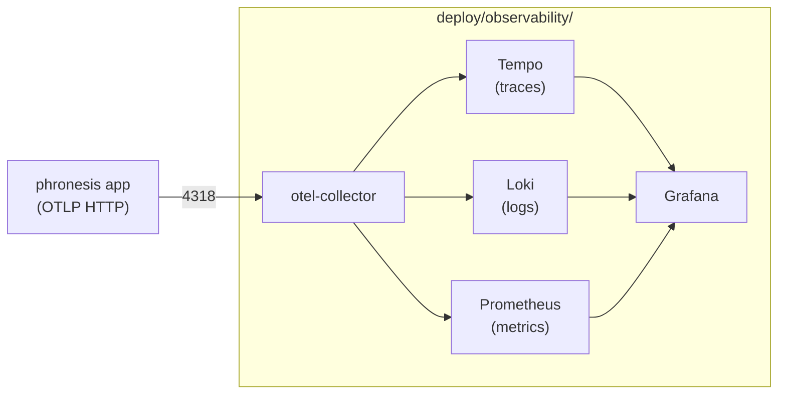

#

<div align="center">
  
</div>

<div align="center">

# Phronesis Framework - Observability stack

</div>

<div align="center">
  Standard OTLP stack (Grafana + Tempo + Loki + Prometheus) that consumes what <code>phronesis.obs</code> emits, in two profiles: all-in-one dev and production with separate services.
</div>

<div align="center">

[]()
[]()
[]()

</div>

---

<div align="center">

## 🎯 Purpose

</div>

Any real Phronesis deployment needs a place where the traces, metrics and logs that `phronesis.obs` emits via OTLP can land. This stack provides that destination without asking the user to wire Grafana, Tempo, Loki and Prometheus together by hand.

Phronesis remains an emitter only: it stores nothing and listens on no port. The stack lives in `deploy/observability/` and is started with `docker compose`.

<div align="center">

## 🏗️ Architecture

</div>


```mermaid
flowchart LR
  app["phronesis app<br/>(OTLP HTTP)"]
  subgraph stack["deploy/observability/"]
    col["otel-collector"]
    tempo["Tempo<br/>(traces)"]
    loki["Loki<br/>(logs)"]
    prom["Prometheus<br/>(metrics)"]
    graf["Grafana"]
  end
  app -->|4318| col
  col --> tempo
  col --> loki
  col --> prom
  tempo --> graf
  loki --> graf
  prom --> graf
```

In the dev profile the `grafana/otel-lgtm` image collapses all services into one container; in prod each component runs isolated on separate networks.

<div align="center">

## 📦 Module layout

</div>

```
deploy/observability/
├── README.md
├── docker-compose.dev.yml
├── docker-compose.prod.yml
├── otel-collector/config.yaml
├── tempo/tempo.yaml
├── loki/loki.yaml
├── prometheus/prometheus.yml
├── grafana/
│   ├── provisioning/
│   │   ├── datasources/datasources.yaml
│   │   └── dashboards/dashboards.yaml
│   └── dashboards/*.json
└── scripts/obs_demo.py
```

<div align="center">

## 📋 Examples

</div>

Dev:

```bash
cd deploy/observability
docker compose -f docker-compose.dev.yml up -d
uv run python scripts/obs_demo.py
```

Prod:

```bash
cd deploy/observability
export GRAFANA_ADMIN_PASSWORD=<secret>
docker compose -f docker-compose.prod.yml up -d
docker compose -f docker-compose.prod.yml ps
```

Emitter configuration:

```python
from phronesis.obs import configure_obs

configure_obs(
    exporter="otlp",
    endpoint="http://localhost:4318",
    service_name="my-app",
)
```

<div align="center">

## 🛠️ Tech stack

</div>

| Component | Image | Version |
|---|---|---|
| All-in-one (dev) | `grafana/otel-lgtm` | 0.8.6 |
| OTel Collector | `otel/opentelemetry-collector-contrib` | 0.115.0 |
| Tempo | `grafana/tempo` | 2.6.1 |
| Loki | `grafana/loki` | 3.3.2 |
| Prometheus | `prom/prometheus` | v3.0.1 |
| Grafana | `grafana/grafana` | 11.4.0 |

<div align="center">

## ⚠️ Pitfalls

</div>

- **Prometheus OTLP receiver**: stable since v3.0; earlier versions require `--enable-feature=otlp-write-receiver`. We pin v3.0.1.
- **OTLP temporality**: Prometheus only accepts `CUMULATIVE` by default. If the app exports `DELTA` (for example via `OTEL_EXPORTER_OTLP_METRICS_TEMPORALITY_PREFERENCE=delta` in the environment), Prometheus returns `HTTP 500: invalid temporality and type combination` and the metric is not persisted. Force `CUMULATIVE` in the exporter (see `scripts/obs_demo.py`) or start Prometheus with `--enable-feature=otlp-deltatocumulative`.
- **Loki OTLP endpoint**: uses `/otlp` since Loki 3.0+. The collector points to `http://loki:3100/otlp`.
- **Tempo metrics-generator**: the derived `cost.usd` metric requires enabling the generator (already enabled in `tempo.yaml` with `span-metrics`).
- **Log shipping from phronesis**: `install_trace_correlation_filter` injects `trace_id` into logs, but there is no `OTLPLogHandler` by default. Until one is added, logs from Python apps do not reach Loki.
- **Provisioning in `otel-lgtm`**: the mounted path is `/otel-lgtm/grafana/conf/provisioning/`. Confirm before customizing.
- **Cardinality**: `provider.model` and `tool.id` are high-cardinality. Dashboard queries filter before aggregating.
- **Volumes on Windows**: bind mounts with spaces in the host path may fail. Use absolute paths without spaces.

<div align="center">

## 🔮 Future work

</div>

- `OTLPLogHandler` in `phronesis.obs.config` to ship logs without a manual handler.
- Prometheus alerting rules (alertmanager) versioned in the repo.
- Helm chart for Kubernetes deployment.
- Recording rules for pre-aggregating high-cardinality metrics.
- Automatic `cost.usd` computation from a per-provider/model pricing catalog.
