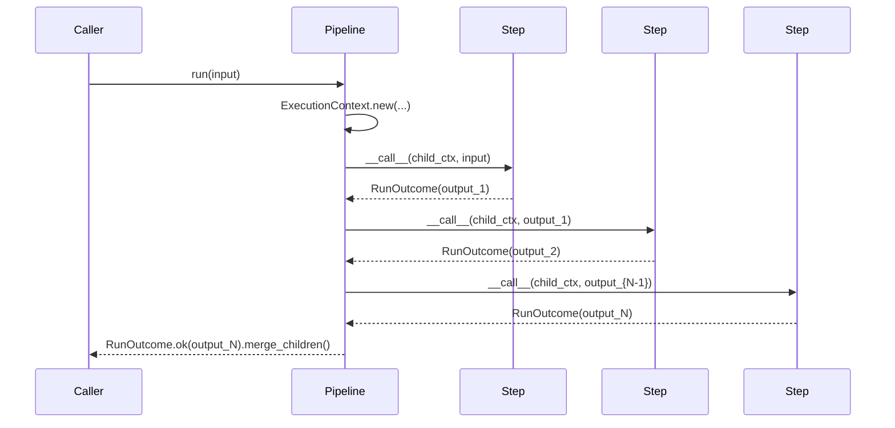
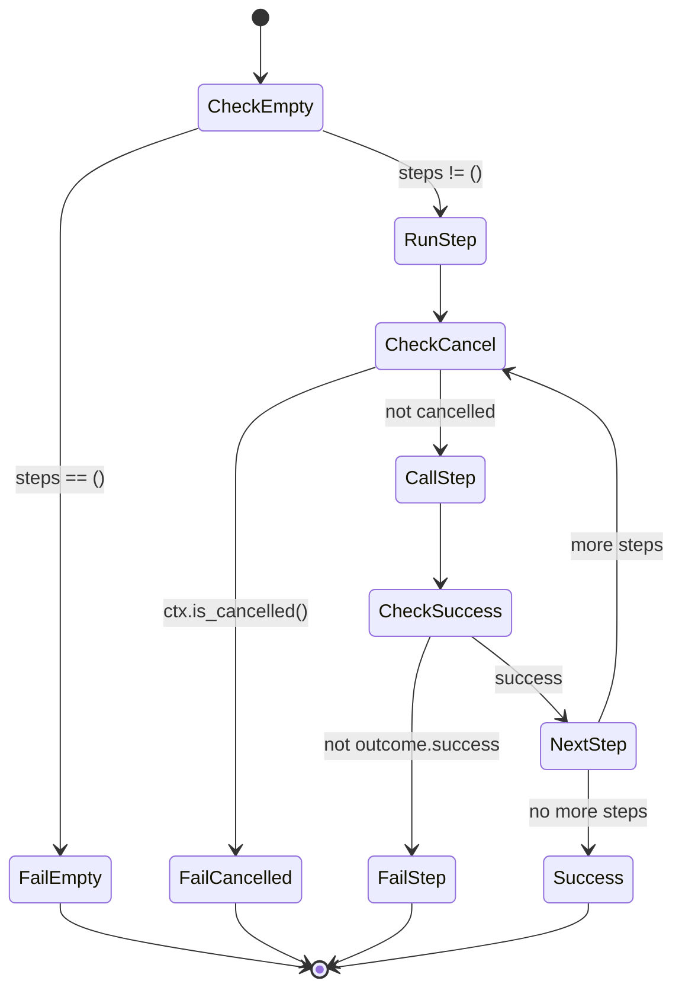

#

<div align="center">
  
</div>

<div align="center">

# Phronesis Framework - `pipelines`

</div>

<div align="center">
  Capa declarativa que envuelve un grafo lineal de <code>Executable</code> con identidad, observabilidad propia y un punto de entrada <code>.run()</code>, sin reimplementar la orquestación del runtime.
</div>

<div align="center">
  <a href="../index.md">docs</a> ·
  <a href="../../src/phronesis/pipelines/">source</a> ·
  <a href="../../tests/pipelines/">tests</a>
</div>

<div align="center">

[]()
[]()
[]()

</div>

---

<div align="center">

## 🎯 Purpose

</div>

`phronesis.pipelines` añade tres cosas sobre `phronesis.runtime`:

1. **Identidad**: cada pipeline es un objeto nombrado con un `PipelineId` estable derivado del nombre. Aparece en spans como `pipeline.id` / `pipeline.name`.
2. **Punto de entrada**: `Pipeline.run(input, deadline_s=..., metadata=...)` construye un `ExecutionContext` raíz por el usuario, sin obligar a importar el runtime para ejecutar.
3. **Composición declarativa**: la factory `pipeline(*steps, name=...)` adapta agentes y callables al protocolo `Executable` vía `as_node`, igual que cualquier modo del runtime.

Lo que el usuario escribe (factory imperativa):

```python
from phronesis.pipelines import pipeline
from phronesis.runtime import callable_node

async def fetch(_ctx, url): ...
async def parse(_ctx, payload): ...
async def summarize(_ctx, parsed): ...

ingestion = pipeline(
    callable_node(fetch),
    callable_node(parse),
    callable_node(summarize),
    name="ingestion",
)

result = await ingestion.run("https://example.com")
```

O, alineado con la filosofía decorador-como-metadata del resto del framework (`@agent`, `@tool`):

```python
from phronesis.pipelines import pipeline

@pipeline(steps=(fetch, parse, summarize))
def ingestion() -> None:
    """Pull a URL, parse it and produce a summary."""

result = await ingestion.run("https://example.com")
```

En modo decorador la función es un mero portador de metadatos: `__name__` provee el `name`, `__doc__` el `description` y `module.qualname` deriva el `PipelineId`, igual que en `@agent`.

Lo que el framework garantiza:

- **Forma uniforme de resultado** (`RunOutcome`), con `tokens` y `cost_usd` agregados vía `merge_children`.
- **Cancelación cooperativa** vía el `ExecutionContext` compartido entre el pipeline y sus steps.
- **Observabilidad** - span `phronesis.runtime.pipeline` con atributos canónicos `pipeline.id`, `pipeline.name`, `runtime.children.count`.
- **Composición** - un step puede ser cualquier modo del runtime (`Parallel`, `Router`, `Retry`, ...).

<div align="center">

## 🏗️ Architecture

</div>

`Pipeline` es un `frozen dataclass` que satisface el protocolo `Executable`:

- **Identidad**: campo `name` + `pipeline_id: PipelineId`.
- **Topología**: tupla ordenada `steps: tuple[Executable, ...]`. La salida del step `N` es la entrada del step `N+1`.
- **Errores tipados**: `PipelineEmptyError` cuando se invoca sin steps. El resto de fallos se propaga del modo/agent subyacente.
- **Sin estado**: el pipeline no guarda nada entre invocaciones. Checkpointing se compone con `phronesis.memory.Checkpointer` cuando se necesita.

DAGs no lineales se expresan **anidando** cualquier modo del runtime como step:

```python
from phronesis.runtime import Parallel, callable_node
from phronesis.pipelines import pipeline

p = pipeline(
    callable_node(prepare),
    Parallel(nodes=(callable_node(branch_a), callable_node(branch_b))),
    callable_node(aggregate),
    name="fan-out-then-aggregate",
)
```

<div align="center">

## 📦 Module layout

</div>

| Fichero | Responsabilidad |
|---|---|
| `__init__.py` | Re-exports públicos (`Pipeline`, `pipeline`, `PipelineId`, errores). |
| `ids.py` | `PipelineId(Id)` y `pipeline_id_generator`; deriva ids estables a partir del nombre. |
| `errors.py` | `PipelineError` y `PipelineEmptyError`. |
| `pipeline.py` | `Pipeline` dataclass + `pipeline()` con doble modo factory/decorador. |

<div align="center">

## 🔌 Public API

</div>

```python
from phronesis.pipelines import (
    Pipeline,
    PipelineEmptyError,
    PipelineError,
    PipelineId,
    pipeline,
    pipeline_id_generator,
)
```

Firmas:

```python
@dataclass(frozen=True, slots=True)
class Pipeline:
    name: str
    steps: tuple[Executable, ...]
    pipeline_id: PipelineId
    description: str = ""

    async def __call__(self, ctx: ExecutionContext, input: Any) -> RunOutcome: ...

    async def run(
        self,
        input: Any,
        *,
        deadline_s: float | None = None,
        metadata: Mapping[str, Any] | None = None,
    ) -> RunOutcome: ...


# Factory mode
def pipeline(
    *steps: Any,
    name: str,
    pipeline_id: PipelineId | None = None,
) -> Pipeline: ...


# Decorator mode
def pipeline(
    *,
    steps: Iterable[Any],
    name: str | None = None,
    pipeline_id: PipelineId | None = None,
) -> Callable[[Callable[..., Any]], Pipeline]: ...


class PipelineId(Id):
    prefix = "PID"
```

<div align="center">

## 📐 Design decisions

</div>

- **D-01 - Lineal + composición anidada** (v1). Un pipeline es una tupla ordenada de steps. Topologías no lineales se cubren anidando modos del runtime, evitando duplicar el motor de DAGs hasta tener señales claras de demanda.
- **D-02 - Solo `.run()` en v1**. Streaming (`.stream()`) y sessions multi-turno se difieren hasta que los eventos correspondientes (`BranchTaken`, `AgentTransition`, `ApprovalRequested`) estén cerrados en el runtime.
- **D-03 - Stateless**. Un `Pipeline` no persiste nada. Si una aplicación necesita resume/checkpointing, lo compone explícitamente con `phronesis.memory.Checkpointer` antes y después de cada step.
- **D-04 - Reusar modos del runtime**. Se considera y descarta reimplementar `Sequence` dentro de `pipelines`. El valor del módulo es **identidad + observabilidad + entrypoint**, no orquestación; cualquier comportamiento avanzado (retry, paralelismo, routing) se compone con los 19 modos ya existentes.
- **D-05 - Factory + decorador bajo el mismo nombre**. `pipeline()` despacha por modo: positionals → factory imperativa; `steps=` keyword → decorador aplicado a una función portadora de metadatos. Mezclar ambos eleva `TypeError`. El decorador alinea la API con `@agent`/`@tool` (función como metadata carrier, identidad derivada de `module.qualname`).

<div align="center">

## 📊 Diagrams

</div>





<div align="center">

## 🔗 Dependencies

</div>

- `phronesis.runtime`: `Executable`, `ExecutionContext`, `RunOutcome`, `as_node`, `runtime_span`, `CancelledError`, `ExecutionFailedError`, `RUNTIME_CHILDREN_COUNT`.
- `phronesis.obs.attributes`: `PIPELINE_ID`, `PIPELINE_NAME`.
- `phronesis._internal.ids`: `Id`, `IdGenerator`.

No depende de `phronesis.memory`, `phronesis.providers`, `phronesis.mcp` ni `phronesis.communication`.

<div align="center">

## 🧪 Testing

</div>

Cobertura organizada en cinco ficheros bajo `tests/pipelines/`:

| Fichero | Foco |
|---|---|
| `test_pipeline.py` | Semántica del happy path, fallos, cancelación, observabilidad. |
| `test_factory.py` | `pipeline()` en modo factory, adaptación de steps vía `as_node`, normalización del nombre. |
| `test_decorator.py` | `@pipeline(steps=...)`, derivación de `name`/`description`/`PipelineId` desde la función portadora. |
| `test_ids.py` | `PipelineId`, estabilidad y sanitización de segmentos. |
| `test_run.py` | `.run()` con metadata y deadline. |
| `test_integration.py` | Pipelines con `Parallel` y `Sequence` anidados. |

Patrón: AAA con breathing room, fixtures `root_ctx` y constructores de nodos en `conftest.py`. Para inspeccionar atributos OTEL se parchea `runtime_span` con un fake `asynccontextmanager`.

<div align="center">

## 📋 Examples

</div>

Pipeline lineal con tres steps (factory imperativa):

```python
from phronesis.pipelines import pipeline
from phronesis.runtime import callable_node

async def fetch(_ctx, url):
    return {"raw": "..."}

async def parse(_ctx, payload):
    return payload["raw"].split()

async def summarize(_ctx, tokens):
    return f"{len(tokens)} tokens"

ingestion = pipeline(
    callable_node(fetch),
    callable_node(parse),
    callable_node(summarize),
    name="ingestion",
)

outcome = await ingestion.run("https://example.com", deadline_s=10.0)
assert outcome.success
```

Mismo pipeline declarado vía decorador:

```python
from phronesis.pipelines import pipeline

async def fetch(_ctx, url): ...
async def parse(_ctx, payload): ...
async def summarize(_ctx, tokens): ...

@pipeline(steps=(fetch, parse, summarize))
def ingestion() -> None:
    """Pull a URL, parse it and produce a summary."""

outcome = await ingestion.run("https://example.com", deadline_s=10.0)
assert outcome.description == "Pull a URL, parse it and produce a summary."
```

Pipeline con un `Parallel` anidado:

```python
from phronesis.pipelines import pipeline
from phronesis.runtime import Parallel, callable_node

async def prepare(_ctx, x):
    return x

async def branch_a(_ctx, x):
    return x + 1

async def branch_b(_ctx, x):
    return x * 2

async def aggregate(_ctx, outputs):
    return sum(outputs)

p = pipeline(
    callable_node(prepare),
    Parallel(nodes=(callable_node(branch_a), callable_node(branch_b))),
    callable_node(aggregate),
    name="fan-out",
)

outcome = await p.run(3)
assert outcome.success
```

<div align="center">

## ⚠️ Pitfalls

</div>

- Un pipeline sin steps **falla** con `PipelineEmptyError`. La factory permite construirlo (`pipeline(name="x")`), pero invocarlo devuelve un `RunOutcome.fail(...)`.
- El tipo de la salida del step `N` debe ser aceptable como entrada del step `N+1`. El pipeline no inserta adaptadores implícitos.
- **No hay reintentos automáticos**. Si un step puede fallar de forma transitoria, envuélvelo con `Retry` del runtime antes de pasarlo al pipeline.
- Los nombres con caracteres no canónicos (espacios, guiones, mayúsculas) se normalizan a `[a-z0-9_]` para construir el `PipelineId` en modo factory. `name` se conserva tal cual en spans como `pipeline.name`.
- En modo decorador, la función portadora debe declararse a nivel de módulo. Funciones anidadas producen `module.qualname` con `<locals>`, que rechaza el validator. Es el mismo requisito que `@agent`.
- Mezclar argumentos positionales con `steps=` keyword en `pipeline()` eleva `TypeError`. Elige un modo y mantenlo.

<div align="center">

## 🚦 Quality gates

</div>

```bash
uv run ruff format src/phronesis/pipelines tests/pipelines
uv run ruff check src/phronesis/pipelines tests/pipelines
uv run mypy src/phronesis/pipelines
uv run pytest tests/pipelines -q
```

<div align="center">

## 🛠️ Tech stack

</div>

- Python 3.11+.
- Solo stdlib (`dataclasses`, `re`, `asyncio` indirectamente vía runtime).
- OpenTelemetry **opcional**: el span helper degrada a no-op cuando el extra `obs` no está instalado.

<div align="center">

## 🔮 Future work

</div>

Diferido conscientemente para v2:

- `Pipeline.stream()` + eventos runtime (`BranchTaken`, `AgentTransition`, `ApprovalRequested`).
- `Pipeline.session()` multi-turno con `phronesis.communication`.
- DAGs no lineales con nodos/edges explícitos.
- Integración nativa con `memory.Checkpointer` para resume.
- Scheduling / triggers / cron.
- Pipelines distribuidos multi-proceso.
- Factories lowercase aspiracionales (`sequence`, `router`, ...) vistas en `docs/examples/customer-support-system.md`; viven en runtime y no se introducen en v1 de pipelines.
