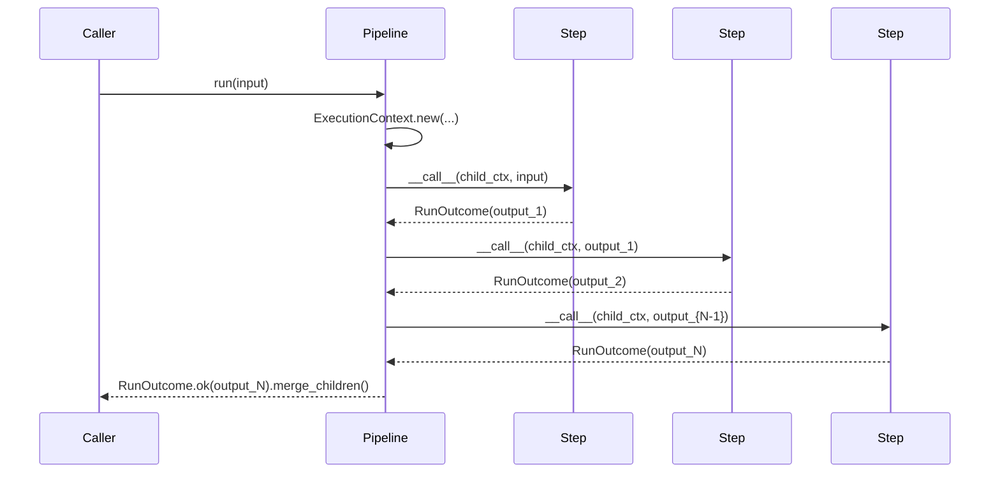
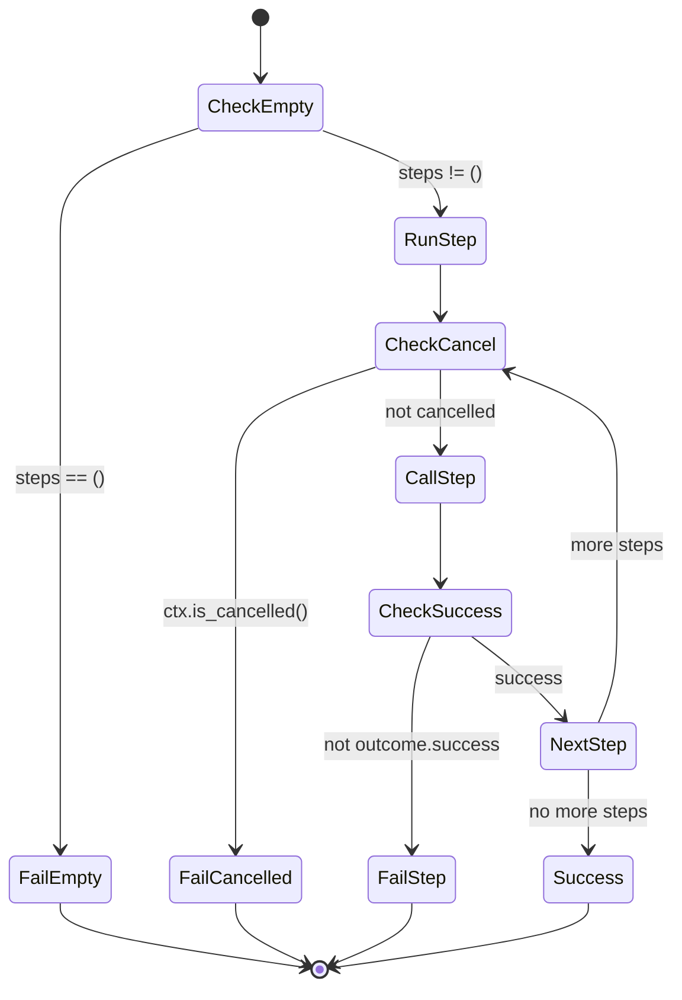

#

<div align="center">
  
</div>

<div align="center">

# Phronesis Framework - `pipelines`

</div>

<div align="center">
  Declarative layer that wraps a linear graph of <code>Executable</code> with identity, its own observability and a <code>.run()</code> entry point, without reimplementing runtime orchestration.
</div>

<div align="center">

[]()
[]()
[]()

</div>

---

<div align="center">

## 🎯 Purpose

</div>

`phronesis.pipelines` adds three things on top of `phronesis.runtime`:

1. **Identity**: each pipeline is a named object with a stable `PipelineId` derived from its name. It appears in spans as `pipeline.id` / `pipeline.name`.
2. **Entry point**: `Pipeline.run(input, deadline_s=..., metadata=...)` builds a root `ExecutionContext` on the user's behalf, without requiring the runtime to be imported to execute.
3. **Declarative composition**: the `pipeline(*steps, name=...)` factory adapts agents and callables to the `Executable` protocol via `as_node`, just like any runtime mode.

What the user writes (imperative factory):

```python
from phronesis.pipelines import pipeline
from phronesis.runtime import callable_node

async def fetch(_ctx, url): ...
async def parse(_ctx, payload): ...
async def summarize(_ctx, parsed): ...

ingestion = pipeline(
    callable_node(fetch),
    callable_node(parse),
    callable_node(summarize),
    name="ingestion",
)

result = await ingestion.run("https://example.com")
```

Or, aligned with the decorator-as-metadata philosophy of the rest of the framework (`@agent`, `@tool`):

```python
from phronesis.pipelines import pipeline

@pipeline(steps=(fetch, parse, summarize))
def ingestion() -> None:
    """Pull a URL, parse it and produce a summary."""

result = await ingestion.run("https://example.com")
```

In decorator mode the function is a mere metadata carrier: `__name__` provides the `name`, `__doc__` the `description`, and `module.qualname` derives the `PipelineId`, just like in `@agent`.

What the framework guarantees:

- **Uniform result shape** (`RunOutcome`), with `tokens` and `cost_usd` aggregated via `merge_children`.
- **Cooperative cancellation** via the `ExecutionContext` shared between the pipeline and its steps.
- **Observability** - `phronesis.runtime.pipeline` span with canonical attributes `pipeline.id`, `pipeline.name`, `runtime.children.count`.
- **Composition** - a step can be any runtime mode (`Parallel`, `Router`, `Retry`, ...).

<div align="center">

## 🏗️ Architecture

</div>

`Pipeline` is a `frozen dataclass` that satisfies the `Executable` protocol:

- **Identity**: `name` field + `pipeline_id: PipelineId`.
- **Topology**: ordered tuple `steps: tuple[Executable, ...]`. The output of step `N` is the input of step `N+1`.
- **Typed errors**: `PipelineEmptyError` when invoked without steps. All other failures propagate from the underlying mode/agent.
- **Stateless**: the pipeline keeps nothing between invocations. Checkpointing is composed with `phronesis.memory.Checkpointer` when needed.

Non-linear DAGs are expressed by **nesting** any runtime mode as a step:

```python
from phronesis.runtime import Parallel, callable_node
from phronesis.pipelines import pipeline

p = pipeline(
    callable_node(prepare),
    Parallel(nodes=(callable_node(branch_a), callable_node(branch_b))),
    callable_node(aggregate),
    name="fan-out-then-aggregate",
)
```

<div align="center">

## 📦 Module layout

</div>

| File | Responsibility |
|---|---|
| `__init__.py` | Public re-exports (`Pipeline`, `pipeline`, `PipelineId`, errors). |
| `ids.py` | `PipelineId(Id)` and `pipeline_id_generator`; derives stable ids from the name. |
| `errors.py` | `PipelineError` and `PipelineEmptyError`. |
| `pipeline.py` | `Pipeline` dataclass + `pipeline()` with dual factory/decorator mode. |

<div align="center">

## 🔌 Public API

</div>

```python
from phronesis.pipelines import (
    Pipeline,
    PipelineEmptyError,
    PipelineError,
    PipelineId,
    pipeline,
    pipeline_id_generator,
)
```

Signatures:

```python
@dataclass(frozen=True, slots=True)
class Pipeline:
    name: str
    steps: tuple[Executable, ...]
    pipeline_id: PipelineId
    description: str = ""

    async def __call__(self, ctx: ExecutionContext, input: Any) -> RunOutcome: ...

    async def run(
        self,
        input: Any,
        *,
        deadline_s: float | None = None,
        metadata: Mapping[str, Any] | None = None,
    ) -> RunOutcome: ...


# Factory mode
def pipeline(
    *steps: Any,
    name: str,
    pipeline_id: PipelineId | None = None,
) -> Pipeline: ...


# Decorator mode
def pipeline(
    *,
    steps: Iterable[Any],
    name: str | None = None,
    pipeline_id: PipelineId | None = None,
) -> Callable[[Callable[..., Any]], Pipeline]: ...


class PipelineId(Id):
    prefix = "PID"
```

<div align="center">

## 📐 Design decisions

</div>

- **D-01 - Linear + nested composition** (v1). A pipeline is an ordered tuple of steps. Non-linear topologies are covered by nesting runtime modes, avoiding a duplicate DAG engine until there are clear demand signals.
- **D-02 - Only `.run()` in v1**. Streaming (`.stream()`) and multi-turn sessions are deferred until the corresponding events (`BranchTaken`, `AgentTransition`, `ApprovalRequested`) are settled in the runtime.
- **D-03 - Stateless**. A `Pipeline` persists nothing. If an application needs resume/checkpointing, it composes it explicitly with `phronesis.memory.Checkpointer` before and after each step.
- **D-04 - Reuse runtime modes**. Reimplementing `Sequence` inside `pipelines` was considered and rejected. The module's value is **identity + observability + entrypoint**, not orchestration; any advanced behavior (retry, parallelism, routing) is composed with the 19 existing modes.
- **D-05 - Factory + decorator under the same name**. `pipeline()` dispatches by mode: positionals → imperative factory; `steps=` keyword → decorator applied to a metadata-carrier function. Mixing both raises `TypeError`. The decorator aligns the API with `@agent`/`@tool` (function as metadata carrier, identity derived from `module.qualname`).

<div align="center">

## 📊 Diagrams

</div>


```mermaid
sequenceDiagram
    participant Caller
    participant Pipeline
    participant Step1 as Step #1
    participant Step2 as Step #2
    participant StepN as Step #N

    Caller->>Pipeline: run(input)
    Pipeline->>Pipeline: ExecutionContext.new(...)
    Pipeline->>Step1: __call__(child_ctx, input)
    Step1-->>Pipeline: RunOutcome(output_1)
    Pipeline->>Step2: __call__(child_ctx, output_1)
    Step2-->>Pipeline: RunOutcome(output_2)
    Pipeline->>StepN: __call__(child_ctx, output_{N-1})
    StepN-->>Pipeline: RunOutcome(output_N)
    Pipeline-->>Caller: RunOutcome.ok(output_N).merge_children()
```


```mermaid
stateDiagram-v2
    [*] --> CheckEmpty
    CheckEmpty --> FailEmpty: steps == ()
    CheckEmpty --> RunStep: steps != ()
    RunStep --> CheckCancel
    CheckCancel --> FailCancelled: ctx.is_cancelled()
    CheckCancel --> CallStep: not cancelled
    CallStep --> CheckSuccess
    CheckSuccess --> FailStep: not outcome.success
    CheckSuccess --> NextStep: success
    NextStep --> CheckCancel: more steps
    NextStep --> Success: no more steps
    FailEmpty --> [*]
    FailCancelled --> [*]
    FailStep --> [*]
    Success --> [*]
```

<div align="center">

## 🔗 Dependencies

</div>

- `phronesis.runtime`: `Executable`, `ExecutionContext`, `RunOutcome`, `as_node`, `runtime_span`, `CancelledError`, `ExecutionFailedError`, `RUNTIME_CHILDREN_COUNT`.
- `phronesis.obs.attributes`: `PIPELINE_ID`, `PIPELINE_NAME`.
- `phronesis._internal.ids`: `Id`, `IdGenerator`.

Does not depend on `phronesis.memory`, `phronesis.providers`, `phronesis.mcp` or `phronesis.communication`.

<div align="center">

## 🧪 Testing

</div>

Coverage organized in five files under `tests/pipelines/`:

| File | Focus |
|---|---|
| `test_pipeline.py` | Happy-path semantics, failures, cancellation, observability. |
| `test_factory.py` | `pipeline()` in factory mode, step adaptation via `as_node`, name normalization. |
| `test_decorator.py` | `@pipeline(steps=...)`, derivation of `name`/`description`/`PipelineId` from the carrier function. |
| `test_ids.py` | `PipelineId`, stability and segment sanitization. |
| `test_run.py` | `.run()` with metadata and deadline. |
| `test_integration.py` | Pipelines with nested `Parallel` and `Sequence`. |

Pattern: AAA with breathing room, `root_ctx` fixtures and node builders in `conftest.py`. To inspect OTEL attributes, `runtime_span` is patched with a fake `asynccontextmanager`.

<div align="center">

## 📋 Examples

</div>

Linear pipeline with three steps (imperative factory):

```python
from phronesis.pipelines import pipeline
from phronesis.runtime import callable_node

async def fetch(_ctx, url):
    return {"raw": "..."}

async def parse(_ctx, payload):
    return payload["raw"].split()

async def summarize(_ctx, tokens):
    return f"{len(tokens)} tokens"

ingestion = pipeline(
    callable_node(fetch),
    callable_node(parse),
    callable_node(summarize),
    name="ingestion",
)

outcome = await ingestion.run("https://example.com", deadline_s=10.0)
assert outcome.success
```

Same pipeline declared via decorator:

```python
from phronesis.pipelines import pipeline

async def fetch(_ctx, url): ...
async def parse(_ctx, payload): ...
async def summarize(_ctx, tokens): ...

@pipeline(steps=(fetch, parse, summarize))
def ingestion() -> None:
    """Pull a URL, parse it and produce a summary."""

outcome = await ingestion.run("https://example.com", deadline_s=10.0)
assert outcome.description == "Pull a URL, parse it and produce a summary."
```

Pipeline with a nested `Parallel`:

```python
from phronesis.pipelines import pipeline
from phronesis.runtime import Parallel, callable_node

async def prepare(_ctx, x):
    return x

async def branch_a(_ctx, x):
    return x + 1

async def branch_b(_ctx, x):
    return x * 2

async def aggregate(_ctx, outputs):
    return sum(outputs)

p = pipeline(
    callable_node(prepare),
    Parallel(nodes=(callable_node(branch_a), callable_node(branch_b))),
    callable_node(aggregate),
    name="fan-out",
)

outcome = await p.run(3)
assert outcome.success
```

<div align="center">

## ⚠️ Pitfalls

</div>

- A pipeline without steps **fails** with `PipelineEmptyError`. The factory allows building it (`pipeline(name="x")`), but invoking it returns a `RunOutcome.fail(...)`.
- The output type of step `N` must be acceptable as input to step `N+1`. The pipeline inserts no implicit adapters.
- **No automatic retries**. If a step can fail transiently, wrap it with the runtime's `Retry` before passing it to the pipeline.
- Names with non-canonical characters (spaces, hyphens, uppercase) are normalized to `[a-z0-9_]` to build the `PipelineId` in factory mode. `name` is kept as-is in spans as `pipeline.name`.
- In decorator mode, the carrier function must be declared at module level. Nested functions produce a `module.qualname` containing `<locals>`, which the validator rejects. Same requirement as `@agent`.
- Mixing positional arguments with the `steps=` keyword in `pipeline()` raises `TypeError`. Pick one mode and stick to it.

<div align="center">

## 🚦 Quality gates

</div>

```bash
uv run ruff format src/phronesis/pipelines tests/pipelines
uv run ruff check src/phronesis/pipelines tests/pipelines
uv run mypy src/phronesis/pipelines
uv run pytest tests/pipelines -q
```

<div align="center">

## 🛠️ Tech stack

</div>

- Python 3.11+.
- Stdlib only (`dataclasses`, `re`, `asyncio` indirectly via runtime).
- OpenTelemetry **optional**: the span helper degrades to a no-op when the `obs` extra is not installed.

<div align="center">

## 🔮 Future work

</div>

Consciously deferred to v2:

- `Pipeline.stream()` + runtime events (`BranchTaken`, `AgentTransition`, `ApprovalRequested`).
- Multi-turn `Pipeline.session()` with `phronesis.communication`.
- Non-linear DAGs with explicit nodes/edges.
- Native integration with `memory.Checkpointer` for resume.
- Scheduling / triggers / cron.
- Distributed multi-process pipelines.
- Aspirational lowercase factories (`sequence`, `router`, ...) seen in `docs/examples/customer-support-system.md`; they live in runtime and are not introduced in pipelines v1.
