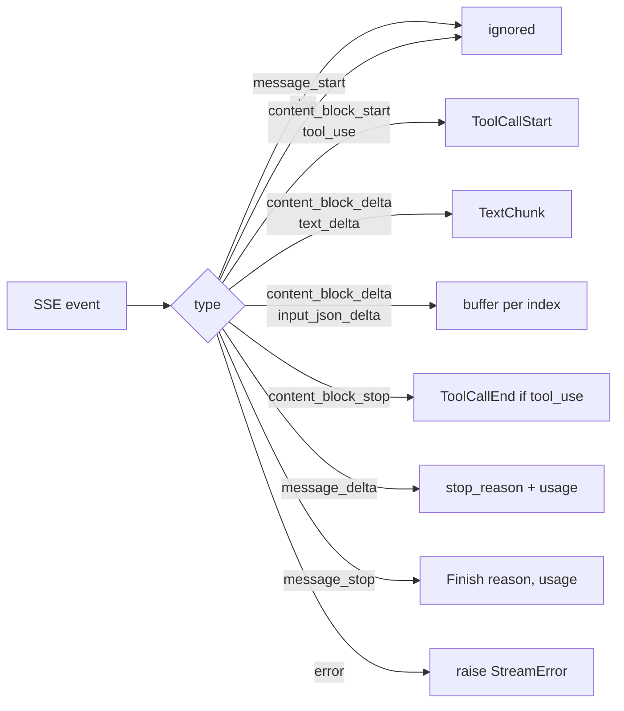

#

<div align="center">
  
</div>

<div align="center">

# Phronesis Framework - `providers.anthropic`

</div>

<div align="center">
  Anthropic adapter for the <code>providers</code> module. Targets the Messages API at <code>/v1/messages</code>, in both synchronous and streaming modes, without any vendor SDK.
</div>

<div align="center">
  <a href="../index.md">providers</a> ·
  <a href="../../index.md">docs</a> ·
  <a href="../../../src/phronesis/providers/anthropic/">source</a> ·
  <a href="../../../tests/providers/anthropic/">tests</a>
</div>

<div align="center">

[]()
[]()
[]()

</div>

---

<div align="center">

## 🎯 Purpose

</div>

Translate the framework's `LLMRequest` / `LLMResponse` types into Anthropic Messages API calls. Speak SSE for streaming, map HTTP errors to the shared `ProviderError` hierarchy, and expose the vendor-specific feature set via `ProviderFeature`.

Public entry point is the [`anthropic`](../../../src/phronesis/providers/anthropic/factory.py) factory function; the `AnthropicProvider` class is framework-internal.

<div align="center">

## 🏗️ Wire shape

</div>

| Concern | Value |
|---|---|
| Endpoint | `POST /v1/messages` |
| Auth header | `x-api-key: $ANTHROPIC_API_KEY` |
| Version header | `anthropic-version: 2023-06-01` |
| Streaming | `?stream=true`; SSE with `event:` + `data:` lines |
| Required body | `model`, `max_tokens`, `messages` |
| System prompt | top-level `system` field (extracted from `Role.SYSTEM` messages or `LLMRequest.system`) |
| Tools | top-level `tools: [{name, description?, input_schema}]` |

<div align="center">

## 🔌 Feature support

</div>

| Feature | Supported | Notes |
|---|:-:|---|
| `PROMPT_CACHING` | yes | Cache markers belong to the caller; tokens reported in `cache_read_tokens` / `cache_creation_tokens`. |
| `VISION` | yes | Image blocks travel as content parts (caller-supplied). |
| `DOCUMENTS` | yes | PDF/document blocks supported by the API. |
| `EXTENDED_THINKING` | yes | Enabled per-request by the caller via `metadata`. |
| `STRUCTURED_OUTPUT` | no | Emulate with a single tool whose `input_schema` is your target shape. |
| `REASONING_EFFORT` | no | OpenAI-only knob. |
| `PREDICTED_OUTPUTS` | no | OpenAI-only knob. |

<div align="center">

## 📊 Streaming event mapping

</div>



Tool-call arguments are streamed as partial JSON across multiple `input_json_delta` events keyed by `index`. The streaming layer accumulates them and parses the full payload on `content_block_stop`; invalid JSON raises `StreamError`.

<div align="center">

## 📐 Error mapping

</div>

| HTTP status | Error JSON `type` | Maps to |
|---|---|---|
| 401, 403 | any | `AuthenticationError` |
| 429 | `rate_limit_error` | `RateLimitError(retry_after_seconds=...)` |
| 400 | `context_length_exceeded` (or matching `message`) | `ContextWindowExceededError` |
| 400 | other | `BadRequestError` |
| 5xx | `api_error`, `overloaded_error`, ... | `ServerError` |
| other | - | `BadRequestError` |

`RateLimitError` parses the `retry-after` response header when present (decimal seconds).

<div align="center">

## 📋 Example

</div>

```python
from phronesis.providers.anthropic import anthropic
from phronesis.providers.types import LLMRequest, Message, Role

provider = anthropic(
    "claude-opus-4-7",
    api_key="sk-ant-...",     # or set ANTHROPIC_API_KEY
    temperature=0.2,
    max_tokens=2048,
)

response = await provider.complete(
    LLMRequest(
        model="",
        messages=(
            Message(role=Role.SYSTEM, content="Be concise."),
            Message(role=Role.USER, content="Three uses for vinegar."),
        ),
    )
)

print(response.text)
print(response.usage.cache_read_tokens, response.usage.cache_creation_tokens)
```

<div align="center">

## ⚠️ Pitfalls

</div>

- **`max_tokens` is required by Anthropic** and defaults to `4096` in the factory. Override per-call via `LLMRequest.max_tokens` for long generations.
- **Streaming is not retried.** `complete` retries on `TransportError`, `RateLimitError`, `ServerError` via `RetryConfig`; `stream` does not.
- **`content` blocks are pass-through.** Image and document blocks travel as plain dicts in the user-supplied message content; the adapter does not validate their shape.
- **`StreamError` from invalid `tool_use` JSON ends the iterator** rather than skipping the block; the runtime should treat this as a non-retryable streaming failure.

<div align="center">

## 🧪 Testing

</div>

| Test file | What it covers |
|---|---|
| `test_errors.py` | Status / envelope -> `ProviderError`. |
| `test_messages.py` | `Message` <-> Anthropic encoding, system extraction, tool blocks. |
| `test_tools.py` | `ToolSpec` -> Anthropic tool dict. |
| `test_provider.py` | Header / body shape, complete path, retries, default temperature. |
| `test_streaming.py` | SSE parser, text deltas, tool use, mixed content, error events. |
| `test_factory.py` | Env var fallback, explicit key precedence, default client. |
