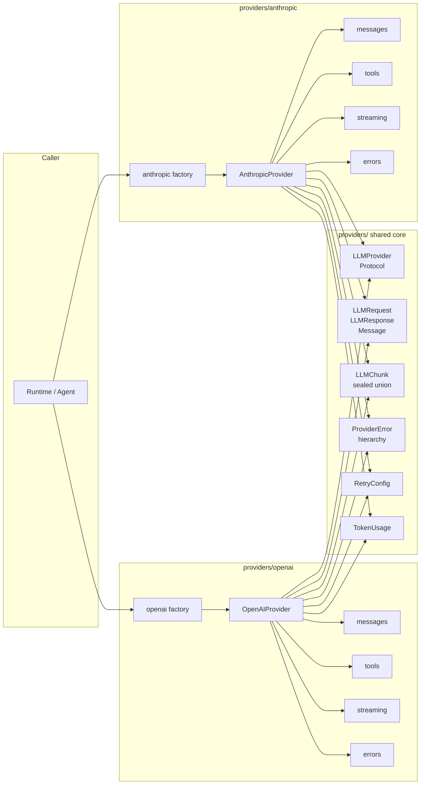
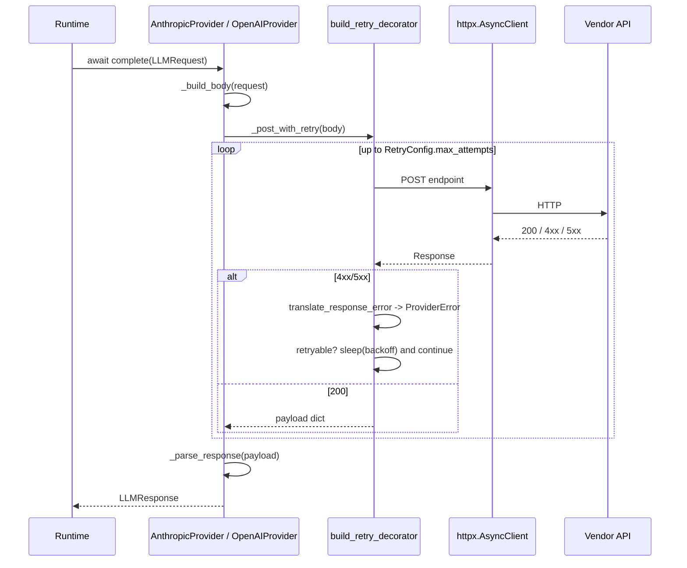
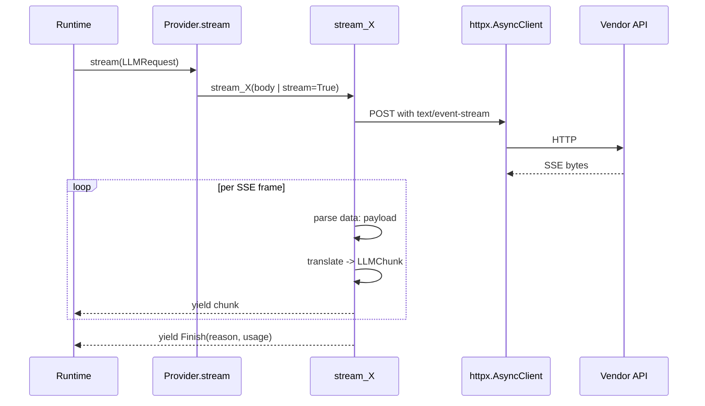
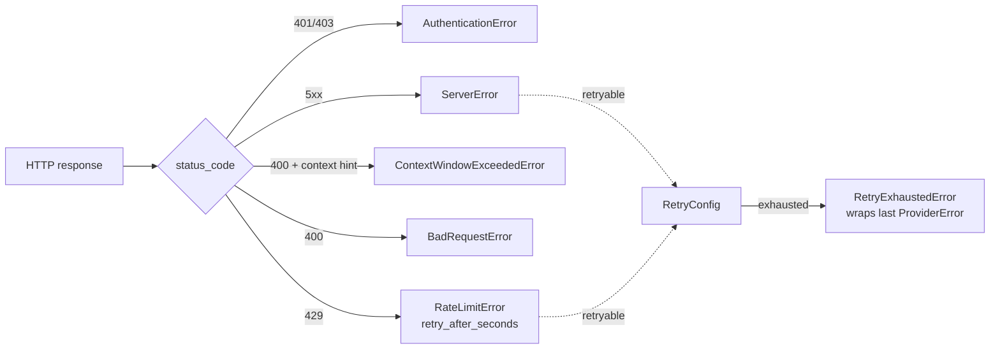
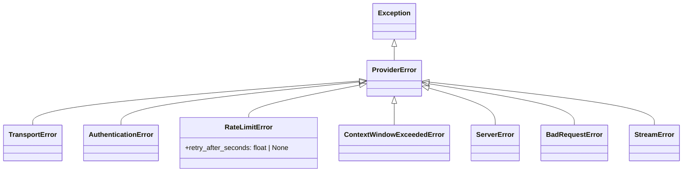

#

<div align="center">
  
</div>

<div align="center">

# Phronesis Framework - `providers`

</div>

<div align="center">
  Async, dependency-light adapters around large-language-model HTTP APIs. A single <code>LLMProvider</code> protocol exposes the same <code>complete</code> and <code>stream</code> surface across vendors, so runtime, tools and agents stay vendor-agnostic.
</div>

<div align="center">
  <a href="../index.md">docs</a> ·
  <a href="../../src/phronesis/providers/">source</a> ·
  <a href="../../tests/providers/">tests</a> ·
  <a href="../PROVIDERS-DECISIONS.md">decisions</a>
</div>

<div align="center">

[]()
[]()
[]()
[]()
[]()

</div>

---

<div align="center">

## 🎯 Purpose

</div>

The `providers` module is the boundary between the framework and any LLM vendor. A provider takes a framework-level `LLMRequest` (typed messages, tools, sampling knobs) and returns:

- an `LLMResponse` for synchronous completions, or
- an `AsyncIterator[LLMChunk]` for streaming completions.

Everything above this layer (runtime loops, tool dispatch, agents) sees a single shape regardless of vendor. Switching from Anthropic to OpenAI is a factory swap; no call-site changes.

What the user writes:

```python
from phronesis.providers.anthropic import anthropic
from phronesis.providers.openai import openai

claude = anthropic("claude-opus-4-7", api_key="sk-ant-...")
gpt = openai("gpt-4o", api_key="sk-openai-...")
```

What the framework guarantees, regardless of which factory:

1. The returned object satisfies the [`LLMProvider`](../../src/phronesis/providers/protocol.py) Protocol.
2. `complete(request)` returns an `LLMResponse(text, tool_calls, finish_reason, usage)`.
3. `stream(request)` yields a sealed union of `LLMChunk` (`TextChunk`, `ToolCallStart`, `ToolCallEnd`, `Finish`).
4. HTTP errors map to a single `ProviderError` hierarchy (`AuthenticationError`, `RateLimitError`, `ContextWindowExceededError`, `BadRequestError`, `ServerError`).
5. Retries (configurable) follow `RetryConfig`, integrated with `phronesis._internal.retry`.

Non-goals (deliberately):

- Tool execution. Providers describe tools and surface tool calls; the runtime dispatches them.
- Prompt engineering, agent loops, memory. Lives in the future `runtime/` and `agents/` modules.
- Cost accounting. `TokenUsage` is reported; conversion to currency is out of scope.

<div align="center">

## 🏗️ Architecture

</div>

The module is split into a **shared core** (types, protocol, errors, retry config) and **per-vendor adapters** that translate framework types into vendor wire shapes.



**Shared core** (vendor-agnostic, pure data):

- `protocol.py` - `LLMProvider` runtime-checkable Protocol + `ProviderFeature` `StrEnum`.
- `types.py` - `LLMRequest`, `LLMResponse`, `Message`, `Role`, `ToolCall`.
- `chunks.py` - sealed `LLMChunk` union for streaming.
- `errors.py` - `ProviderError` hierarchy.
- `usage.py` - `TokenUsage` dataclass.
- `retry_config.py` - `RetryConfig` + `build_retry_decorator`.

**Per-vendor adapters** (HTTP, encoding, decoding):

- `anthropic/` - Messages API at `/v1/messages` with `x-api-key`.
- `openai/` - Chat Completions at `/v1/chat/completions` with `Authorization: Bearer`.

**Common adapter layout** (mirrored across vendors):

| File | Responsibility |
|---|---|
| `factory.py` | Public entry point. Resolves API key, builds default `httpx.AsyncClient`. |
| `provider.py` | The provider class. Builds bodies, posts, parses responses, delegates streaming. |
| `messages.py` | Encode `Message` to the vendor shape, decode responses back to framework types. |
| `tools.py` | Encode `ToolSpec` to the vendor's tool description shape. |
| `streaming.py` | Parse the vendor's SSE event stream into `LLMChunk` values. |
| `errors.py` | Map HTTP status + JSON error envelope to `ProviderError` subclasses. |

<div align="center">

## 📦 Module layout

</div>

| File | Responsibility | Public symbols |
|---|---|---|
| `protocol.py` | Structural contract that every provider satisfies. | `LLMProvider`, `ProviderFeature` |
| `types.py` | Framework-level request, response and message types. | `LLMRequest`, `LLMResponse`, `Message`, `Role`, `ToolCall` |
| `chunks.py` | Sealed union of streaming events. | `LLMChunk`, `TextChunk`, `ToolCallStart`, `ToolCallEnd`, `ToolResult`, `Finish` |
| `errors.py` | Common error hierarchy. | `ProviderError`, `TransportError`, `AuthenticationError`, `RateLimitError`, `ContextWindowExceededError`, `ServerError`, `BadRequestError`, `StreamError` |
| `usage.py` | Token accounting. | `TokenUsage` |
| `retry_config.py` | Configurable retry policy bridged to `phronesis._internal.retry`. | `RetryConfig`, `build_retry_decorator` |
| `anthropic/factory.py` | `anthropic(...)` factory. | `anthropic` |
| `anthropic/provider.py` | Anthropic provider class. | `AnthropicProvider` |
| `anthropic/messages.py` | Anthropic-shape message encode/decode. | `to_anthropic_messages`, `from_anthropic_content` |
| `anthropic/tools.py` | Anthropic-shape tool encode. | `to_anthropic_tool`, `to_anthropic_tools` |
| `anthropic/streaming.py` | SSE parser for `/v1/messages?stream=true`. | `stream_anthropic_messages` |
| `anthropic/errors.py` | HTTP status -> `ProviderError`. | `translate_response_error` |
| `openai/factory.py` | `openai(...)` factory. | `openai` |
| `openai/provider.py` | OpenAI provider class. | `OpenAIProvider` |
| `openai/messages.py` | OpenAI-shape message encode/decode. | `to_openai_messages`, `from_openai_message` |
| `openai/tools.py` | OpenAI-shape tool encode. | `to_openai_tool`, `to_openai_tools` |
| `openai/streaming.py` | SSE parser for `/v1/chat/completions?stream=true`. | `stream_openai_chat` |
| `openai/errors.py` | HTTP status -> `ProviderError`. | `translate_response_error` |

<div align="center">

## 🔌 Public API

</div>

### Imports

```python
from phronesis.providers import (
    LLMProvider, ProviderFeature,
    LLMRequest, LLMResponse, Message, Role, ToolCall,
    LLMChunk, TextChunk, ToolCallStart, ToolCallEnd, ToolResult, Finish,
    TokenUsage,
    RetryConfig,
    ProviderError, TransportError, AuthenticationError,
    RateLimitError, ContextWindowExceededError,
    ServerError, BadRequestError, StreamError,
)
from phronesis.providers.anthropic import anthropic
from phronesis.providers.openai import openai
```

### `LLMProvider` Protocol

```python
@runtime_checkable
class LLMProvider(Protocol):
    @property
    def model(self) -> str: ...
    def supports(self, feature: ProviderFeature) -> bool: ...
    async def complete(self, request: LLMRequest) -> LLMResponse: ...
    def stream(self, request: LLMRequest) -> AsyncIterator[LLMChunk]: ...
```

Any object satisfying this contract is a provider. The two built-in implementations (`AnthropicProvider`, `OpenAIProvider`) are the canonical examples.

### `ProviderFeature` matrix

| Feature | Anthropic | OpenAI |
|---|:-:|:-:|
| `PROMPT_CACHING` | yes | yes |
| `VISION` | yes | yes |
| `DOCUMENTS` | yes | no |
| `EXTENDED_THINKING` | yes | no |
| `STRUCTURED_OUTPUT` | no (emulated via tool use) | yes |
| `REASONING_EFFORT` | no | yes (o1/o3 family) |
| `PREDICTED_OUTPUTS` | no | yes |

Capability is queried at runtime with `provider.supports(ProviderFeature.X)`; never branch on the provider class.

### Factories

```python
def anthropic(
    model: str,
    *,
    api_key: str | None = None,
    base_url: str = "https://api.anthropic.com",
    temperature: float | None = None,
    max_tokens: int = 4096,
    timeout: float = 60.0,
    retry: RetryConfig | None = None,
    http_client: httpx.AsyncClient | None = None,
) -> AnthropicProvider: ...

def openai(
    model: str,
    *,
    api_key: str | None = None,
    base_url: str = "https://api.openai.com",
    temperature: float | None = None,
    max_tokens: int | None = None,
    timeout: float = 60.0,
    retry: RetryConfig | None = None,
    http_client: httpx.AsyncClient | None = None,
) -> OpenAIProvider: ...
```

| Argument | Behavior |
|---|---|
| `api_key` | Falls back to `ANTHROPIC_API_KEY` / `OPENAI_API_KEY`. Missing key raises `AuthenticationError`. |
| `base_url` | Override for proxies, gateways, regional endpoints. |
| `temperature`, `max_tokens` | Per-provider defaults; per-request `LLMRequest.temperature` / `max_tokens` override. |
| `timeout` | HTTP timeout in seconds. Ignored if `http_client` is supplied. |
| `retry` | `RetryConfig` (see below). `None` uses sensible defaults. |
| `http_client` | Pre-built `httpx.AsyncClient`. Caller owns its lifetime. Required for tests using `MockTransport`. |

### `RetryConfig`

```python
@dataclass(frozen=True, slots=True)
class RetryConfig:
    max_attempts: int = 3
    on: tuple[type[BaseException], ...] = (TransportError, RateLimitError, ServerError)
    backoff: BackoffStrategy | None = None
    honor_retry_after: bool = True
    should_retry: Callable[[Exception], bool] | None = None
```

Applies only to `complete`. Streaming retry is intentionally out of scope (see D-12).

### Request and response types

```python
@dataclass(frozen=True, slots=True)
class LLMRequest:
    model: str                               # "" -> use provider default
    messages: tuple[Message, ...]
    tools: tuple[ToolSpec, ...] = ()
    system: str | None = None
    temperature: float | None = None
    max_tokens: int | None = None
    metadata: dict[str, Any] = field(default_factory=dict)

@dataclass(frozen=True, slots=True)
class LLMResponse:
    text: str = ""
    tool_calls: tuple[ToolCall, ...] = ()
    finish_reason: str = ""
    usage: TokenUsage | None = None
```

### Streaming chunks

`LLMChunk` is a sealed union; consumers can `match` on it exhaustively:

```python
match chunk:
    case TextChunk(text=t):       ...
    case ToolCallStart(call_id=cid, tool_name=n):   ...
    case ToolCallEnd(call_id=cid, arguments=args):  ...
    case Finish(reason=r, usage=u):                 ...
```

`ToolResult` is reserved for runtime-emitted tool outcomes; providers do not produce it directly.

<div align="center">

## 📐 Design decisions

</div>

Full rationale lives in [`../PROVIDERS-DECISIONS.md`](../PROVIDERS-DECISIONS.md). Headline-only:

| ID | Decision |
|---|---|
| D-01 | One implementation per vendor exposed through a typed factory function (`anthropic(...)`, `openai(...)`). |
| D-02 | `httpx` is the sole transport; no vendor SDK dependency. |
| D-03 | The factory is the only public construction path. Provider classes are framework-internal. |
| D-04 | HTTP I/O is async-only; sync wrappers belong to the caller. |
| D-05 | `LLMRequest` / `LLMResponse` are framework types; vendor encoding is internal. |
| D-06 | The same `Message` shape works across vendors; system goes either in `LLMRequest.system` or as a `Role.SYSTEM` message. |
| D-07 | All public dataclasses are `frozen=True, slots=True`. |
| D-08 | `LLMChunk` is a sealed union of `frozen+slots` dataclasses. |
| D-09 | `ProviderFeature` is a `StrEnum` with a closed vocabulary. |
| D-10 | `TokenUsage` exposes `input/output/cache_read/cache_creation` tokens. No currency. |
| D-11 | Errors live in a single hierarchy shared across vendors. |
| D-12 | Retries are configurable per provider via `RetryConfig`. Streaming is not retried. |

<div align="center">

## 📊 Diagrams

</div>

### `complete` request flow



### `stream` event flow



### Error mapping



### `ProviderError` hierarchy



<div align="center">

## 📋 Examples

</div>

### Minimal completion

```python
from phronesis.providers.anthropic import anthropic
from phronesis.providers.types import LLMRequest, Message, Role

provider = anthropic("claude-opus-4-7", api_key="sk-ant-...")

response = await provider.complete(
    LLMRequest(
        model="",
        messages=(Message(role=Role.USER, content="Say hi."),),
    )
)

print(response.text)
print(response.usage)
```

### Streaming

```python
from phronesis.providers.openai import openai
from phronesis.providers.chunks import Finish, TextChunk

provider = openai("gpt-4o", api_key="sk-openai-...")

async for chunk in provider.stream(request):
    match chunk:
        case TextChunk(text=t):
            print(t, end="", flush=True)
        case Finish(reason=r, usage=u):
            print(f"\n[done: {r}, tokens in/out = {u.input_tokens}/{u.output_tokens}]")
```

### Tools

Use the `@tool` decorator from `phronesis.tools` to declare a tool, then pass its `ToolSpec` to the request:

```python
from phronesis import tool
from phronesis.providers.types import LLMRequest, Message, Role

@tool
def search(query: str, limit: int = 10) -> list[str]:
    """Search the index."""
    ...

request = LLMRequest(
    model="",
    messages=(Message(role=Role.USER, content="Find phronesis docs."),),
    tools=(search.spec,),
)

response = await provider.complete(request)

for call in response.tool_calls:
    print(call.tool_name, call.arguments)
```

### Switching vendor with the same code

```python
def pick(vendor: str) -> LLMProvider:
    if vendor == "anthropic":
        return anthropic("claude-opus-4-7")

    return openai("gpt-4o")

provider = pick(vendor)
response = await provider.complete(request)   # identical from here on
```

### Custom retry

```python
from phronesis.providers.retry_config import RetryConfig
from phronesis._internal.retry import ExponentialBackoff

provider = anthropic(
    "claude-opus-4-7",
    retry=RetryConfig(
        max_attempts=5,
        backoff=ExponentialBackoff(initial_seconds=0.5, max_seconds=10.0),
        honor_retry_after=True,
    ),
)
```

### Injecting a mock transport (tests)

```python
import httpx
from phronesis.providers.anthropic import anthropic

def handler(request: httpx.Request) -> httpx.Response:
    return httpx.Response(200, json={"content": [{"type": "text", "text": "ok"}], "stop_reason": "end_turn", "usage": {}})

client = httpx.AsyncClient(
    transport=httpx.MockTransport(handler),
    base_url="https://api.anthropic.com",
)

provider = anthropic("claude-test", api_key="sk-x", http_client=client)
```

The caller owns `client` and is responsible for closing it.

<div align="center">

## 🔗 Dependencies

</div>

### Hard

- **`httpx >= 0.27`** - sole transport. Sync and async clients are supported by the library; providers only use the async one.

### Internal

| From `phronesis.providers` -> | Used for |
|---|---|
| `phronesis._internal.retry.retry` | retry decorator under `RetryConfig` |
| `phronesis._internal.retry.BackoffStrategy` | pluggable backoff |
| `phronesis.tools.ToolSpec` | tool descriptions sent on requests |

### Who depends on `phronesis.providers`

Currently no other framework module consumes providers directly. The future `runtime/` will be the first consumer; agents will go through the runtime, not the provider, to keep retries and policy uniform.

<div align="center">

## ⚠️ Pitfalls

</div>

- **Capability != availability.** `provider.supports(STRUCTURED_OUTPUT)` returning `False` does not mean the underlying model cannot produce structured output; it means the *adapter* does not yet expose a typed path for it. Use tool calls as a portable workaround.
- **`max_tokens` semantics differ.** Anthropic requires it (default 4096 here). OpenAI treats it as a cap (`None` lets the model decide). The factory signatures reflect this difference.
- **`Role.SYSTEM` placement.** Anthropic extracts it into a top-level `system` field; OpenAI prepends it as a regular message. The `LLMRequest.system` override always wins on Anthropic and is normalized to a system message on OpenAI.
- **Tool argument shapes.** Anthropic returns `arguments` as a JSON object inline; OpenAI streams a partial JSON string per delta and a JSON-encoded string in non-streaming responses. Both decode to a `dict[str, Any]` in `ToolCall.arguments`.
- **Streaming is not retried.** A mid-stream 5xx ends the iterator with `StreamError`/`ProviderError`. The caller decides whether to restart.
- **Default `httpx.AsyncClient` is created by the factory.** That client lives for the process lifetime and is not closed automatically. Inject your own client and manage its lifecycle for production deployments.
- **Provider classes are not the public API.** Construct providers through the factory functions. The class signatures may change between minor versions.
- **`StreamError` only signals SSE/JSON malformation or vendor-emitted `error` events.** HTTP-level failures during streaming raise the matching `ProviderError` subclass before any chunk is yielded.

<div align="center">

## 🧪 Testing

</div>

Tests mirror the source layout under `tests/providers/`:

| Test file | What it covers |
|---|---|
| `test_package.py` | Smoke imports for the package skeleton. |
| `test_usage.py`, `test_errors.py`, `test_chunks.py`, `test_types.py`, `test_protocol.py`, `test_retry_config.py` | Core types and protocol. |
| `anthropic/test_errors.py` | Status / envelope -> `ProviderError`. |
| `anthropic/test_messages.py` | `Message` <-> Anthropic encoding. |
| `anthropic/test_tools.py` | `ToolSpec` -> Anthropic tool dict. |
| `anthropic/test_provider.py` | Header / body shape, complete, error retries, default temperature. |
| `anthropic/test_streaming.py` | SSE parser, text, tool use, mixed content, error events. |
| `anthropic/test_factory.py` | Env var fallback, explicit key precedence, default client. |
| `openai/test_*.py` | Symmetric coverage for the OpenAI adapter. |
| `test_portability.py` | Parametrized cross-provider contract: same input -> same response shape, uniform error mapping, streaming union conformance. |

Counts:

- `tests/providers/` - **227 tests**.

Common pytest patterns used:

- `httpx.MockTransport` for all HTTP I/O; no real network.
- `FixedBackoff(0)` for retry tests to keep them deterministic.
- Parametrized fixtures (`tests/providers/test_portability.py`) for vendor-agnostic assertions.

<div align="center">

## 🚦 Quality gates

</div>

```
uv run ruff format src/phronesis/providers tests/providers
uv run ruff check src/phronesis/providers tests/providers
uv run mypy src/phronesis/providers
uv run pytest tests/providers -q
```

All four must be green before commit. CI runs the same set against the whole repo.

<div align="center">

## 🛠️ Tech stack

</div>

| Library | Version | Used for |
|---|---|---|
| Python | `>= 3.11` | `StrEnum`, structural pattern matching on sealed unions, `frozen+slots` dataclasses. |
| `httpx` | `>= 0.27` | async transport, `MockTransport` in tests, SSE streaming via `aiter_lines`. |
| stdlib | - | `json`, `enum`, `dataclasses`, `collections.abc`. |

<div align="center">

## 🔮 Future work

</div>

- **More vendors** - Gemini, Bedrock, Cohere, Mistral, Groq. Each plugs in as a new subpackage that satisfies `LLMProvider`.
- **Typed structured outputs.** A `response_format` field on `LLMRequest` that maps to OpenAI `json_schema` and to an Anthropic tool-use coercion path.
- **Reasoning effort knob.** Pass through `reasoning_effort` for OpenAI o-series; degrade silently for vendors that ignore it.
- **Streaming retry.** A higher-level helper that re-issues the request when a stream dies mid-flight, deduplicating already-emitted chunks.
- **Cost accounting.** A pluggable hook that converts `TokenUsage` to currency per model id, kept out of the provider core.
- **OpenAI Responses API.** Migrate the streaming path once the API is stable and feature-equivalent.
- **Tool-call IDs across providers.** Normalize `call_id` lifetimes so the runtime can correlate streamed `ToolCallStart` / `ToolCallEnd` with eventual `ToolResult` events without per-vendor branching.

<div align="center">

## 🧭 Vendor-specific notes

</div>

- [`anthropic/`](./anthropic/index.md) - Messages API specifics.
- [`openai/`](./openai/index.md) - Chat Completions specifics.
