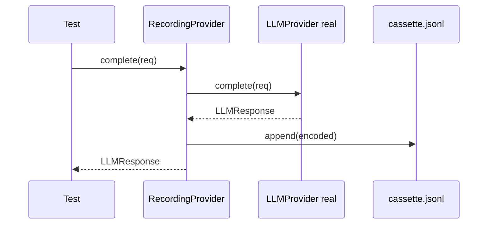
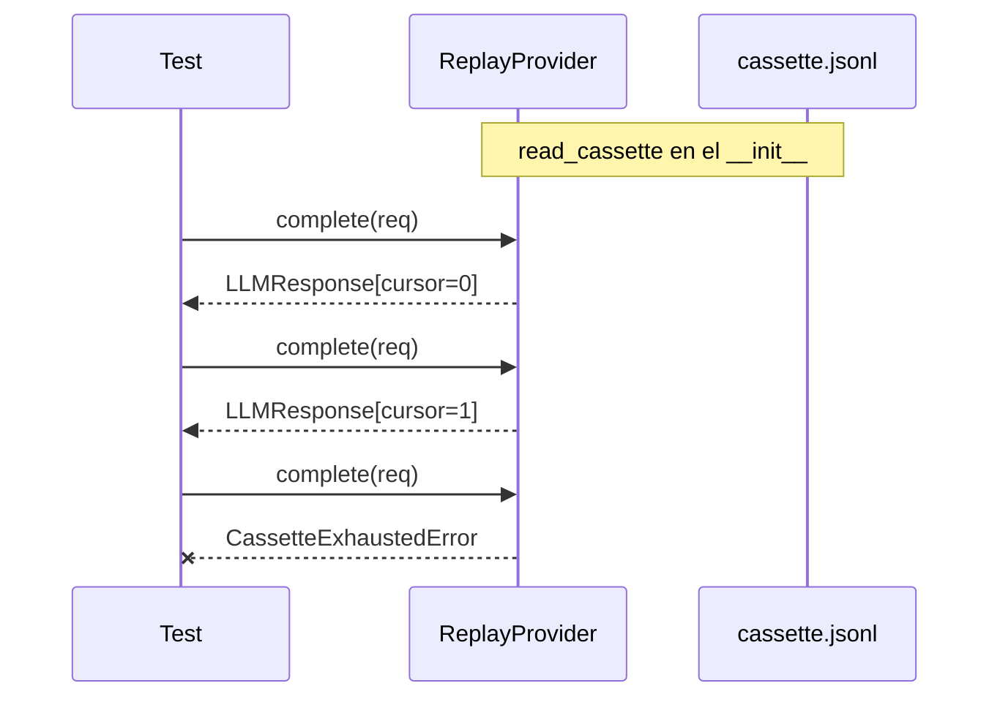

#

<div align="center">
  
</div>

<div align="center">

# Phronesis Framework - Replay

</div>

<div align="center">
  Grabación y reproducción determinista de respuestas LLM en cassettes JSONL: tests reproducibles sin red, sin coste y sin no-determinismo.
</div>

<div align="center">
  <a href="../index.md">docs</a> ·
  <a href="../../src/phronesis/replay/">source</a> ·
  <a href="../../tests/replay/">tests</a>
</div>

<div align="center">

[]()
[]()
[]()

</div>

---

<div align="center">

## 🎯 Purpose

</div>

Los providers LLM son la fuente principal de no-determinismo en una suite de tests: cuestan dinero, dependen de la red, tienen latencia variable y devuelven respuestas distintas en cada llamada. `replay` resuelve esto con un patrón record/replay clásico aplicado al `LLMProvider`:

- **Grabar una vez** contra el provider real (`RecordingProvider`).
- **Reproducir N veces** sin tocar la red (`ReplayProvider`).

El cassette es un fichero JSONL legible, diffable y editable a mano. Ideal para tests de integración de agents, runtime y pipelines.

<div align="center">

## 🏗️ Architecture

</div>

Dos proxies que implementan el protocolo `LLMProvider`:

```
real test:    Agent --> RecordingProvider --> LLMProvider real --> network
                              ↓
                       cassette.jsonl

replay test:  Agent --> ReplayProvider --reads--> cassette.jsonl
```

Ambos pasan por las mismas APIs que cualquier provider; el agent no se entera.

La forma del cassette es un `LLMResponse` por línea, codificado en JSON:

```json
{"text": "...", "tool_calls": [...], "finish_reason": "...", "usage": {...}}
{"text": "...", "tool_calls": [...], "finish_reason": "...", "usage": {...}}
```

<div align="center">

## 📦 Module layout

</div>

| Fichero | Responsabilidad |
|---|---|
| `__init__.py` | Re-exports de la API pública (`__all__`). |
| `errors.py` | `ReplayError` -> `CassetteFormatError`, `CassetteExhaustedError`. |
| `cassette.py` | I/O JSONL + `encode_response` / `decode_response` (incluye `ToolCall`, `TokenUsage`). |
| `recording.py` | `RecordingProvider`: wrapper que delega + `append_cassette` por cada `complete`. |
| `replay.py` | `ReplayProvider`: cassette en memoria + cursor secuencial. |

<div align="center">

## 🔌 Public API

</div>

```python
from phronesis.replay import (
    RecordingProvider,
    ReplayProvider,
    ReplayError,
    CassetteFormatError,
    CassetteExhaustedError,
    read_cassette,
    write_cassette,
    append_cassette,
    encode_response,
    decode_response,
)
```

Signaturas clave:

```python
class RecordingProvider:
    def __init__(
        self,
        inner: LLMProvider,
        cassette_path: str | Path,
        *,
        truncate: bool = True,
    ) -> None: ...

    async def complete(self, request: LLMRequest) -> LLMResponse: ...

class ReplayProvider:
    def __init__(
        self,
        cassette_path: str | Path,
        *,
        context_window: int = 200_000,
    ) -> None: ...

    async def complete(self, _request: LLMRequest) -> LLMResponse: ...

def encode_response(response: LLMResponse) -> dict[str, Any]: ...
def decode_response(payload: dict[str, Any]) -> LLMResponse: ...

def read_cassette(path: Path) -> list[LLMResponse]: ...
def write_cassette(path: Path, responses: list[LLMResponse]) -> None: ...
def append_cassette(path: Path, response: LLMResponse) -> None: ...
```

<div align="center">

## 📐 Design decisions

</div>

- **D-01 JSONL.** Formato textual, una entrada por línea. Diffable en git, editable a mano, language-neutral. Sin pickles, sin binarios opacos.
- **D-02 Record-then-replay puro.** El `ReplayProvider` no matchea por request: sirve respuestas en orden vía un cursor interno. Simplifica el modelo y deja la responsabilidad de "matching" al test que decide qué grabar. Si necesitas matching estricto, lo envuelves tú.
- **D-03 Cassette completo en memoria.** `ReplayProvider` carga todo el fichero al construirse. Cassettes son pequeños (decenas o cientos de entradas) y así los errores de formato salen en la construcción, no en medio del test.
- **D-04 Append por llamada.** `RecordingProvider` abre el fichero en append en cada `complete`. Si el test peta a mitad, lo grabado hasta el punto sigue siendo válido y reutilizable.
- **D-05 `truncate=True` por defecto.** Una nueva sesión de grabación no debe contaminarse con runs anteriores. `truncate=False` habilita explícitamente el modo append cross-session.
- **D-06 Streaming fuera de v1.** Sólo `complete` se graba. `RecordingProvider.stream` delega tal cual al provider real (sin grabar chunks); `ReplayProvider.stream` lanza `CassetteExhaustedError` siempre. Reproducir streams es complejidad innecesaria para el caso de uso central.
- **D-07 Capacidades sintéticas en replay.** `ReplayProvider.supports(...)` siempre `False`; `context_window_size()` devuelve el valor pasado al constructor (default 200 000); `count_tokens` usa heurística `len(text) // 4`; `count_tokens_exact` siempre `None`. Es un test double, no un modelo.

<div align="center">

## 📊 Diagrams

</div>

Flujo de grabación:



Flujo de reproducción:



<div align="center">

## 🔗 Dependencies

</div>

- `phronesis.providers.protocol` - `LLMProvider`, `ProviderFeature`.
- `phronesis.providers.types` - `LLMRequest`, `LLMResponse`, `ToolCall`.
- `phronesis.providers.usage` - `TokenUsage`.
- `phronesis.providers.chunks` - `LLMChunk` (sólo para tipos de stream).
- `phronesis.core.messages` - `Message` (sólo para tipos de count_tokens).
- `phronesis.errors.PhronesisError` - jerarquía raíz.
- Stdlib: `json`, `pathlib`, `asyncio`.

<div align="center">

## 🧪 Testing

</div>

Tests en `tests/replay/`. Estrategia:

- Provider stub minimal in-memory para no atar el cassette a un provider real.
- Casos cubiertos: encode/decode round-trip (incluye `tool_calls` y `usage`), grabación, replay secuencial, cassette mal formado, cassette agotado, `truncate=True/False`, passthrough de los métodos no grabados.
- Cobertura objetivo: 100%.

<div align="center">

## 📋 Examples

</div>

Grabar la primera vez:

```python
import asyncio
from phronesis.replay import RecordingProvider

async def main():
    # real_provider es tu provider real (Anthropic, OpenAI, etc.)
    recorder = RecordingProvider(real_provider, "tests/fixtures/agent_run.jsonl")

    agent = my_agent.with_provider(recorder)
    await agent.run("explica el teorema de Pitágoras")
    # tests/fixtures/agent_run.jsonl contiene ahora todas las responses

asyncio.run(main())
```

Reproducir en CI sin red:

```python
import asyncio
from phronesis.replay import ReplayProvider

async def main():
    replay = ReplayProvider("tests/fixtures/agent_run.jsonl")
    agent = my_agent.with_provider(replay)

    result = await agent.run("explica el teorema de Pitágoras")
    # Mismo input -> exactamente las mismas responses que en la grabación

asyncio.run(main())
```

Cassette manual (sin grabar):

```python
from phronesis.providers.types import LLMResponse
from phronesis.replay import write_cassette, ReplayProvider

write_cassette(
    "tests/fixtures/stubbed.jsonl",
    [
        LLMResponse(text="primera respuesta"),
        LLMResponse(text="segunda respuesta"),
    ],
)

replay = ReplayProvider("tests/fixtures/stubbed.jsonl")
```

Append entre runs distintos:

```python
from phronesis.replay import RecordingProvider

recorder = RecordingProvider(real_provider, cassette_path, truncate=False)
# Cada run añade al final del cassette sin borrar lo previo
```

<div align="center">

## ⚠️ Pitfalls

</div>

- **El replay no valida el request**. Sirve respuestas en orden ciegamente. Si tu test cambia el flujo (nuevo prompt, nueva tool call), el orden ya no encaja y el cassette deja de ser válido. Re-graba.
- **Streaming no se graba**. Si tu agente usa `stream`, el cassette ignora esas llamadas y `ReplayProvider.stream` lanza `CassetteExhaustedError`. Cambia el test a `complete` o documenta la limitación.
- **`truncate=True` borra al construir**. Si reusas el cassette path en varios tests del mismo proceso sin pensarlo, el segundo test borra lo del primero. Usa paths distintos por test o `truncate=False` con cuidado.
- **`context_window_size()` es sintético**. Si tu agente toma decisiones basadas en el tamaño del contexto, fija explícitamente `context_window=N` al construir el `ReplayProvider` para reflejar el modelo original.
- **`count_tokens` es una heurística**. `len(text) // 4`. Sirve para tests; no para billing ni para tomar decisiones de truncado serias.
- **Los cassettes son test fixtures**. Trátalos como datos checked-in en `tests/fixtures/`. Si una API cambia y rompe el formato decodificado, actualiza el cassette o re-graba.

<div align="center">

## 🚦 Quality gates

</div>

```
uv run ruff format src/phronesis/replay tests/replay
uv run ruff check src/phronesis/replay tests/replay
uv run mypy src/phronesis/replay
uv run pytest tests/replay -q
uv run pytest -q
```

<div align="center">

## 🛠️ Tech stack

</div>

- Python 3.11+.
- Sólo stdlib (`json`, `pathlib`, `asyncio`).

<div align="center">

## 🔮 Future work

</div>

- **Matching por request** - una variante `MatchingReplayProvider` que busque la entrada por hash del request en lugar de cursor secuencial.
- **Grabación de streams** - serializar la secuencia de chunks (delta acumulado o lista) y reproducirla.
- **Compresión** - opcional gzip para cassettes grandes manteniendo el formato JSONL por dentro.
- **Sanitización en la grabación** - hook para redactar PII antes de escribir al cassette.
- **Versionado del esquema** - cabecera de cassette con `format_version` para migraciones futuras.
- **Integración con `phronesis.testing`** - fixtures de pytest que construyan automáticamente el provider grabador/reproductor según un flag.
