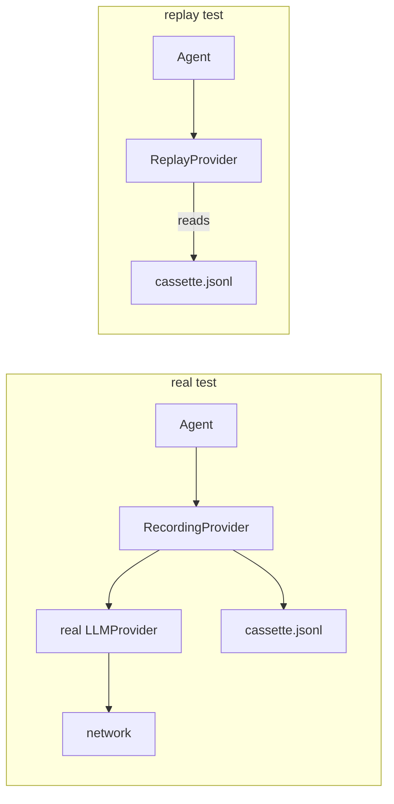
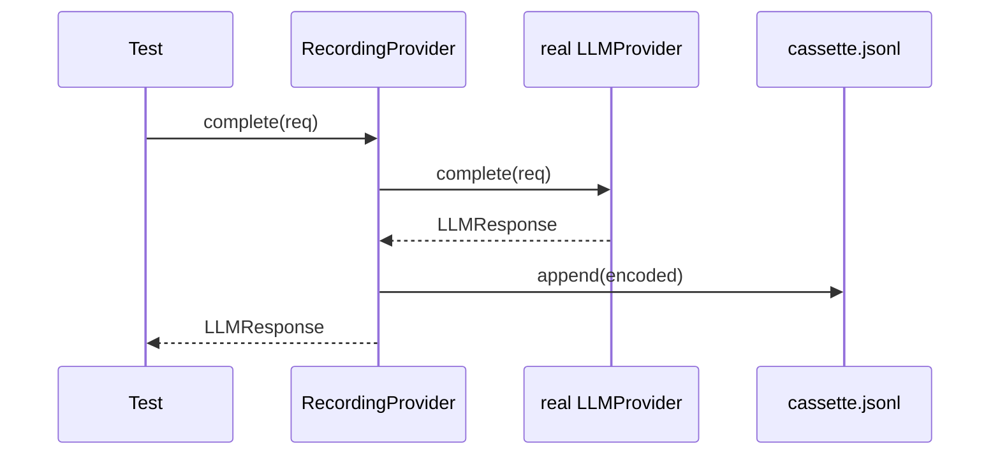
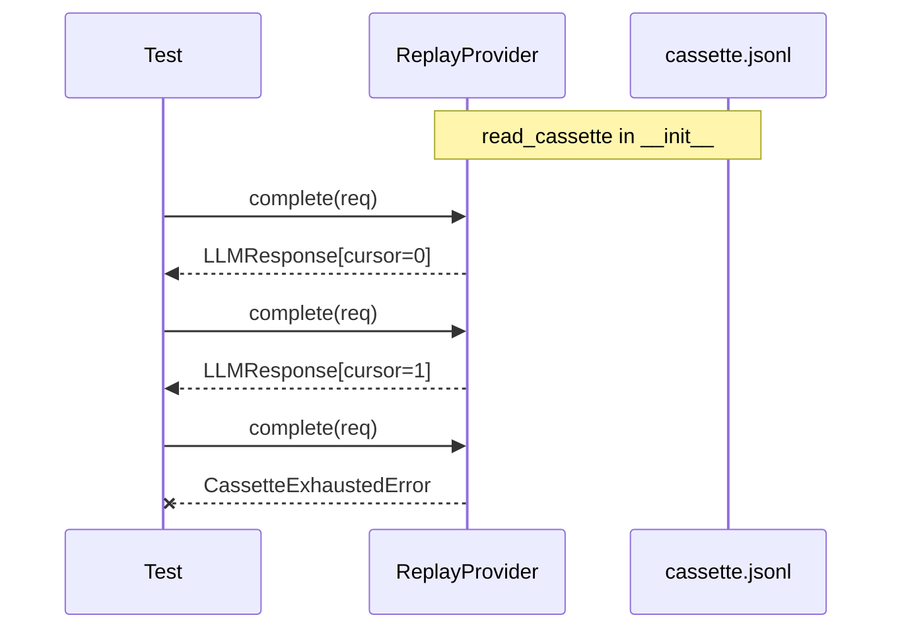

#

<div align="center">
  
</div>

<div align="center">

# Phronesis Framework - Replay

</div>

<div align="center">
  Deterministic recording and replay of LLM responses in JSONL cassettes: reproducible tests with no network, no cost and no non-determinism.
</div>

<div align="center">
  <a href="../index.md">docs</a> ·
  <a href="../../src/phronesis/replay/">source</a> ·
  <a href="../../tests/replay/">tests</a>
</div>

<div align="center">

[]()
[]()
[]()

</div>

---

<div align="center">

## 🎯 Purpose

</div>

LLM providers are the main source of non-determinism in a test suite: they cost money, depend on the network, have variable latency and return different responses on every call. `replay` solves this with a classic record/replay pattern applied to `LLMProvider`:

- **Record once** against the real provider (`RecordingProvider`).
- **Replay N times** without touching the network (`ReplayProvider`).

The cassette is a readable, diffable, hand-editable JSONL file. Ideal for integration tests of agents, runtime and pipelines.

<div align="center">

## 🏗️ Architecture

</div>

Two proxies that implement the `LLMProvider` protocol:


```mermaid
flowchart LR
    subgraph real["real test"]
        A1[Agent] --> RP[RecordingProvider] --> LLM[real LLMProvider] --> NET[network]
        RP --> C1[cassette.jsonl]
    end

    subgraph replay["replay test"]
        A2[Agent] --> RPL[ReplayProvider] -- reads --> C2[cassette.jsonl]
    end
```

Both go through the same APIs as any provider; the agent does not notice.

The cassette shape is one `LLMResponse` per line, encoded as JSON:

```json
{"text": "...", "tool_calls": [...], "finish_reason": "...", "usage": {...}}
{"text": "...", "tool_calls": [...], "finish_reason": "...", "usage": {...}}
```

<div align="center">

## 📦 Module layout

</div>

| File | Responsibility |
|---|---|
| `__init__.py` | Public API re-exports (`__all__`). |
| `errors.py` | `ReplayError` -> `CassetteFormatError`, `CassetteExhaustedError`. |
| `cassette.py` | JSONL I/O + `encode_response` / `decode_response` (includes `ToolCall`, `TokenUsage`). |
| `recording.py` | `RecordingProvider`: delegating wrapper + `append_cassette` on every `complete`. |
| `replay.py` | `ReplayProvider`: in-memory cassette + sequential cursor. |

<div align="center">

## 🔌 Public API

</div>

```python
from phronesis.replay import (
    RecordingProvider,
    ReplayProvider,
    ReplayError,
    CassetteFormatError,
    CassetteExhaustedError,
    read_cassette,
    write_cassette,
    append_cassette,
    encode_response,
    decode_response,
)
```

Key signatures:

```python
class RecordingProvider:
    def __init__(
        self,
        inner: LLMProvider,
        cassette_path: str | Path,
        *,
        truncate: bool = True,
    ) -> None: ...

    async def complete(self, request: LLMRequest) -> LLMResponse: ...

class ReplayProvider:
    def __init__(
        self,
        cassette_path: str | Path,
        *,
        context_window: int = 200_000,
    ) -> None: ...

    async def complete(self, _request: LLMRequest) -> LLMResponse: ...

def encode_response(response: LLMResponse) -> dict[str, Any]: ...
def decode_response(payload: dict[str, Any]) -> LLMResponse: ...

def read_cassette(path: Path) -> list[LLMResponse]: ...
def write_cassette(path: Path, responses: list[LLMResponse]) -> None: ...
def append_cassette(path: Path, response: LLMResponse) -> None: ...
```

<div align="center">

## 📐 Design decisions

</div>

- **D-01 JSONL.** Text format, one entry per line. Diffable in git, hand-editable, language-neutral. No pickles, no opaque binaries.
- **D-02 Pure record-then-replay.** `ReplayProvider` does not match by request: it serves responses in order via an internal cursor. This simplifies the model and leaves "matching" to the test that decides what to record. If you need strict matching, wrap it yourself.
- **D-03 Whole cassette in memory.** `ReplayProvider` loads the entire file on construction. Cassettes are small (tens or hundreds of entries), and this way format errors surface at construction, not mid-test.
- **D-04 Append per call.** `RecordingProvider` opens the file in append mode on every `complete`. If the test crashes halfway, everything recorded up to that point remains valid and reusable.
- **D-05 `truncate=True` by default.** A new recording session must not be polluted by previous runs. `truncate=False` explicitly enables cross-session append mode.
- **D-06 Streaming out of v1.** Only `complete` is recorded. `RecordingProvider.stream` delegates as-is to the real provider (without recording chunks); `ReplayProvider.stream` always raises `CassetteExhaustedError`. Replaying streams is unnecessary complexity for the core use case.
- **D-07 Synthetic capabilities in replay.** `ReplayProvider.supports(...)` is always `False`; `context_window_size()` returns the value passed to the constructor (default 200 000); `count_tokens` uses the `len(text) // 4` heuristic; `count_tokens_exact` is always `None`. It is a test double, not a model.

<div align="center">

## 📊 Diagrams

</div>

Recording flow:


```mermaid
sequenceDiagram
    participant Test
    participant Recording as RecordingProvider
    participant Real as real LLMProvider
    participant Cassette as cassette.jsonl

    Test->>Recording: complete(req)
    Recording->>Real: complete(req)
    Real-->>Recording: LLMResponse
    Recording->>Cassette: append(encoded)
    Recording-->>Test: LLMResponse
```

Replay flow:


```mermaid
sequenceDiagram
    participant Test
    participant Replay as ReplayProvider
    participant Cassette as cassette.jsonl

    Note over Replay,Cassette: read_cassette in __init__
    Test->>Replay: complete(req)
    Replay-->>Test: LLMResponse[cursor=0]
    Test->>Replay: complete(req)
    Replay-->>Test: LLMResponse[cursor=1]
    Test->>Replay: complete(req)
    Replay--xTest: CassetteExhaustedError
```

<div align="center">

## 🔗 Dependencies

</div>

- `phronesis.providers.protocol` - `LLMProvider`, `ProviderFeature`.
- `phronesis.providers.types` - `LLMRequest`, `LLMResponse`, `ToolCall`.
- `phronesis.providers.usage` - `TokenUsage`.
- `phronesis.providers.chunks` - `LLMChunk` (only for stream types).
- `phronesis.core.messages` - `Message` (only for count_tokens types).
- `phronesis.errors.PhronesisError` - root hierarchy.
- Stdlib: `json`, `pathlib`, `asyncio`.

<div align="center">

## 🧪 Testing

</div>

Tests in `tests/replay/`. Strategy:

- Minimal in-memory provider stub so the cassette is not tied to a real provider.
- Covered cases: encode/decode round-trip (including `tool_calls` and `usage`), recording, sequential replay, malformed cassette, exhausted cassette, `truncate=True/False`, passthrough of non-recorded methods.
- Target coverage: 100%.

<div align="center">

## 📋 Examples

</div>

Record the first time:

```python
import asyncio
from phronesis.replay import RecordingProvider

async def main():
    # real_provider is your real provider (Anthropic, OpenAI, etc.)
    recorder = RecordingProvider(real_provider, "tests/fixtures/agent_run.jsonl")

    agent = my_agent.with_provider(recorder)
    await agent.run("explain the Pythagorean theorem")
    # tests/fixtures/agent_run.jsonl now contains all the responses

asyncio.run(main())
```

Replay in CI without network:

```python
import asyncio
from phronesis.replay import ReplayProvider

async def main():
    replay = ReplayProvider("tests/fixtures/agent_run.jsonl")
    agent = my_agent.with_provider(replay)

    result = await agent.run("explain the Pythagorean theorem")
    # Same input -> exactly the same responses as in the recording

asyncio.run(main())
```

Manual cassette (no recording):

```python
from phronesis.providers.types import LLMResponse
from phronesis.replay import write_cassette, ReplayProvider

write_cassette(
    "tests/fixtures/stubbed.jsonl",
    [
        LLMResponse(text="first response"),
        LLMResponse(text="second response"),
    ],
)

replay = ReplayProvider("tests/fixtures/stubbed.jsonl")
```

Append across separate runs:

```python
from phronesis.replay import RecordingProvider

recorder = RecordingProvider(real_provider, cassette_path, truncate=False)
# Each run appends to the end of the cassette without erasing previous content
```

<div align="center">

## ⚠️ Pitfalls

</div>

- **Replay does not validate the request**. It blindly serves responses in order. If your test changes the flow (new prompt, new tool call), the order no longer matches and the cassette becomes invalid. Re-record.
- **Streaming is not recorded**. If your agent uses `stream`, the cassette ignores those calls and `ReplayProvider.stream` raises `CassetteExhaustedError`. Switch the test to `complete` or document the limitation.
- **`truncate=True` erases on construction**. If you carelessly reuse the cassette path across several tests in the same process, the second test erases the first one's recording. Use distinct paths per test, or `truncate=False` with care.
- **`context_window_size()` is synthetic**. If your agent makes decisions based on context size, explicitly set `context_window=N` when building the `ReplayProvider` to reflect the original model.
- **`count_tokens` is a heuristic**. `len(text) // 4`. Fine for tests; not for billing or serious truncation decisions.
- **Cassettes are test fixtures**. Treat them as checked-in data under `tests/fixtures/`. If an API changes and breaks the decoded format, update the cassette or re-record.

<div align="center">

## 🚦 Quality gates

</div>

```
uv run ruff format src/phronesis/replay tests/replay
uv run ruff check src/phronesis/replay tests/replay
uv run mypy src/phronesis/replay
uv run pytest tests/replay -q
uv run pytest -q
```

<div align="center">

## 🛠️ Tech stack

</div>

- Python 3.11+.
- Stdlib only (`json`, `pathlib`, `asyncio`).

<div align="center">

## 🔮 Future work

</div>

- **Request matching** - a `MatchingReplayProvider` variant that looks up the entry by request hash instead of a sequential cursor.
- **Stream recording** - serialize the chunk sequence (accumulated delta or list) and replay it.
- **Compression** - optional gzip for large cassettes, keeping the JSONL format inside.
- **Sanitization during recording** - hook to redact PII before writing to the cassette.
- **Schema versioning** - cassette header with `format_version` for future migrations.
- **Integration with `phronesis.testing`** - pytest fixtures that automatically build the recording/replaying provider based on a flag.
