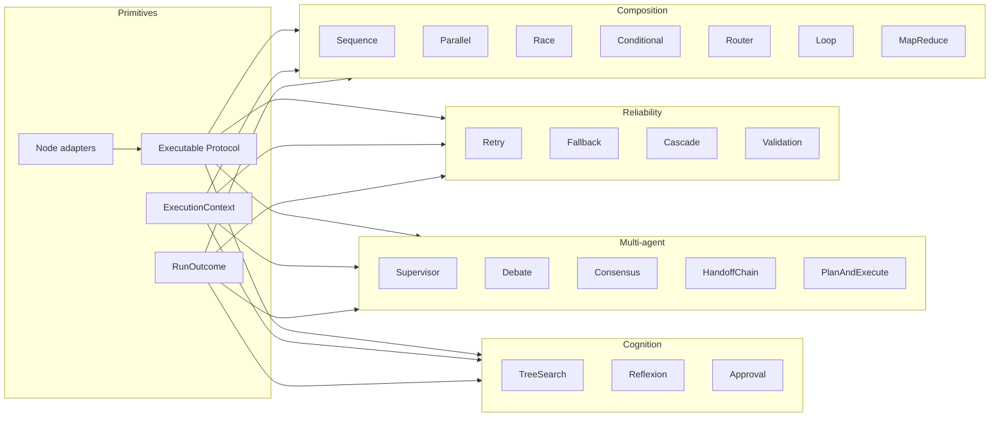
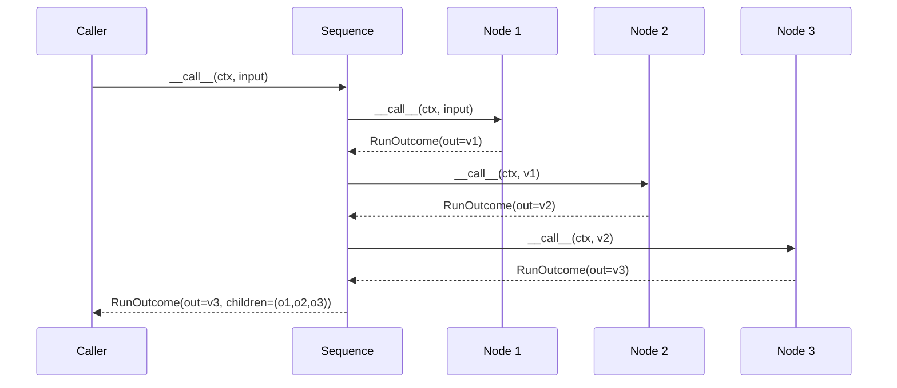
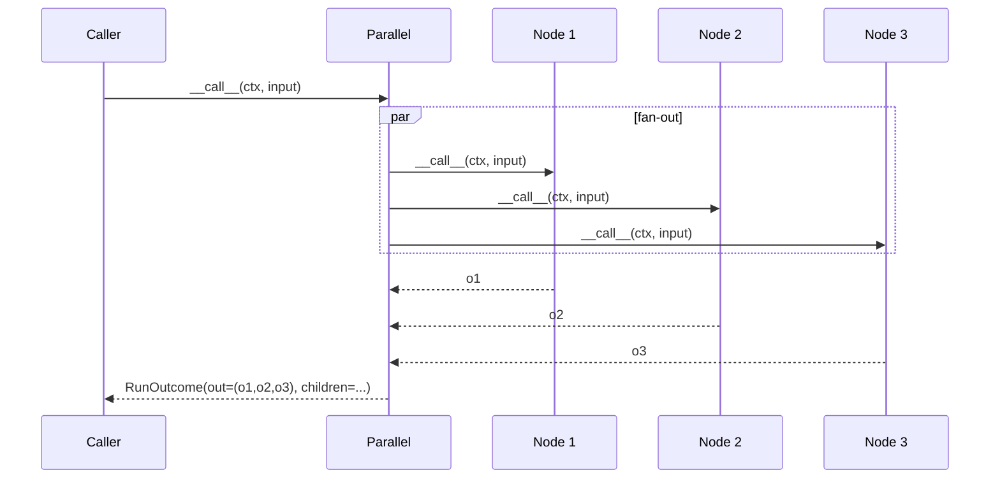
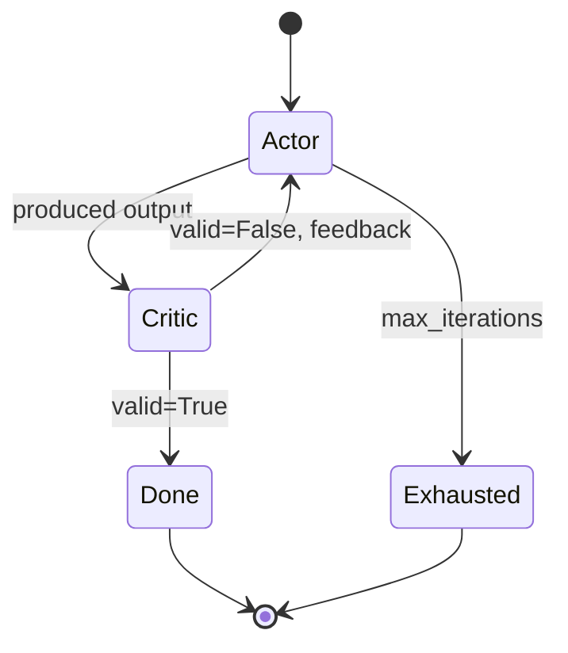
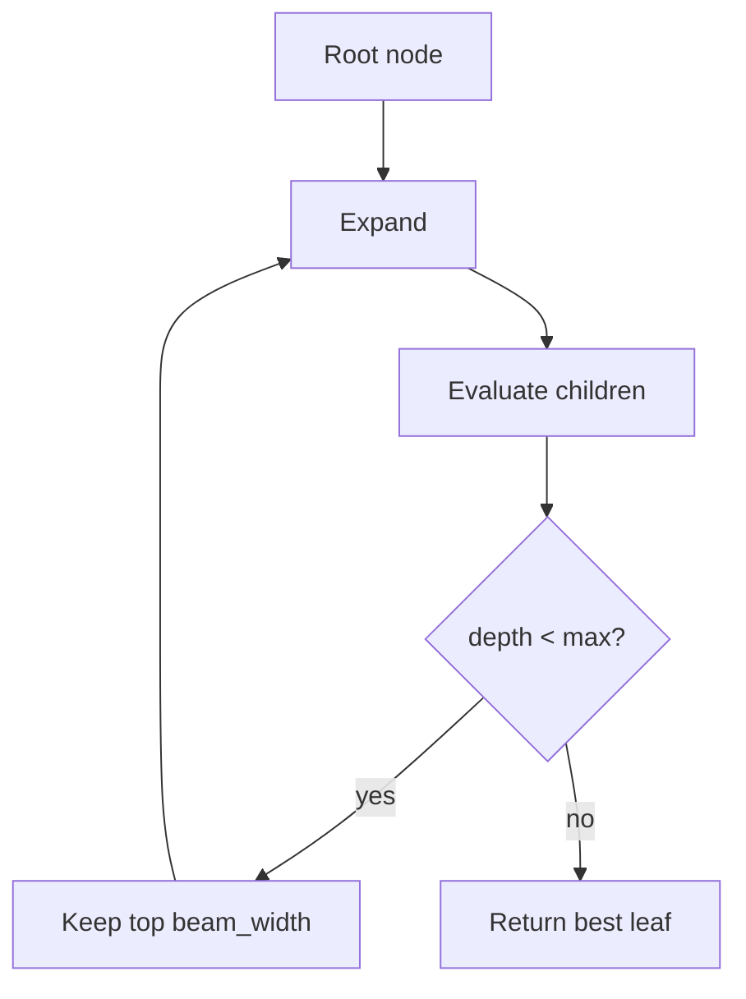
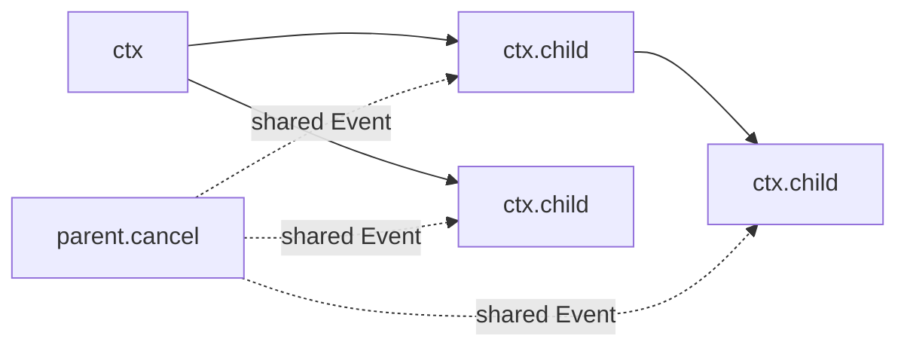

#

<div align="center">
  
</div>

<div align="center">

# Phronesis Framework - `runtime`

</div>

<div align="center">
  Stateless, composable orchestration layer that turns agents and async callables into a uniform <code>Executable</code> graph, executed through 19 declarative modes spanning composition, reliability, multi-agent coordination, and cognitive patterns.
</div>

<div align="center">
  <a href="../index.md">docs</a> ·
  <a href="../../src/phronesis/runtime/">source</a> ·
  <a href="../../tests/runtime/">tests</a>
</div>

<div align="center">

[]()
[]()
[]()
[]()

</div>

---

<div align="center">

## 🎯 Purpose

</div>

`phronesis.runtime` is the orchestration kernel of the framework. It defines a single execution contract (`Executable`) and ships **19 immutable modes** that compose that contract into the most common control-flow patterns required by agentic systems:

1. **Basic composition** - chain, fan-out, races, branches, routing, loops, map-reduce.
2. **Reliability** - retries with backoff, fallbacks, cascades, validated retries.
3. **Multi-agent** - supervisors, debates, consensus, handoffs, planner/executor.
4. **Advanced cognition** - tree search, reflexion loops, human-in-the-loop approval.

Every mode is a frozen dataclass. State lives in an immutable `ExecutionContext` that is threaded explicitly through every call. The output is always a `RunOutcome`. There is no global registry, no implicit shared state, no hidden side effects.

What the user writes:

```python
from phronesis.runtime import Sequence, Retry, callable_node, ExecutionContext

seq = Sequence(nodes=(
    Retry(node=callable_node(fetch), max_attempts=3),
    callable_node(parse),
    callable_node(summarize),
))

ctx = ExecutionContext.new(deadline_s=30.0)
result = await seq(ctx, "https://example.com")
```

What the framework guarantees:

- **Uniform result shape** (`RunOutcome` with `output`, `success`, `error`, `tokens`, `cost_usd`, `children`).
- **Cooperative cancellation** via `ctx.cancellation` (shared `asyncio.Event` propagated to children).
- **Observability** - every mode emits a `phronesis.runtime.<mode>` span and increments the same metric set.
- **Token/cost propagation** through `merge_children()`.
- **Composability** - every mode is itself an `Executable`, so any mode can wrap any other.

Non-goals (deliberately):

- Declarative DAGs - reserved for the future `pipelines/` module.
- Durable pause/resume - `Approval` is in-memory only.
- Distributed execution - everything is single-process.
- Streaming events - the agents loop owns that vocabulary.

<div align="center">

## 🏗️ Architecture

</div>

The module is built on four orthogonal primitives plus the 19 modes that compose them.



**Primitives**:

- `protocol.py` - `Executable` Protocol (`async __call__(ctx, input) -> RunOutcome`).
- `context.py` - `ExecutionContext` immutable run-scoped state with `child()`, `remaining()`, `cancel()`.
- `outcome.py` - `RunOutcome` uniform result + `merge_children()` for usage propagation.
- `node.py` - `agent_node`, `callable_node`, `as_node` adapters wrapping `Agent` / async callables.
- `errors.py` - `RuntimeOrchestrationError` hierarchy.
- `obs.py` - span/metric constants + `runtime_span(mode, ctx)` helper.

**Modes** live under `modes/`. Each file is a frozen dataclass implementing the Protocol, stateless, dependency-light.

<div align="center">

## 📦 Module layout

</div>

| File | Responsibility | Public symbols |
|---|---|---|
| `protocol.py` | The `Executable` contract. | `Executable` |
| `context.py` | `ExecutionContext` plus `RunId`. | `ExecutionContext`, `RunId` |
| `outcome.py` | Uniform result type. | `RunOutcome` |
| `node.py` | Adapters wrapping `Agent` / async callables. | `as_node`, `agent_node`, `callable_node` |
| `errors.py` | Runtime error hierarchy. | `RuntimeOrchestrationError`, `ExecutionFailedError`, `LoopExhaustedError`, `HandoffLimitError`, `NoMatchingRouteError`, `ConsensusError`, `ValidationFailedError`, `ApprovalDeniedError`, `ApprovalTimeoutError`, `CancelledError` |
| `obs.py` | Span/metric helpers, attribute constants. | `runtime_span`, attribute constants |
| `modes/sequence.py` | Chain nodes; output[n] -> input[n+1]. | `Sequence` |
| `modes/parallel.py` | Fan-out same input concurrently. | `Parallel` |
| `modes/race.py` | First winner cancels the rest. | `Race` |
| `modes/conditional.py` | Predicate-based branch. | `Conditional` |
| `modes/router.py` | Classifier-based dispatch. | `Router` |
| `modes/loop.py` | Bounded iteration with predicate. | `Loop` |
| `modes/map_reduce.py` | Split / map / reduce. | `MapReduce` |
| `modes/retry.py` | Exponential backoff retries. | `Retry` |
| `modes/fallback.py` | Try primary then fallbacks. | `Fallback` |
| `modes/cascade.py` | Cheap-to-expensive cascade with acceptance. | `Cascade` |
| `modes/validation.py` | Validate and retry with feedback. | `Validation`, `ValidationResult` |
| `modes/supervisor.py` | Supervisor agent routes to workers. | `Supervisor` |
| `modes/debate.py` | N-round debate with optional moderator. | `Debate` |
| `modes/consensus.py` | Parallel voters + aggregator. | `Consensus` |
| `modes/handoff_chain.py` | Agents pass the turn explicitly. | `HandoffChain` |
| `modes/plan_and_execute.py` | Planner -> step executor. | `PlanAndExecute` |
| `modes/tree_search.py` | Expand -> evaluate beam search. | `TreeSearch` |
| `modes/reflexion.py` | Actor / critic loop with feedback. | `Reflexion` |
| `modes/approval.py` | Human-in-the-loop gate with timeout. | `Approval` |
| `__init__.py` | Public re-exports. | (see Public API) |

<div align="center">

## 🔌 Public API

</div>

### Imports

```python
from phronesis.runtime import (
    # primitives
    Executable, ExecutionContext, RunOutcome,
    as_node, agent_node, callable_node,
    # errors
    RuntimeOrchestrationError, ExecutionFailedError,
    LoopExhaustedError, HandoffLimitError, NoMatchingRouteError,
    ConsensusError, ValidationFailedError,
    ApprovalDeniedError, ApprovalTimeoutError, CancelledError,
    # modes
    Sequence, Parallel, Race, Conditional, Router, Loop,
    MapReduce, Retry, Fallback, Cascade, Validation,
    ValidationResult, Supervisor, Debate, Consensus,
    HandoffChain, PlanAndExecute, TreeSearch, Reflexion, Approval,
)
```

### `Executable`

```python
@runtime_checkable
class Executable(Protocol):
    async def __call__(self, ctx: ExecutionContext, input: Any) -> RunOutcome: ...
```

Every mode and adapter implements this. Nothing else is required.

### `ExecutionContext`

```python
@dataclass(frozen=True, slots=True)
class ExecutionContext:
    run_id: RunId
    parent_id: RunId | None
    deadline: float | None
    cancellation: asyncio.Event
    metadata: Mapping[str, Any]
    logger: Logger

    @classmethod
    def new(cls, *, deadline_s: float | None = None,
            metadata: Mapping[str, Any] | None = None) -> ExecutionContext: ...
    def child(self, *, metadata: Mapping[str, Any] | None = None) -> ExecutionContext: ...
    def remaining(self) -> float | None: ...
    def is_cancelled(self) -> bool: ...
    def cancel(self) -> None: ...
```

The `cancellation` event is shared with children; calling `cancel()` propagates to every descendant context derived from `child()`.

### `RunOutcome`

```python
@dataclass(frozen=True, slots=True)
class RunOutcome:
    output: Any
    success: bool
    error: Exception | None = None
    tokens: TokenUsage = ...
    cost_usd: float | None = None
    children: tuple[RunOutcome, ...] = ()
    metadata: Mapping[str, Any] = ...

    @classmethod
    def ok(cls, output: Any, **kw: Any) -> RunOutcome: ...
    @classmethod
    def fail(cls, error: Exception, **kw: Any) -> RunOutcome: ...
    def merge_children(self) -> RunOutcome: ...
```

`merge_children()` aggregates `tokens` and `cost_usd` from the `children` tuple. Modes that fan out (Parallel, MapReduce, Consensus, Debate, ...) call this before returning so the caller always sees the cumulative cost.

### Node adapters

```python
def as_node(target: Agent | Callable[..., Awaitable[Any]]) -> Executable: ...
def agent_node(agent: Agent) -> Executable: ...
def callable_node(fn: Callable[..., Awaitable[Any]], *, name: str | None = None) -> Executable: ...
```

`callable_node` inspects the signature: callables with two positional parameters get `(ctx, input)`; one-parameter callables get just `(input)`. A callable that returns a `RunOutcome` directly is passed through unchanged.

### Modes - selected signatures

```python
@dataclass(frozen=True, slots=True)
class Sequence:
    nodes: tuple[Executable, ...]

@dataclass(frozen=True, slots=True)
class Parallel:
    nodes: tuple[Executable, ...]
    policy: GatherPolicy = FailFastPolicy()

@dataclass(frozen=True, slots=True)
class Retry:
    node: Executable
    max_attempts: int = 3
    backoff_initial_s: float = 0.5
    backoff_multiplier: float = 2.0
    backoff_max_s: float = 30.0
    on: tuple[type[Exception], ...] = (Exception,)

@dataclass(frozen=True, slots=True)
class Reflexion:
    actor: Executable
    critic: Executable
    max_iterations: int = 3

@dataclass(frozen=True, slots=True)
class TreeSearch:
    expander: Executable
    evaluator: Executable
    max_depth: int = 3
    beam_width: int = 3
```

See `modes/*.py` for the rest. All modes share the same shape: a frozen dataclass with config and a single `__call__`.

<div align="center">

## 📐 Design decisions

</div>

| ID | Decision |
|---|---|
| D-01 | One Protocol (`Executable`) is the only contract; everything else is an implementation. |
| D-02 | Modes are frozen dataclasses with `slots=True`. No mutation, no inheritance trees. |
| D-03 | State is carried by `ExecutionContext`, passed explicitly. No thread-locals or context-vars used by the runtime itself. |
| D-04 | `RunOutcome` is uniform across all modes. Failure is data (`success=False`, `error=...`), not an exception above the call site. |
| D-05 | Cancellation is cooperative: long-running modes (Loop, Reflexion, Supervisor, HandoffChain, TreeSearch) check `ctx.is_cancelled()` at every boundary. |
| D-06 | Concurrency reuses `_internal/concurrency.gather_all` with `FailFastPolicy` / `BestEffortPolicy`. The runtime does not reimplement gather logic. |
| D-07 | Retries reuse `_internal/retry.ExponentialBackoff`. Jitter is off by default for deterministic tests. |
| D-08 | Default extractors (`Supervisor`, `HandoffChain`, `PlanAndExecute`) accept dicts or attribute-bearing objects so users can swap in pydantic models without writing custom code. |
| D-09 | Token/cost propagate via `RunOutcome.merge_children()`. Modes never compute usage themselves. |
| D-10 | `runtime.run_id` is a span attribute, never a metric label, to keep cardinality bounded. |
| D-11 | Approval is in-memory only. Durable pause/resume belongs in a future PR coupled to `memory.Checkpointer`. |
| D-12 | TreeSearch is intentionally bounded by `beam_width` and `max_depth` - no unbounded frontier. |

<div align="center">

## 📊 Diagrams

</div>

### Sequence



### Parallel



### Reflexion



### TreeSearch



### Cancellation propagation



<div align="center">

## 🧪 Testing

</div>

Tests mirror the source layout under `tests/runtime/`:

| Test file | What it covers |
|---|---|
| `test_context.py` | `ExecutionContext` lifecycle, `child`, `remaining`, cancellation, deadline, read-only metadata. |
| `test_outcome.py` | `RunOutcome.ok` / `fail` / `merge_children`, token aggregation. |
| `test_node.py` | `as_node`, `callable_node` for 1- and 2-arg callables, RunOutcome pass-through. |
| `test_errors.py` | Error hierarchy and `code` attributes. |
| `test_obs.py` | Attribute constants and `runtime_span` helper. |
| `modes/test_<mode>.py` | One file per mode covering happy path, error path, and edge cases. |
| `test_integration.py` | Compositions like `Sequence(Parallel(...), Retry(...))`. |

Counts:

- `tests/runtime/` - **92 tests**.

Common patterns:

- Async tests via `pytest-asyncio` in auto mode.
- Fixtures `echo_node`, `make_const_node`, `make_failing_node`, `make_outcome_node`, `root_ctx` in `conftest.py`.
- `ExponentialBackoff(jitter=False)` inside `Retry` for deterministic timings.
- Direct `await mode(ctx, input)` invocation; no abstraction over the Protocol.

<div align="center">

## 📋 Examples

</div>

### Sequence chaining

```python
from phronesis.runtime import Sequence, ExecutionContext, callable_node

async def fetch(_ctx, url): ...
async def parse(_ctx, html): ...
async def summarize(_ctx, doc): ...

seq = Sequence(nodes=(
    callable_node(fetch),
    callable_node(parse),
    callable_node(summarize),
))

ctx = ExecutionContext.new(deadline_s=30.0)
result = await seq(ctx, "https://example.com")
```

### Race across providers

```python
from phronesis.runtime import Race, agent_node

race = Race(nodes=(
    agent_node(anthropic_agent),
    agent_node(openai_agent),
))

result = await race(ctx, "Summarize this document.")
```

### Retry around a flaky tool

```python
from phronesis.runtime import Retry, callable_node

retried = Retry(
    node=callable_node(call_flaky_api),
    max_attempts=4,
    backoff_initial_s=0.5,
    on=(ConnectionError, TimeoutError),
)

result = await retried(ctx, payload)
```

### Reflexion loop

```python
from phronesis.runtime import Reflexion, ValidationResult, callable_node

async def actor(_c, prompt): ...
async def critic(_c, output) -> ValidationResult:
    return ValidationResult(valid=is_good(output), feedback="be more concise")

ref = Reflexion(actor=callable_node(actor), critic=callable_node(critic),
                max_iterations=3)
result = await ref(ctx, "Draft a release note.")
```

### Supervisor over workers

```python
from phronesis.runtime import Supervisor

sup = Supervisor(
    dispatcher=agent_node(router_agent),     # output: {"route": "search", ...}
    workers={
        "search": agent_node(search_agent),
        "compute": agent_node(math_agent),
    },
    max_iterations=6,
)
result = await sup(ctx, "Compute and explain ...")
```

### Approval gate

```python
from phronesis.runtime import Approval

async def confirm(output) -> bool:
    return await ui.confirm(output)

approved = Approval(
    node=callable_node(propose_action),
    approve=confirm,
    timeout_s=30.0,
)
```

<div align="center">

## 🔗 Dependencies

</div>

### Hard dependencies

- **`phronesis._internal.concurrency`** - `gather_all`, `FailFastPolicy`, `BestEffortPolicy` used by `Parallel`, `MapReduce`, `Consensus`.
- **`phronesis._internal.retry`** - `ExponentialBackoff` used by `Retry`.
- **`phronesis._internal.ids`** - `Id` / `IdGenerator` for `RunId`.
- **`phronesis.providers.usage`** - `TokenUsage` used by `RunOutcome`.
- **`phronesis.errors`** - `PhronesisError` base for the runtime error hierarchy.

### Soft dependencies

- **`phronesis.obs`** - spans and metrics. When the `obs` extra is missing everything degrades to no-op instruments.

### Who depends on `phronesis.runtime`

The future `pipelines/` module will be the first declarative consumer. `agents/` and `memory/` remain independent today.

<div align="center">

## ⚠️ Pitfalls

</div>

- **Cancellation requires cooperation.** A node that blocks in C code (e.g., a synchronous HTTP client) will not honor `ctx.cancel()`. Race and Approval rely on `asyncio.CancelledError` propagation through `await`.
- **Handoff loops bite.** Two agents that cede to each other will tip `max_handoffs`. Tune the cap and instrument `runtime.handoff.from/to` attributes.
- **Default extractors assume `dict` or attribute access.** `Supervisor` and `HandoffChain` parse `{"route": ...}` / `{"handoff_to": ...}`; pass a custom `route_extractor` / `handoff_extractor` for other shapes.
- **TreeSearch explodes geometrically.** `beam_width ** max_depth` evaluations. Keep `max_depth` modest.
- **Validation can stall.** A validator that never accepts trips `max_attempts` with `ValidationFailedError`. Make the validator monotonic.
- **`runtime.run_id` is a span attribute, never a metric label.** Aggregating by `run_id` would explode metric cardinality.
- **Shared mutable state inside callables is your problem.** The runtime does not lock; if your nodes share buffers, protect them.
- **Approval without a timeout can hang forever.** Always set `timeout_s` for human-in-the-loop nodes.

<div align="center">

## 🚦 Quality gates

</div>

```
uv run ruff format src/phronesis/runtime tests/runtime
uv run ruff check src/phronesis/runtime tests/runtime
uv run mypy src/phronesis/runtime tests/runtime
uv run pytest tests/runtime -q
```

All four must be green before commit. `mypy` is configured in strict mode.

<div align="center">

## 🛠️ Tech stack

</div>

| Library | Version | Used for |
|---|---|---|
| Python | `>= 3.11` | `Protocol`, frozen dataclasses with `slots=True`, `Self`, structural pattern matching. |
| stdlib | - | `asyncio`, `dataclasses`, `inspect`, `types.MappingProxyType`, `contextlib.suppress`. |
| OpenTelemetry | optional (`obs` extra) | spans (`phronesis.runtime.<mode>`) and the metric set. |

<div align="center">

## 🔮 Future work

</div>

- **Declarative DAGs** in `pipelines/` built on top of `Executable`.
- **Durable Approval** backed by `memory.Checkpointer` for pause/resume across processes.
- **Streaming events** equivalent to `AgentEvent` for runtime nodes.
- **Per-mode budgets** that short-circuit on token / cost thresholds.
- **Visualization** of the executable graph (mermaid emission from a tree of `Executable`s).
