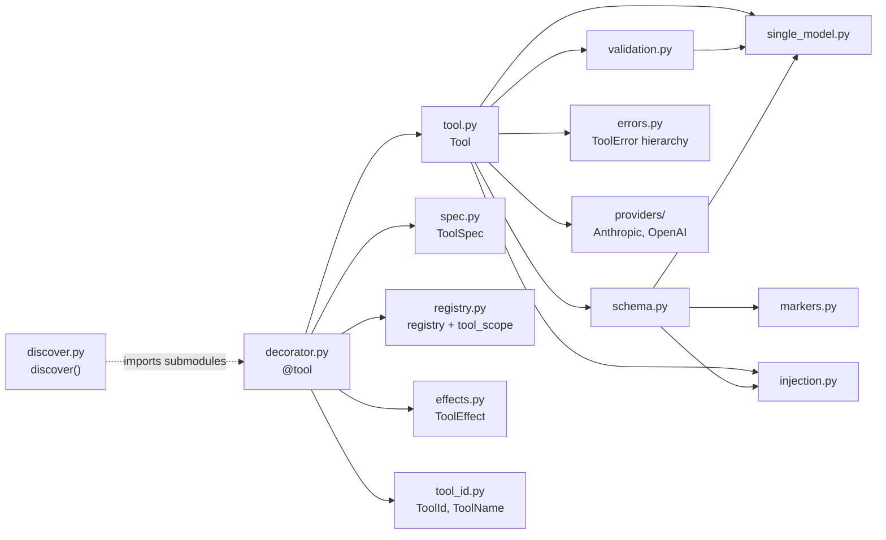
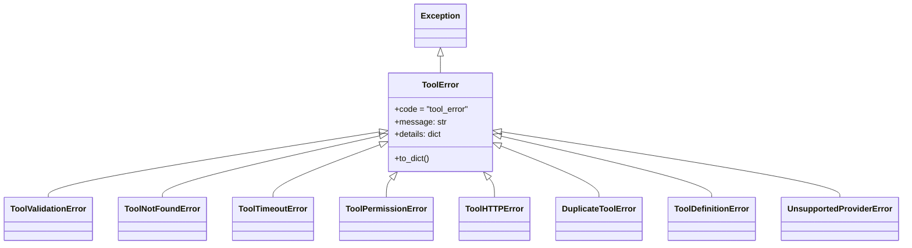
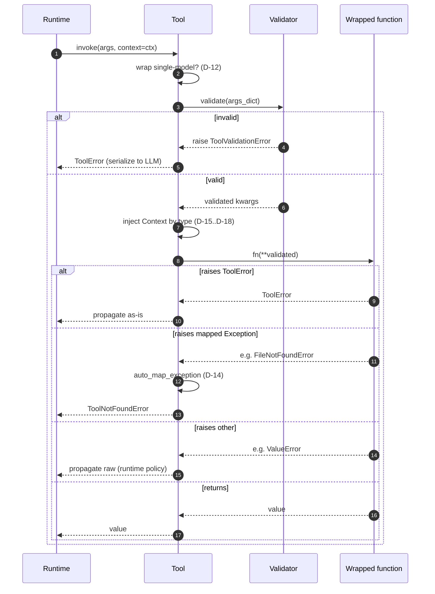
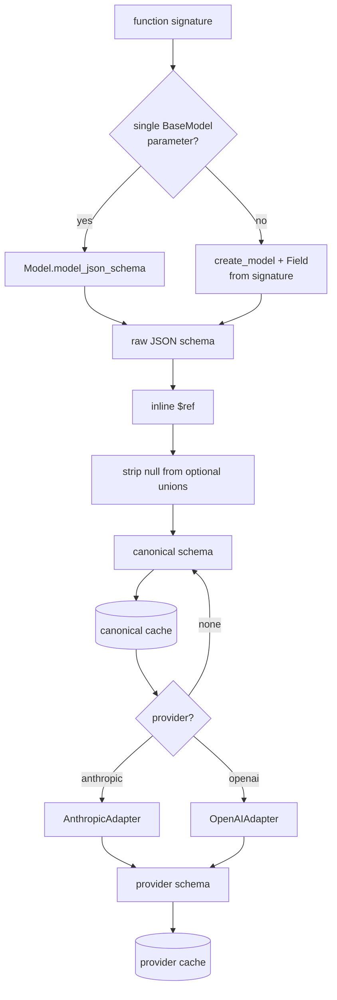
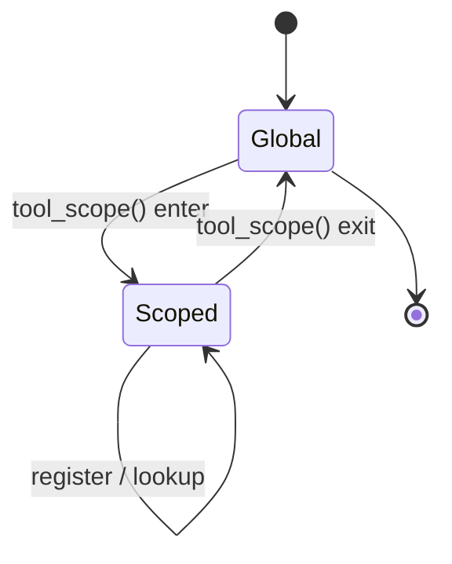

#

<div align="center">
  
</div>

<div align="center">

# Phronesis Framework - `tools`

</div>

<div align="center">
  Declarative <code>@tool</code> decorator that turns Python callables into LLM-callable, schema-validated, provider-adaptable units with two-channel error handling.
</div>

<div align="center">
  <a href="../index.md">docs</a> ·
  <a href="../../src/phronesis/tools/">source</a> ·
  <a href="../../tests/tools/">tests</a>
</div>

<div align="center">

[]()
[]()
[]()

</div>

---

<div align="center">

## 🎯 Purpose

</div>

Convert ordinary Python functions into **tools** that an LLM can discover, schema-introspect, validate against, and invoke - without the user wiring any of that by hand. A `@tool`-decorated function gets:

- A stable internal **id** and a human-facing **name** (both inferrable).
- An automatically generated **JSON schema** for its inputs (or the schema of a single `BaseModel` parameter; both styles supported).
- Argument **validation** via Pydantic before the function runs.
- A two-channel **error model**: `ToolError` is serialized back to the model; anything else escapes to the runtime.
- Per-call **`Context` injection** by type (not by name), filtered out of the LLM-facing schema.
- **Provider adapters** (Anthropic, OpenAI Chat Completions) generated lazily and cached.
- A process-wide **registry** with isolatable scopes via `tool_scope()`.
- Recursive **`discover()`** to bulk-import a package and trigger its `@tool` registrations.

<div align="center">

## 🏗️ Architecture

</div>



Pure-data side (`ToolSpec`, `ToolId`, `ToolEffect`, errors) is decoupled from the callable side (`Tool`, registry). The decorator stitches them together; everything else is reusable.

<div align="center">

## 📦 Module layout

</div>

| File | Responsibility |
|---|---|
| `decorator.py` | `@tool` / `@tool(...)` decorator; spec assembly; auto-registration. |
| `tool.py` | `Tool` callable wrapper: validation, Context injection, two-channel errors, lazy provider schema cache, `@tool.schema` override. |
| `spec.py` | Frozen, JSON-serializable `ToolSpec` (no function reference). |
| `tool_id.py` | `ToolId` (internal, prefixed `TID`), `ToolName` (LLM-facing). |
| `effects.py` | Closed `ToolEffect` vocabulary (`NETWORK`, `FILESYSTEM_READ`, ...). |
| `errors.py` | `ToolError` hierarchy + `auto_map_exception` allowlist mapper. |
| `injection.py` | `detect_context_param` - by type, not by name. |
| `markers.py` | `Annotated` helpers re-exporting `annotated_types` + Pydantic patterns. |
| `schema.py` | Canonical JSON schema generation; `$ref` inlining; null-stripping. |
| `single_model.py` | Detection and handling of single-`BaseModel`-input tools (D-12). |
| `validation.py` | Pydantic-backed kwargs validator; delegates to model for single-model tools. |
| `registry.py` | Thread-safe registry + async-safe `tool_scope()` via `ContextVar`. |
| `discover.py` | Recursive package import that triggers `@tool` decorations. |
| `providers/base.py` | `ProviderAdapter` Protocol. |
| `providers/anthropic.py` | `AnthropicAdapter` -> `{name, description, input_schema}`. |
| `providers/openai.py` | `OpenAIAdapter` -> Chat Completions `{type, function: {...}}` envelope. |
| `providers/__init__.py` | `get_adapter(name)` registry; `UnsupportedProviderError` on miss. |

<div align="center">

## 🔌 Public API

</div>

```python
from phronesis.tools import (
    # decorator and wrapper
    tool, Tool, ToolSpec, ToolId, ToolName, ToolEffect,
    # runtime
    Context,
    # registry and discovery
    tool_scope, current_registry, discover,
    # errors
    ToolError,
    ToolValidationError, ToolNotFoundError, ToolTimeoutError,
    ToolPermissionError, ToolHTTPError, DuplicateToolError,
    ToolDefinitionError, UnsupportedProviderError,
    SchemaDegradationWarning, auto_map_exception,
)
```

Top-level convenience re-exports from `phronesis`:

```python
from phronesis import tool, Context, ToolEffect, ToolError, tool_scope, discover
```

Decorator signature:

```python
def tool(
    fn: Callable[..., Any] | None = None,
    /,
    *,
    name: str | None = None,
    id: str | None = None,
    description: str | None = None,
    effects: Iterable[ToolEffect] | None = None,
    version: str | None = None,
    lazy: bool = False,
) -> Tool | Callable[[Callable[..., Any]], Tool]: ...
```

`Tool` invocation surface:

```python
class Tool:
    spec: ToolSpec
    is_async: bool

    def __call__(self, *args, **kwargs) -> Any: ...                       # direct call (testing / programmatic)
    def invoke(self, args: dict | None = None, *, context: Context | None = None) -> Any: ...  # runtime entry
    def get_schema(self, provider: str | None = None) -> dict: ...        # canonical (None) or adapted
    def schema(self, factory: Callable[[], dict]) -> Callable[[], dict]: ...  # @tool.schema override
```

<div align="center">

## 📐 Design decisions

</div>

Detailed rationale lives in [`../TOOLS-DECISIONS.md`](../TOOLS-DECISIONS.md). Highlights:

- **D-01..D-03 - decorator forms.** Both `@tool` and `@tool(...)` supported via a single `overload`-typed function; bare `@tool` triggers no registration ambiguity.
- **D-06 - data vs callable split.** `ToolSpec` is frozen, JSON-serializable, holds no function reference. The function lives on `Tool`.
- **D-07..D-08 - scoped registry.** Global default registry; `tool_scope()` swaps a `ContextVar` so async scopes are isolated, with thread-safe mutations.
- **D-12 - two input shapes.** Flat parameters (90% case) and single `BaseModel` (10%) are both first-class. Detection is automatic.
- **D-13..D-14 - two error channels.** Anything inheriting `ToolError` is for the LLM; everything else propagates to the runtime. A small allowlist (`FileNotFoundError`, `PermissionError`, `TimeoutError`, `pydantic.ValidationError`, `httpx.HTTPStatusError` 4xx) auto-maps.
- **D-15..D-18 - Context by type.** Any parameter whose annotation resolves to `Context` (or subclass) is filtered from schema/validator and injected at `invoke()` time. Detection is by type, not by name (`ctx`, `context`, `c` all work).
- **D-19 - schema override is total.** `@tool.schema` replaces the canonical schema; there is no partial override. The validator is not affected (override is presentational only).
- **D-20..D-22 - LLM-friendly schemas.** `$ref` is inlined eagerly; `null` is dropped from optional unions; descriptions come from Google-style docstrings overridden by `Annotated[T, "..."]`.
- **D-23..D-24 - provider adapters cached.** Canonical schema generated once (eagerly unless `lazy=True`), adapted on first request per provider, cached on the `Tool`.
- **D-09 - discovery optional.** Explicit imports remain the primary path; `discover()` exists for tree-shaking convenience and never aborts on a broken submodule.

<div align="center">

## 📊 Diagrams

</div>

`ToolError` hierarchy:



Runtime invocation with Context injection:



Schema generation pipeline:



Registry scoping (async-safe via `ContextVar`):



<div align="center">

## 📋 Examples

</div>

Basic tool with auto-derived id and schema:

```python
from phronesis import tool

@tool
def add(a: int, b: int) -> int:
    """Add two integers."""
    return a + b

add.spec.id           # ToolId('phronesis.tools.add')
add.spec.name         # ToolName('add')
add.get_schema()      # {"type": "object", "properties": {"a": ..., "b": ...}, "required": [...]}
```

Single-`BaseModel` input (D-12):

```python
from pydantic import BaseModel, Field
from phronesis import tool

class JobInput(BaseModel):
    name: str
    count: int = Field(ge=1)

@tool
def run_job(payload: JobInput) -> str:
    return f"{payload.name}x{payload.count}"

run_job.invoke({"name": "alpha", "count": 4})   # validated and built into JobInput
```

Context injection by type:

```python
from phronesis import tool, Context

@tool
def greet(name: str, ctx: Context) -> str:
    trace = ctx.trace_id or "?"
    return f"hi {name} [{trace}]"

greet.invoke({"name": "alice"}, context=Context(trace_id="t-1"))
# "hi alice [t-1]"
```

Two-channel error handling:

```python
from phronesis import tool, ToolError

@tool
def fetch(path: str) -> str:
    if path == "/forbidden":
        raise ToolError("denied", details={"path": path})   # serialized to LLM
    return open(path).read()                                # may raise FileNotFoundError -> auto-mapped to ToolNotFoundError
```

Provider-adapted schema:

```python
add.get_schema(provider="anthropic")
# {"name": "add", "description": "...", "input_schema": {...}}

add.get_schema(provider="openai")
# {"type": "function", "function": {"name": "add", "description": "...", "parameters": {...}}}
```

Schema override (D-19, rare):

```python
@tool
def search(q: str) -> list[str]: ...

@search.schema
def _() -> dict:
    return {
        "type": "object",
        "properties": {"q": {"type": "string", "minLength": 1, "description": "user query"}},
        "required": ["q"],
    }
```

Scoped registry and discovery:

```python
from phronesis import tool_scope, discover

with tool_scope() as scope:
    discover("my_app.tools")            # imports all submodules, triggering @tool registrations
    print([t.spec.name for t in scope.all()])
```

<div align="center">

## ⚠️ Pitfalls

</div>

- **Direct `__call__` does not auto-inject `Context`.** Pass it as an explicit kwarg by its real name (`my_tool(name="alice", ctx=ctx)`) or use `invoke(..., context=ctx)`. Direct call is the testing / programmatic path; runtime path is `invoke`.
- **`@tool.schema` does not change validation.** It only changes what the LLM sees. To change validation, change the function signature or use a single-`BaseModel` input.
- **Single-model and Context coexist.** A tool can take exactly one `BaseModel` and a `Context`. Two `BaseModel` parameters disable single-model mode.
- **`<locals>` in qualified names break id derivation.** Define tools at module level; nesting under classes/functions yields ids that fail `ToolId` validation.
- **`auto_map_exception` is a closed allowlist.** Adding new mapped exceptions requires editing `errors.py`; do not subclass to "fake" mappings.
- **`tool_scope()` is per async context.** Threads not started inside the scope see the global registry. Use the scope only for the async branch that owns it.
- **`discover()` swallows broken submodules with a warning.** If you need import errors to abort startup, import explicitly.

<div align="center">

## 🧪 Testing

</div>

Tests live under `tests/tools/` and mirror the source layout:

- `test_decorator.py` - both forms of `@tool`, inference, explicit overrides, registration.
- `test_tool.py` - invocation (sync/async), signature preservation, repr, validation, schema (canonical + provider + override), two-channel errors, Context injection.
- `test_validation.py` - Pydantic-backed validation; field-scoped error details.
- `test_schema.py` - basic types, containers, optional null-strip, Literal/Enum, descriptions, `$ref` inlining, Context filtering.
- `test_single_model.py` - detection, model-delegated validation, model-derived schema.
- `test_injection.py` - Context detection by type, alias names, multiple-Context rejection.
- `test_registry.py` - global registry, `tool_scope`, isolation across scopes, duplicate detection.
- `test_discover.py` - happy path, recursive walk, broken submodule warning, missing root.
- `test_errors.py` - hierarchy, codes, serialization, `auto_map_exception` allowlist.
- `test_effects.py`, `test_spec.py`, `test_tool_id.py`, `test_markers.py` - data primitives.
- `providers/test_anthropic.py`, `providers/test_openai.py` - per-adapter shape contracts.
- `test_public_api.py` - `__all__` invariants and end-to-end smoke through `phronesis` re-exports.

Total: **270 tests** for the module, **508** for the whole repository.

<div align="center">

## 🚦 Quality gates

</div>

```
uv run ruff format src/phronesis/tools tests/tools
uv run ruff check src/phronesis/tools tests/tools
uv run mypy src/phronesis/tools
uv run pytest tests/tools -q
```

All four must be green before commit.

<div align="center">

## 🔮 Future work

</div>

- Stricter OpenAI schema mode (`strict: true` + `additionalProperties: false` enforcement, deferred per D-23).
- More provider adapters (Gemini, Bedrock) plugged through `ProviderAdapter`.
- Per-effect runtime policies (e.g. `EXPENSIVE` rate-limiting, `REQUIRES_CONFIRMATION` approval flow) - lives in a future `policy/` module, not in `tools/`.
- Streaming tool outputs (currently a single return value).
