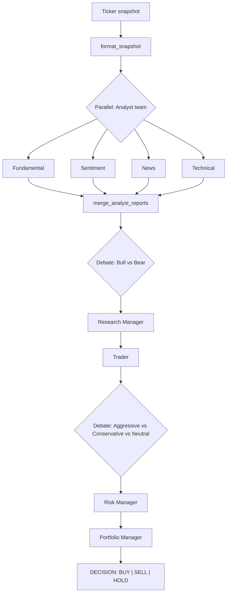

# trading_agents

Reproduce el organigrama del paper **TradingAgents** (Xiao et al., 2024) como
una mini-app dentro del catalogo de ejemplos. No es un ejemplo numerado: es
una composicion de 13 agentes en 5 fases que demuestra como encadenar
`Sequence`, `Parallel` y `Debate` del runtime de Phronesis.

## Que demuestra

- `runtime.Sequence` como espina dorsal del pipeline.
- `runtime.Parallel` para el equipo de analistas (fundamental, sentimiento,
  noticias, tecnico) corriendo a la vez sobre el mismo snapshot.
- `runtime.Debate` con moderador en dos ubicaciones:
  - Bull vs Bear moderado por el Research Manager.
  - Aggressive vs Conservative vs Neutral moderado por el Risk Manager.
- `agent_node` y `callable_node` como adapters para encajar agentes y
  funciones puras dentro del grafo.

## Organigrama



## Estructura

```
examples/trading_agents/
├── __init__.py
├── README.md
├── main.py                       Sequence de 5 fases + entry point
├── prompts.py                    13 system prompts
├── data.py                       Cache JSON local + fallback yfinance
├── tools.py                      Formatters / truncadores entre fases
├── agents/
│   ├── __init__.py               exporta los 13 agentes
│   ├── analysts.py               4 analistas paralelos
│   ├── researchers.py            bull, bear, research_manager
│   ├── trader.py                 trader
│   ├── risk.py                   aggressive, conservative, neutral, risk_manager
│   └── portfolio.py              portfolio_manager
├── cassette.jsonl                18 entradas (1 por llamada al LLM)
└── data_cache/
    └── AAPL_2024-01-15.json      snapshot canned
```

## Como correr

La mini-app trae un CLI minimo (argparse, sin dependencias extra). Se
invoca con `python -m examples.trading_agents`.

```
usage: python -m examples.trading_agents [-h] [--ticker TICKER]
                                         [--as-of AS_OF] [-v]

  --ticker TICKER   Equity symbol (default: AAPL).
  --as-of AS_OF     Snapshot date in ISO format (default: 2024-01-15).
  -v, --verbose     Print the output of every phase, not just the final
                    decision.
```

### Contra cassette (determinista, sin red)

```bash
CASSETTE_PATH=examples/trading_agents/cassette.jsonl \
  python -m examples.trading_agents
```

Solo imprime la decision final del portfolio manager. Para ver el output
de cada fase:

```bash
CASSETTE_PATH=examples/trading_agents/cassette.jsonl \
  python -m examples.trading_agents --verbose
```

### Contra Ollama local

```bash
ollama pull qwen2.5:3b
python -m examples.trading_agents --ticker AAPL --as-of 2024-01-15
```

### Regrabar la cassette

Si cambias los prompts, los adapters o el numero de rondas de los debates,
la cassette queda obsoleta. Para regrabar:

```bash
RECORD_CASSETTE=examples/trading_agents/cassette.jsonl \
  python -m examples.trading_agents
```

> **Nota sobre orden en `Parallel`**: los 4 analistas pueden llegar al
> provider en orden no determinista. El smoke test asserta unicamente que
> el output final contiene una de las marcas `BUY|SELL|HOLD`, no texto
> exacto.

## Datos

- `data_cache/AAPL_2024-01-15.json` viene commiteado con valores plausibles,
  asi los tests no necesitan `yfinance` ni acceso a red.
- Para tickers / fechas distintos, instala el extra opcional `trading`:

  ```bash
  pip install 'phronesis-framework[trading]'
  ```

  La primera ejecucion descargara via `yfinance` y cacheara el JSON.

## Fuera de alcance

- Backtesting real o curvas P&L.
- Position sizing real (el portfolio manager emite BUY/SELL/HOLD, no
  cantidad de acciones).
- Hooks a brokers o ejecucion en vivo.
- Multi-ticker en paralelo (un ticker por run).
- Reflection memory entre runs (el paper la usa, esta mini-app no).
